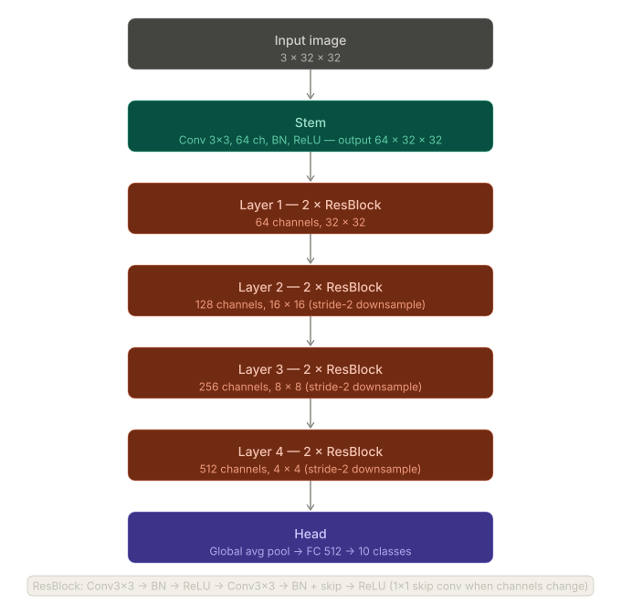
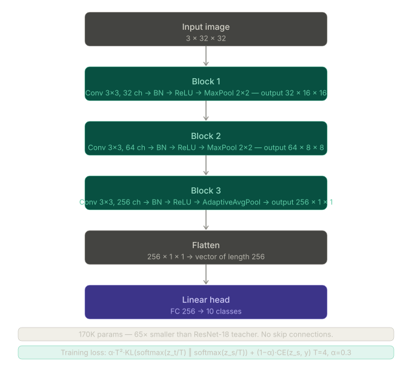
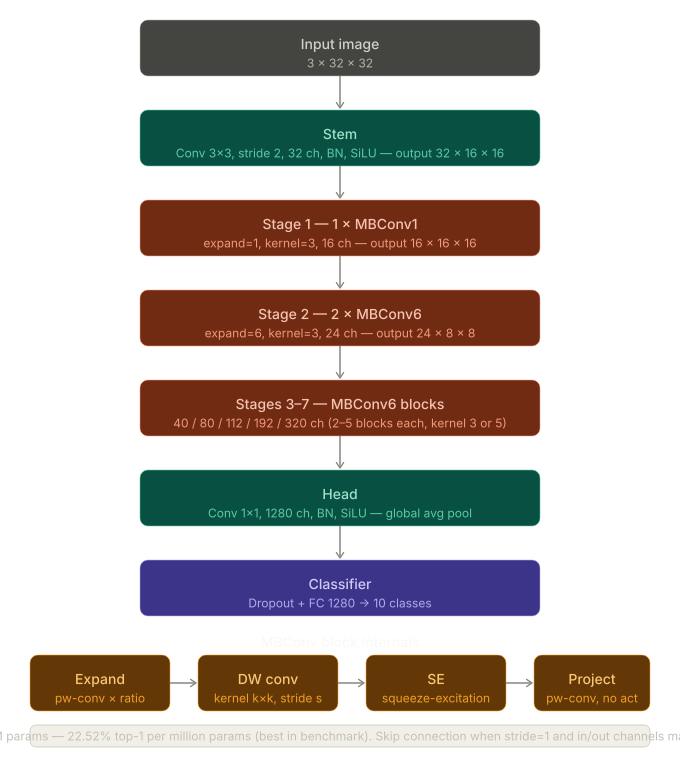
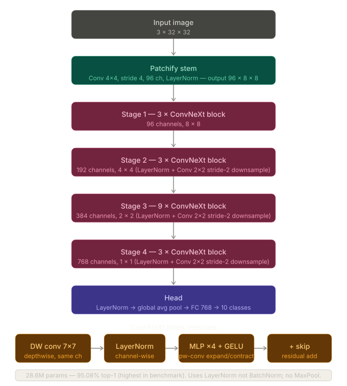
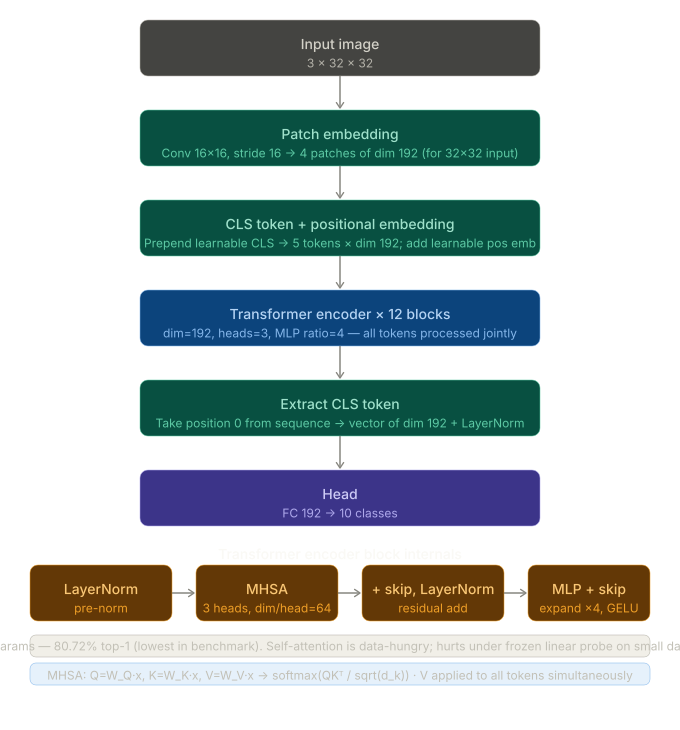
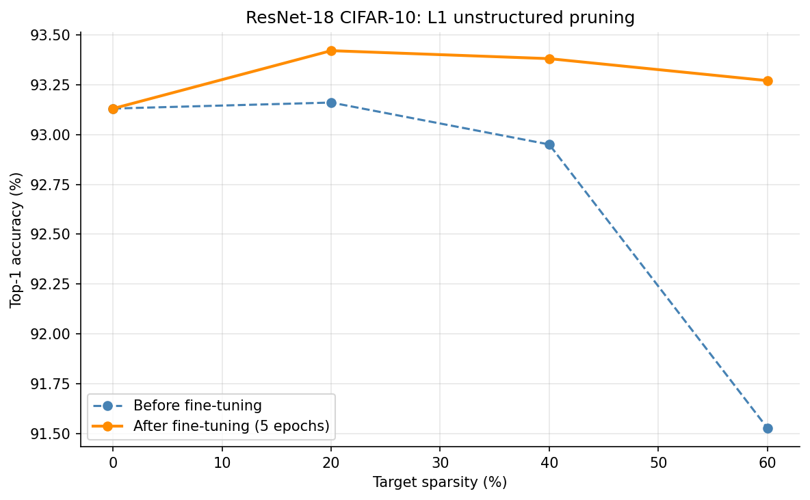

# Advanced CV and Efficient Models

Efficient neural network architectures and model compression techniques applied to
CIFAR-10 image classification. All compression experiments use a ResNet-18 baseline
(93.43% top-1, 11.17M parameters) trained from scratch in the companion
`computer-vision-foundations` module.

## Contents

- [Architecture Benchmark](#architecture-benchmark)
- [Knowledge Distillation](#knowledge-distillation)
- [Post-Training Quantization](#post-training-quantization)
- [Unstructured Pruning](#unstructured-pruning)
- [Compression Summary](#compression-summary)
- [Visualizations](#visualizations)
- [Code Structure](#code-structure)
- [Reproducing Results](#reproducing-results)
- [References](#references)

---

## Architecture Benchmark

Linear probe evaluation over frozen pretrained backbones from `timm` on CIFAR-10.
Features were extracted from the frozen encoder, L2-normalized, and fed into a
logistic regression classifier (C=0.316). This protocol
isolates representational quality from task-specific fine-tuning.

| Architecture   | Top-1 (%) | Parameters (M) | Accuracy / Param (%/M) |
|----------------|-----------|----------------|------------------------|
| ConvNeXt-Tiny  | 95.08     | 28.6           | 3.32                   |
| EfficientNet-B0| 90.06     | 4.0            | 22.52                  |
| ResNet-18      | 83.83     | 11.7           | 7.17                   |
| ViT-Tiny       | 80.72     | 5.7            | 14.16                  |

EfficientNet-B0 achieves the best accuracy-per-parameter ratio at 22.52%/M,
consistent with the compound scaling hypothesis of Tan and Le (2019). ConvNeXt-Tiny
leads in absolute accuracy, supporting the finding of Liu et al. (2022) that modern
ConvNet designs remain competitive with vision transformers at smaller dataset scales.
ViT-Tiny's lower accuracy reflects its data hunger: self-attention requires
large-scale pretraining to learn competitive visual representations, and the frozen
linear probe setting amplifies this gap.

---
# Architecture Diagrams — README insert

Paste the section below **between the Architecture Benchmark table and the Knowledge Distillation
section** in compression_readme.md.

Save each screenshotted diagram as a PNG in `plots/architectures/` inside your repo:

  plots/
  └── architectures/
      ├── resnet18.png
      ├── smallcnn.png
      ├── efficientnet_b0.png
      ├── convnext_tiny.png
      └── vit_tiny.png

---

## Paste this block into compression_readme.md

---

### Architecture overviews

**ResNet-18 (teacher)**



Stem (Conv 7×7, BN, ReLU) → four residual stages (64 / 128 / 256 / 512 channels, 2 blocks each)
→ global average pool → FC 512→10. Each ResBlock applies two 3×3 convolutions with a skip
connection; the shortcut uses a 1×1 Conv when channel count or stride changes.

---

**SmallCNN (student)**



Three convolutional blocks (3→32, 32→64, 64→256 channels), each followed by BatchNorm, ReLU, and
pooling. Block 3 uses AdaptiveAvgPool(1) in place of MaxPool to collapse the spatial dimensions
to 1×1 before a single FC 256→10 head. No skip connections. Total: 170K parameters — 65× smaller
than the ResNet-18 teacher.

---

**EfficientNet-B0 (benchmark)**



Stem Conv 3×3 (32 ch) → one MBConv1 stage → six MBConv6 stages of increasing width and depth
→ head Conv 1×1 (1280 ch) → global pool → FC. Each MBConv block expands channels by a factor of 6
(except stage 1), applies a depthwise 3×5 convolution, passes through squeeze-and-excitation, then
projects back down. Best accuracy-per-parameter in the benchmark at 22.52 %/M.

---

**ConvNeXt-Tiny (benchmark)**



Patchify stem (Conv 4×4, stride 4, 96 ch) → four stages (3/3/9/3 ConvNeXt blocks, 96/192/384/768 ch)
→ LayerNorm + global pool → FC 768→10. Each ConvNeXt block uses a depthwise 7×7 convolution,
LayerNorm (not BatchNorm), an inverted-bottleneck pointwise MLP with GELU, and a skip connection.
Highest absolute accuracy in the benchmark at 95.08%.

---

**ViT-Tiny (benchmark)**



Image → 16×16 patch embedding (196 tokens, dim=192) → prepend CLS token + learnable positional
embedding (197 tokens total) → 12 transformer encoder blocks (3-head MHSA + MLP ×4, dim=192)
→ extract CLS token → LayerNorm → FC 192→10. Lower accuracy than ConvNets under frozen linear probe
evaluation because self-attention requires large-scale pretraining to learn competitive representations.

---

## Knowledge Distillation

A SmallCNN student (170K parameters, 3 conv blocks) was trained to mimic a ResNet-18
teacher (11.17M parameters) using the combined KD and CE loss of Hinton et al. (2015):

```
L = alpha * T^2 * KL(softmax(z_t/T) || softmax(z_s/T)) + (1 - alpha) * CE(z_s, y)
```

where `z_s` and `z_t` are student and teacher logits, `T` is temperature, and `alpha`
weights the soft-target KL term. The `T^2` factor restores gradient magnitudes after
dividing logits by `T`, keeping `alpha` a stable hyperparameter across temperature
values. Both distillation and CE baseline students were trained with Adam (lr=1e-3)
and CosineAnnealingLR over 30 epochs.

**Hyperparameters:** T=4.0, alpha=0.3, 30 epochs, batch size 128, Adam lr=1e-3,
CosineAnnealingLR.

### Student architecture: SmallCNN

```
Block 1: Conv(3->32)  + BN + ReLU + MaxPool(2) -> 16x16
Block 2: Conv(32->64) + BN + ReLU + MaxPool(2) ->  8x8
Block 3: Conv(64->256)+ BN + ReLU + AdaptiveAvgPool(1) -> 1x1
Linear(256, 10)
```

### Results

| Model                  | Parameters  | Size (MB) | Latency (ms) | Top-1 (%) |
|------------------------|-------------|-----------|--------------|-----------|
| ResNet-18 (teacher)    | 11,173,962  | 42.63     | 12.44        | 93.43     |
| SmallCNN (distilled)   | 170,378     | 0.65      | 0.86         | 78.33     |
| SmallCNN (CE baseline) | 170,378     | 0.65      | 0.84         | 78.97     |

Latency: single-sample CPU inference, median of 100 runs.

The distilled student achieves 65.6x parameter reduction and 14.4x speedup over the
teacher at a 15.10pp accuracy cost. The distillation gain over the CE baseline is
-0.64pp -- the baseline marginally outperforms the distilled student with these
hyperparameters.

This result is consistent with the capacity-gap analysis: at 65x compression, student
capacity is the binding constraint rather than the training signal. The soft targets
from the teacher encode inter-class similarity structure, but the 3-block student
cannot fully absorb it. With alpha=0.3, the KL term introduces noise relative to the
dominant CE signal (70% weight) that is not offset by the additional information in
the soft targets at this compression ratio. A larger student or higher alpha would
be expected to widen the distillation gap in the positive direction.

### Plots

Loss breakdown (distillation run):


Validation accuracy comparison:


---

## Post-Training Quantization

PTQ was applied to the ResNet-18 checkpoint using PyTorch's quantization pipeline
(`torch.ao.quantization`). Both dynamic and static schemes were evaluated on CPU.
Latency is measured as single-sample median over 100 runs.

**Quantization map:** `x_int = clamp(round(x_float / scale) + zero_point, q_min, q_max)`

Static PTQ used per-channel weight quantization and per-tensor unsigned INT8 activation
quantization, following Jacob et al. (2018). Conv-BN fusion was applied before
calibration to eliminate intermediate requantization steps. Calibration used 100
CIFAR-10 training batches with MinMax observers.

| Method                      | Size (MB) | Latency (ms) | Top-1 (%) | Delta (pp) |
|-----------------------------|-----------|--------------|-----------|------------|
| FP32 baseline               | 42.70     | 9.47         | 93.43     | --         |
| INT8 dynamic (Linear only)  | 42.69     | 18.80        | 93.44     | +0.01      |
| INT8 static (PTQ)           | 10.80     | 6.21         | 93.44     | +0.01      |

Dynamic quantization produces no meaningful size reduction because ResNet-18 is
almost entirely Conv2d layers. PyTorch does not support dynamic quantization for
Conv2d, so only the final fully-connected layer (5,120 of 11.17M parameters) is
quantized. The latency increase reflects dequantization overhead on a
convolution-dominated model where the quantized FC layer contributes negligibly to
total compute.

Static PTQ achieves a 3.95x size reduction (42.70 MB to 10.80 MB) and 1.52x latency
reduction (9.47 ms to 6.21 ms) with no measurable accuracy degradation, consistent
with well-calibrated INT8 PTQ results on ResNet-class models reported in Nagel et
al. (2021).

---

## Unstructured Pruning

L1 magnitude pruning (Han et al., 2015) was applied to all Conv2d weight tensors
using `torch.nn.utils.prune.l1_unstructured`, followed by 5 epochs of fine-tuning
with SGD (lr=1e-3, momentum=0.9, weight_decay=5e-4) with masks held fixed. Masks
were then made permanent via `prune.remove`.

| Target sparsity | Actual sparsity | Top-1 before FT (%) | Top-1 after FT (%) | Delta vs baseline (pp) |
|-----------------|-----------------|---------------------|--------------------|------------------------|
| 0% (baseline)   | 0.0%            | 93.43               | 93.43              | --                     |
| 20%             | 20.0%           | 93.45               | 93.17              | -0.26                  |
| 40%             | 40.0%           | 93.21               | 93.27              | -0.16                  |
| 60%             | 60.0%           | 91.56               | 93.16              | -0.27                  |

5-epoch fine-tuning recovers accuracy to within 0.27pp of the dense baseline at all
three sparsity levels. At 60% sparsity, the pre-fine-tuning degradation is 1.87pp;
fine-tuning closes this to 0.27pp below baseline.

These results do not translate to runtime improvements. L1 unstructured pruning zeroes
individual weights within a dense float32 tensor without changing its shape. Standard
CPU matrix multiplication kernels process zero-valued weights identically to non-zeros,
so model size and latency remain equal to the FP32 baseline after mask removal.
Structured pruning (filter or channel removal) would be required to achieve actual
size and latency reductions.

Sparsity vs accuracy:



---

## Compression Summary

All methods applied to the same ResNet-18 baseline (93.43%, 11.17M parameters).
Latency is single-sample CPU inference, median of 100 runs. The student model is a
different architecture (SmallCNN, 170K parameters) and is not directly comparable
to the quantization and pruning rows, which all operate on ResNet-18.

| Method                     | Params (M) | Size (MB) | Latency (ms) | Top-1 (%) |
|----------------------------|------------|-----------|--------------|-----------|
| ResNet-18 (FP32 baseline)  | 11.17      | 42.70     | 9.47         | 93.43     |
| + Dynamic INT8             | 11.17      | 42.69     | 18.80        | 93.44     |
| + Static INT8 (PTQ)        | 11.17      | 10.80     | 6.21         | 93.44     |
| + Pruning 40% (L1 unstr.)  | 11.17      | 42.70     | 9.47*        | 93.27     |
| SmallCNN (distilled)       | 0.17       | 0.65      | 0.86         | 78.33     |
| SmallCNN (CE baseline)     | 0.17       | 0.65      | 0.84         | 78.97     |

*Pruning latency equals FP32 baseline -- unstructured pruning has no CPU speedup
without sparse kernels.

Static PTQ is the most practical compression technique for this architecture: 3.95x
size reduction and 1.52x speedup with no accuracy cost and no retraining. Distillation
yields 65.6x parameter reduction and 14.4x speedup but at a 15.10pp accuracy cost
and, at this compression ratio, no benefit over CE-only training.

---

## Visualizations

**`plots/distillation/soft_target_distributions.png`**
Softmax output of the teacher at T=1, 2, 4, and 8 for four representative CIFAR-10
samples. At T=1 the distribution is near-degenerate -- the correct class receives
close to 100% probability and soft targets carry no more information than hard labels.
At T=4, inter-class similarity structure emerges: a cat sample assigns non-trivial
probability to dog and deer; a ship sample spreads probability onto airplane and truck.
At T=8 the distribution approaches uniform and the correct class signal degrades. This
is the empirical justification for T=4 as the operating point.

**`plots/distillation/distill_loss_breakdown.png`**
Per-epoch training loss decomposed into the combined loss, KD term
(T^2 * KL divergence), and CE term over 30 epochs. The KD loss is
consistently larger in scale than the CE term -- expected, since KL divergence between
two distributions over 10 classes is naturally larger than cross-entropy against a
one-hot target. The ratio between them decreases as the student distribution converges
toward the teacher.

**`plots/distillation/val_accuracy_comparison.png`**
Validation accuracy over 30 epochs comparing distillation vs CE baseline. The plot
legend reflects training-time validation accuracy logged on Kaggle (distillation best
77.73%, baseline best 78.93%). Evaluation of the saved checkpoints on the local test
set gives 78.33% and 78.97% respectively (see Results table); the small difference
reflects run-to-run variance in validation accuracy across epochs. The ordering is
consistent: the baseline converges faster and finishes higher, consistent with the
capacity-gap interpretation.

**`experiments/pruning/sparsity_accuracy.png`**
Top-1 accuracy at each sparsity level before and after 5-epoch fine-tuning. Shows the
pre-fine-tuning degradation growing with sparsity (negligible at 20%, 1.87pp at 60%)
and the recovery capacity of fine-tuning, which brings all three sparsity levels to
within 0.27pp of the dense baseline.

---

## Code Structure

```
Advanced CV & Efficient Models/
├── code/
│   ├── efficient_architectures/
│   │   ├── efficientnet.py            # EfficientNet-B0 from scratch
│   │   ├── convnext.py                # ConvNeXt-Tiny from scratch
│   │   └── receptive_field_analysis.py
│   └── compression/
│       ├── distillation.py            # SmallCNN, distillation_loss, build_student
│       ├── train_distillation.py      # Training script: distill and CE baseline modes
│       ├── quantization.py            # PTQ: dynamic and static quantization
│       ├── pruning_kaggle.ipynb       # L1 unstructured pruning (Kaggle GPU)
│       ├── distillation-kaggle.ipynb  # Distillation training (Kaggle GPU)
│       ├── inference_benchmark.py     # Latency benchmark: teacher vs student
│       └── visualize_soft_targets.py  # Soft target distributions at T=1,2,4,8
├── experiments/
│   ├── benchmark_architecture.py      # Linear probe over timm backbones
│   └── pruning/
│       └── sparsity_accuracy.png
└── notes/
    ├── knowledge_distillation.md
    └── networks_comparison.md
```

---

## Reproducing Results

All scripts resolve data to `<repo_root>/data/` via
`Path(__file__).resolve().parents[N] / "data"`. Run all commands from the repo root.

```bash
# Architecture linear probe benchmark
python "Advanced CV & Efficient Models/experiments/benchmark_architecture.py"

# Post-training quantization
python "Advanced CV & Efficient Models/code/compression/quantization.py"

# Knowledge distillation (Kaggle GPU recommended, ~25 min on T4)
# Upload distillation-kaggle.ipynb and resent_input dataset, then run all cells.

# Pruning (Kaggle GPU recommended)
# Upload pruning_kaggle.ipynb and resent_input dataset, then run all cells.

# Inference benchmark: teacher vs student
python "Advanced CV & Efficient Models/code/compression/inference_benchmark.py"
```

**Environment:** Python 3.12, PyTorch, timm, scikit-learn.

```bash
pip install -e .
```

---

## References

- Hinton, G., Vinyals, O., and Dean, J. (2015). Distilling the Knowledge in a Neural
  Network. arXiv:1503.02531. https://arxiv.org/abs/1503.02531
- Han, S., Pool, J., Tran, J., and Dally, W. (2015). Learning both Weights and
  Connections for Efficient Neural Networks. NeurIPS.
  https://arxiv.org/abs/1506.02626
- Jacob, B., Kligys, S., Chen, B., Zhu, M., Tang, M., Howard, A., Adam, H., and
  Kalenichenko, D. (2018). Quantization and Training of Neural Networks for Efficient
  Integer-Arithmetic-Only Inference. CVPR. https://arxiv.org/abs/1712.05877
- Nagel, M., Fournarakis, M., Amjad, R. A., Bondarenko, Y., van Baalen, M., and
  Blankevoort, T. (2021). A White Paper on Neural Network Quantization.
  https://arxiv.org/abs/2106.08295
- Tan, M. and Le, Q. V. (2019). EfficientNet: Rethinking Model Scaling for
  Convolutional Neural Networks. ICML. https://arxiv.org/abs/1905.11946
- Liu, Z., Mao, H., Wu, C.-Y., Feichtenhofer, C., Darrell, T., and Xie, S. (2022).
  A ConvNet for the 2020s. CVPR. https://arxiv.org/abs/2201.03545