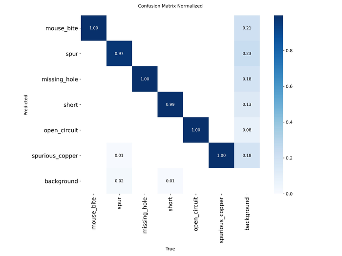
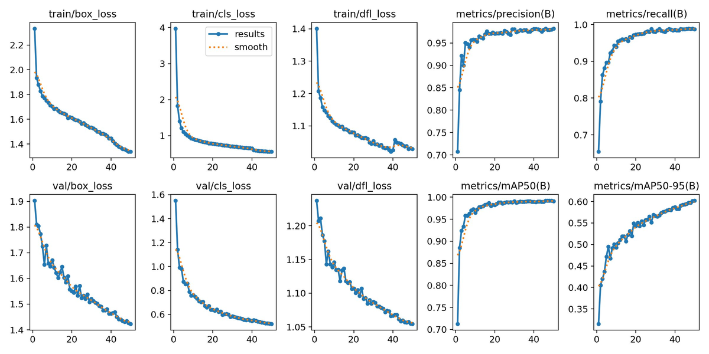

# Object Detection: PCB Defect Detection with YOLOv8n

Fine-tuning of Ultralytics YOLOv8n on a six-class printed-circuit-board defect dataset, together with NumPy implementations of the detection metrics used to evaluate it. The YOLOv8n weights are the Ultralytics pretrained baseline. The metrics in `metrics.py` are written from scratch.

## Results

Test set: 801 images, 1,621 instances.

| Metric | Value |
| :--- | ---: |
| mAP@0.5 | 0.9896 |
| mAP@0.5:0.95 | 0.6025 |
| Precision | 0.9769 |
| Recall | 0.9837 |

The model has 3,006,818 parameters and 8.1 GFLOPs, and occupies 6.0 MB on disk. Inference takes 3.9 ms per image on a Tesla T4 (inference only), or about 6 ms including pre- and post-processing.

The 0.39 gap between mAP@0.5 (0.9896) and mAP@0.5:0.95 (0.6025) is consistent with localisation difficulty on small defects, since bounding boxes concentrate at roughly 3 to 7% of the image width and height.





## Dataset

The six classes are mouse_bite, spur, missing_hole, short, open_circuit and spurious_copper, and their instance counts are approximately balanced. The 8,001 matched image-label pairs are divided by a fixed 80/10/10 random split with seed 42 into train, validation and test sets. `dataset.yaml` holds the Ultralytics dataset configuration, and the Dataset section of `yolov8_pcb.md` documents provenance.

## Metrics implemented from scratch

`metrics.py` provides `compute_iou`, `non_max_suppression`, `compute_ap` and `compute_map` in NumPy. `test_metrics.py` covers them with 25 unit tests that use synthetic boxes only.

```bash
python -m pytest "Advanced CV & Efficient Models/code/detection/" -v
```

## Files

| File | Contents |
| :--- | :--- |
| `metrics.py` | IoU, non-maximum suppression, average precision and mAP |
| `test_metrics.py` | 25 unit tests for the metrics |
| `yolov8_pcb_kaggle.ipynb`, `yolov8-pcb-kaggle.log` | Kaggle training notebook and its log |
| `yolov8_pcb.md` | Dataset, training configuration, test results, training dynamics and error analysis |
| `walkthrough.md` | Module walkthrough, including a section titled "Honest Assessment of the Results" |
| `dataset.yaml` | Ultralytics dataset configuration |
| `plots/` | Confusion matrices, precision-recall and F1 curves, and training curves |
