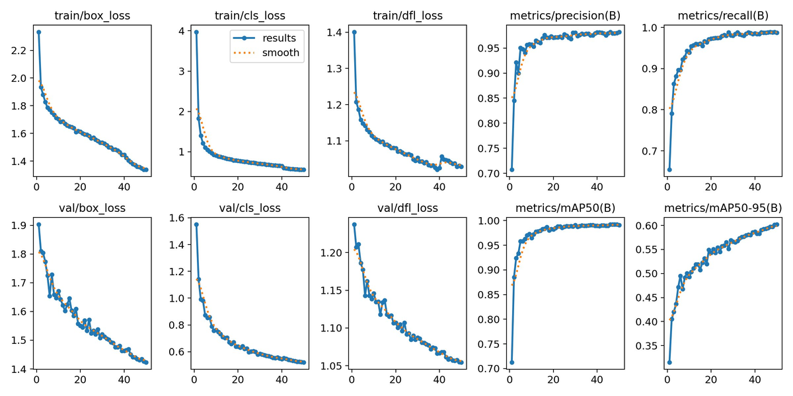
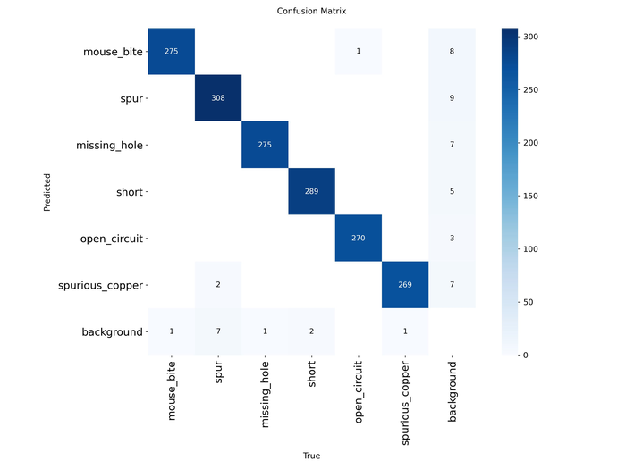
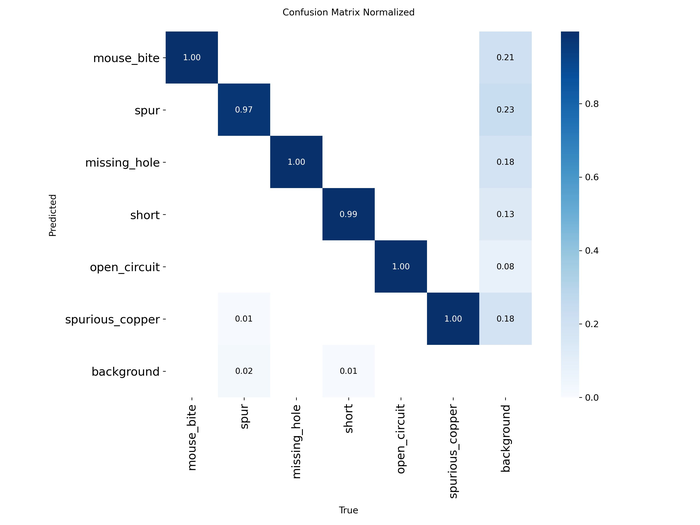
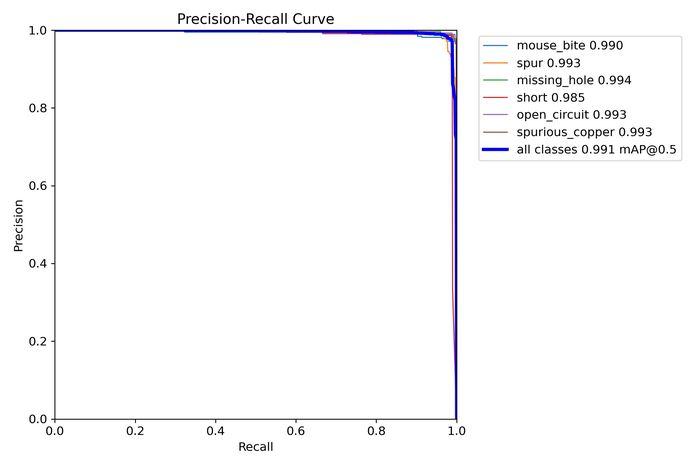
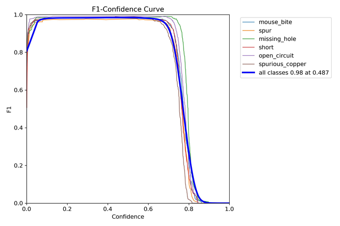

# YOLOv8n PCB Defect Detection

**Model:** YOLOv8n (Ultralytics 8.4.33)
**Task:** 6-class industrial defect detection on PCB images
**Dataset:** PCB Defect Dataset (Norbert Elter, Kaggle)
**Hardware:** Tesla T4 GPU (Kaggle)
**Notebook:** `yolov8_pcb_kaggle.ipynb`
**Weights:** `weights/best_pcb_yolov8n.pt`

---

## Dataset

The source dataset contains 10,668 images across 6 defect classes. Only images
with a matching label file were used (8,001 matched pairs). The pre-existing
train/val/test split was discarded and replaced with a fixed 80/10/10 random
split (seed=42) to ensure reproducibility and control over split proportions.
Images without a corresponding label file (2,667) were excluded.

| Split | Images |
|-------|--------|
| train | 6,400  |
| val   | 800    |
| test  | 801    |

**Class distribution:** Approximately balanced across all six classes (roughly
2,060-2,206 instances per class across the full dataset), as shown in the label
distribution plot below. Defect locations are uniformly distributed across image
coordinates with no spatial clustering. All defects are small relative to image
size: bounding box dimensions are tightly concentrated around 3-7% of image
width and height, making this a small-object detection task.


**dataset.yaml:**

```yaml
path: /kaggle/working/pcb_dataset
train: images/train
val: images/val
test: images/test
nc: 6
names:
- mouse_bite
- spur
- missing_hole
- short
- open_circuit
- spurious_copper
```

---

## Training Configuration

| Parameter | Value |
|-----------|-------|
| Base model | yolov8n.pt (COCO pretrained) |
| Epochs | 50 |
| Image size | 640 |
| Batch size | 16 |
| Optimizer | SGD (lr0=0.01, lrf=0.01) |
| Augmentation | Default YOLOv8 (mosaic, fliplr=0.5, HSV jitter, erasing=0.4) |
| AMP | True |
| Seed | 42 |

---

## Results (test set, 801 images, 1,621 instances)

| Metric | Value |
|--------|-------|
| mAP@0.5 | 0.9896 |
| mAP@0.5:0.95 | 0.6025 |
| Precision | 0.9769 |
| Recall | 0.9837 |
| Optimal confidence threshold | 0.487 |

**Per-class AP@0.5:**

| Class | AP@0.5 |
|-------|--------|
| mouse_bite | 0.9872 |
| spur | 0.9923 |
| missing_hole | 0.9920 |
| short | 0.9873 |
| open_circuit | 0.9944 |
| spurious_copper | 0.9840 |

All six classes exceed 0.984 AP@0.5. The worst-performing class (spurious_copper
at 0.9840) and the best (open_circuit at 0.9944) differ by less than 1.1
percentage points, indicating consistent performance across defect types.

**Inference speed:** 3.9ms per image (inference only), ~6ms total including
pre/postprocessing, on Tesla T4.

**Model size:** 3,006,818 parameters, 8.1 GFLOPs, 6.0MB on disk.

---

## Training Dynamics



All three loss components (box, cls, dfl) decrease monotonically across 50
epochs on both train and val sets with no sign of overfitting: train and val
loss curves track closely throughout. Validation loss continues to decrease at
epoch 50, suggesting additional epochs would yield marginal further gains.
mAP@0.5 reaches approximately 0.95 by epoch 5 and plateaus near 0.99 around
epoch 15; mAP@0.5:0.95 continues improving through epoch 50, indicating that
tight box localization is still being refined at run end.

---

## Error Analysis

### Confusion Matrix





The diagonal is near-perfect. The only meaningful off-diagonal signal is in the
background column of the normalized matrix: the model fires false positive
detections on unannotated background regions at rates of 21% (mouse_bite) and
23% (spur). The remaining classes show lower false positive rates against
background (8-18%). Cross-class confusion between defect types is negligible,
with at most 1-2 raw counts anywhere off the main diagonal. This pattern
suggests the primary failure mode is not misclassification between defect types
but rather occasional detections on visually ambiguous background texture,
particularly for mouse_bite and spur.

### Precision-Recall Curve



All six classes maintain precision near 1.0 across the full recall range up to
approximately 0.97-0.99 recall, at which point precision drops sharply. The
near-rectangular shape of each curve indicates that the model's ranking of
detections by confidence score is nearly perfect: it retrieves almost all true
positives before producing any false positives. AP@0.5 values of 0.984-0.994
per class confirm this. Note that the legend reports mAP@0.5 = 0.991, which
reflects the validation set; the held-out test set value is 0.9896.

### F1-Confidence Curve



Peak F1 of 0.98 is achieved at confidence threshold 0.487, consistent across
all classes. F1 remains above 0.95 for confidence values from approximately
0.05 to 0.75, giving a wide operational range with minimal sensitivity to
threshold selection within that interval. The sharp drop above 0.75-0.80
reflects that at high confidence thresholds, true positives with moderate
confidence scores begin to be suppressed. The recommended operating threshold
for deployment is 0.487.

### Inference Samples


Test set predictions at confidence threshold 0.25. The model correctly
localizes defects across all represented classes (open_circuit, mouse_bite,
missing_hole, spurious_copper, short). Multiple instances of the same defect
type within a single image are detected independently, as visible in the
open_circuit and spurious_copper examples.

---

## Notes on Results Quality

The strong mAP@0.5 (0.99) reflects characteristics specific to this dataset:
images are 600px crops at controlled, consistent lighting; defect types are
visually distinctive from one another; and the class distribution is balanced.
The gap between mAP@0.5 (0.99) and mAP@0.5:0.95 (0.60) is the more diagnostic
figure. It indicates that while the model reliably detects defects, tight box
localization at IoU thresholds above 0.5 is harder, which is expected for small
(~5% image width), irregular defect shapes. The false positive rate against
background (8-23% depending on class) is worth monitoring if this model is
applied to full-board images where the background region is much larger relative
to defect instances than in these pre-cropped crops.
