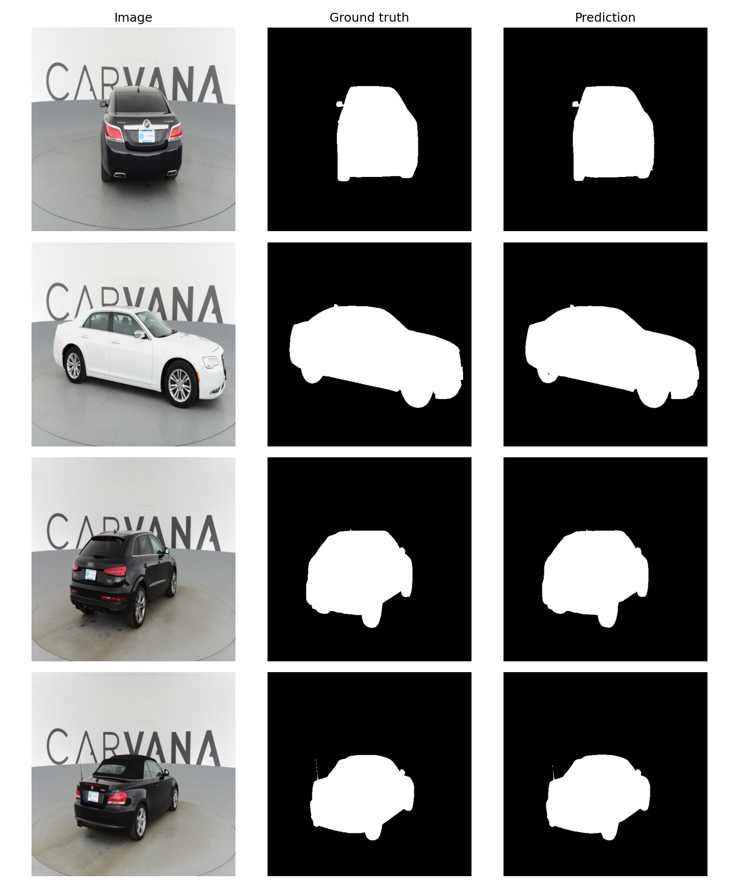
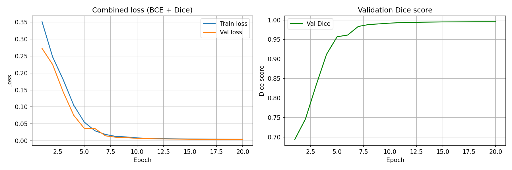

# Semantic Segmentation: U-Net from Scratch

A U-Net implemented from `nn.Module` primitives and trained on two datasets: Carvana (car masks, RGB) and LGG MRI (brain tumour masks, single channel). Carvana has a recorded evaluation. The LGG run trains and checkpoints but has no recorded evaluation metric, so no figure is quoted for it.

## Results

Carvana, 508 validation images (per-image values in `outputs/evaluation_results.csv`):

| Metric | Mean | Minimum | Maximum |
| :--- | ---: | ---: | ---: |
| Dice | 0.9955 | 0.9868 | 0.9973 |
| IoU | 0.9932 | 0.9764 | 0.9967 |

| Dataset | Input | Configuration |
| :--- | :--- | :--- |
| Carvana Image Masking | 512 x 512, 3 channels | 20 epochs, batch size 8, learning rate 1e-4, AdamW, OneCycleLR, mixed precision, 10% validation split, seed 42 |
| LGG MRI | 256 x 256, 1 channel | 20 epochs, batch size 4, learning rate 1e-4, ReduceLROnPlateau, patient-level 90/10 split, seed 42 |

The LGG split is drawn over patients, so every slice of a given patient lies entirely in the training set or entirely in the validation set, which prevents anatomy leakage across slices.



The four examples illustrate the output format. The per-image distribution of Dice and IoU is in `outputs/metrics_histogram.png`.



## Implementation

`unet.py` defines `DoubleConv`, `Down`, `Up` and `UNet`. Each `DoubleConv` applies two 3x3 convolutions with batch normalisation and ReLU. Convolutions use same-padding, so the output matches the input's spatial size; the original paper used unpadded convolutions and cropped the skip connections. `Up` supports bilinear upsampling and transposed convolution.

The training objective is 0.3 x binary cross-entropy + 0.7 x Dice loss (`alpha` = 0.3 is the BCE weight in the training configuration), with `dice_loss` defined in `segmentation_loss.py`.

`test_unet.py` holds 16 unit tests, including shape preservation, odd-sized and non-square inputs, batch size one, output dtype and gradient flow.

```bash
python -m pytest "Advanced CV & Efficient Models/code/segmentation/" -v
```

## Files

| File | Contents |
| :--- | :--- |
| `unet.py` | U-Net building blocks and the full model |
| `segmentation_loss.py` | Dice loss for the combined objective |
| `train_unet.py` | Training script for the LGG MRI run |
| `train_unet_carvana.ipynb`, `train-unet-carvana.log` | Carvana training notebook (Kaggle) and log |
| `evaluate_unet_carvana.ipynb` | Carvana evaluation notebook |
| `test_unet.py` | 16 unit tests |
| `u-net_paper.md` | Notes on the U-Net paper, with a section on the Mask R-CNN mask head |
| `outputs/` | Evaluation results, prediction grids, metric histogram and training curves |

Reference: Ronneberger, Fischer and Brox, "U-Net: Convolutional Networks for Biomedical Image Segmentation", MICCAI 2015 ([arXiv:1505.04597](https://arxiv.org/abs/1505.04597)).
