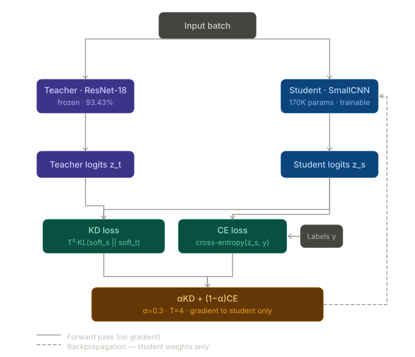
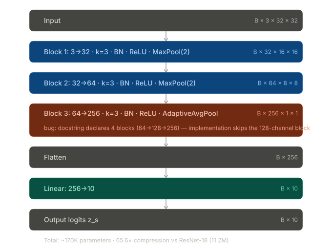
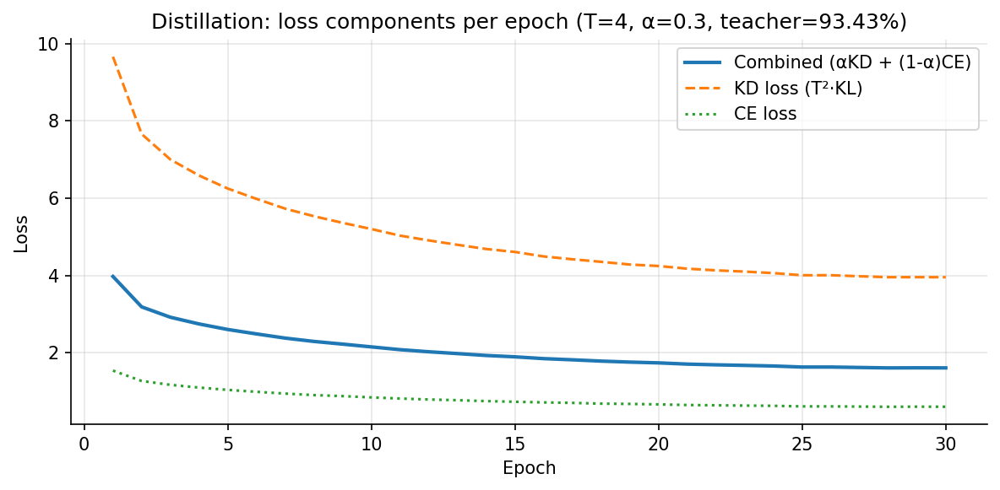
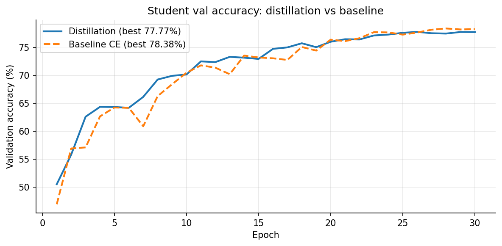
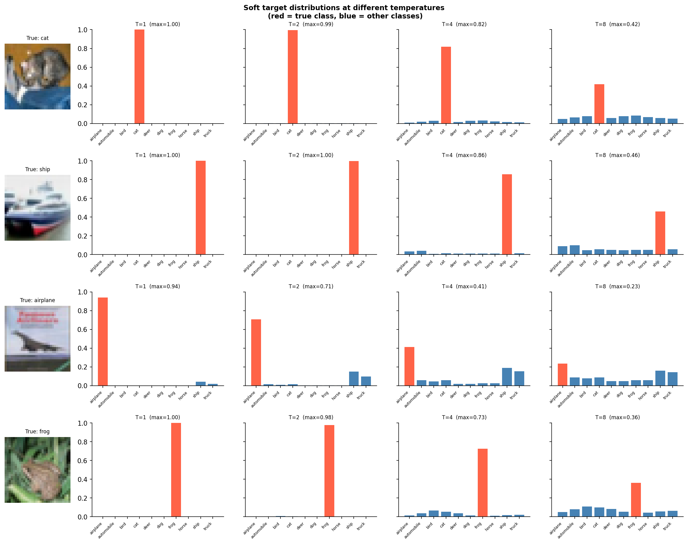

# Knowledge Distillation

**Paper:** "Distilling the Knowledge in a Neural Network" - Hinton, Vinyals & Dean, 2015  
**Link:** https://arxiv.org/abs/1503.02531
**Implementation:** `code/compression/distillation.py`, `code/compression/train_distillation.py`

---

## Core Idea

A large, accurate model (teacher) contains more information in its output distribution than the hard one-hot labels alone. When the teacher predicts, say, 85% cat / 12% dog / 3% other, the 12% dog probability is not noise - it encodes the teacher's learned belief that cats and dogs share visual features. Training a smaller model (student) to match these soft distributions transfers that structured knowledge, not just the final decision.

This is the central insight: **hard labels tell you what the answer is; soft labels tell you how similar the wrong answers are to each other.**

---

## Architecture Diagrams

### Knowledge Distillation Pipeline

The diagram below shows the full forward and backward pass. Purple = teacher
(frozen), blue = student (trainable), teal = loss components, amber = combined
loss. The dashed line is the gradient flowing back - it reaches only the student.

**Distillation Pipeline:**  
How teacher logits and student logits feed both loss terms, and how backprop flows only to the student.




**SmallCNN architecture:** each row shows the operation, the channel progression, and the output tensor shape.



---

## The Loss Function

The combined distillation loss has two terms:

```text
L = α · T² · KL(softmax(z_s/T) ‖ softmax(z_t/T)) + (1 - α) · CE(z_s, y)
```

Where:
- `z_s` - student logits
- `z_t` - teacher logits (frozen, no gradient)
- `T` - temperature
- `α` - weight on the soft-target KL term
- `y` - ground truth hard labels

This is a reparameterisation of the loss in Hinton et al. (their Eq. 4), where the distillation term is written in terms of cross-entropy between softened outputs.

### Temperature T

Dividing logits by T before softmax flattens the probability distribution. At T=1 the model is confident (peaked distribution). At higher T (e.g. T=4) the distribution is softer, making the small inter-class probabilities (e.g. the 12% dog) much more visible and learnable.

Without temperature scaling, the teacher's distribution is often so peaked that non-maximum probabilities are effectively negligible after softmax - the soft target degenerates toward a hard label, and the KL term carries little extra information beyond CE.

### The T² Multiplier

The full combined loss from the paper (Eq. 4) is:

```text
L = (1 - α) · H(y, σ(z_s; T=1)) + α · H(σ(z_t; T), σ(z_s; T))
```

Where H is cross-entropy and σ is softmax at temperature T. Hinton et al. argue that when logits are divided by T, the gradients from the distillation term scale approximately as 1/T². Without compensating, increasing T would reduce the effective strength of the distillation term.

Multiplying the distillation term by T² restores its gradient scale so that, across different temperatures, α continues to control the intended balance between distillation and hard-label loss.

In implementation this becomes the KL form shown at the top of this section, with the T² scaling factor applied explicitly. Because the teacher distribution is fixed, KL(softmax(z_s/T) ‖ softmax(z_t/T)) and the cross-entropy H(σ(z_t; T), σ(z_s; T)) differ only by the (constant) entropy of the teacher’s distribution.

### Alpha α

α controls the balance between learning from the teacher (soft targets) and the ground truth labels (hard targets). In our experiments we set α=0.3, placing more weight on the distillation term than on the hard-label CE, in line with common practice in KD for vision tasks. Setting α=0 reduces to standard CE training with no teacher, which serves as the baseline condition.

---

## Why It Works: Dark Knowledge

The teacher's soft predictions encode **inter-class similarity structure** learned from the full dataset. For example, a model trained on ImageNet can learn that Persian cats look more like Siamese cats than like trucks, and this similarity is embedded in the off-diagonal probabilities of its output distribution.  
The student absorbs this structure during training, effectively getting access to a richer training signal than one-hot labels provide.

This is analogous to how a student learns more from a detailed explanation of *why* an answer is correct than from just being told the correct answer.

---

## Architecture

The following teacher–student setup is specific to this project and is not part of the original KD paper, which focused on a large speech model and MNIST.

### Teacher: ResNet-18
- Parameters: ~11.2M
- CIFAR-10 accuracy: 93.43% (pre-trained checkpoint)
- Frozen during all distillation training - no gradients computed

### Student: SmallCNN
- Parameters: ~170K
- Architecture: 4 conv blocks + adaptive avg pool + linear
- Compression ratio: ~65.6× fewer parameters than teacher

```text
Block 1: Conv(3→32)    + BN + ReLU + MaxPool(2) → 16×16
Block 2: Conv(32→64)   + BN + ReLU + MaxPool(2) →  8×8
Block 3: Conv(64→128)  + BN + ReLU + MaxPool(2) →  4×4
Block 4: Conv(128→256) + BN + ReLU + AdaptiveAvgPool(1) → 1×1
Linear(256, 10)
```

---

## Hyperparameters

| Parameter | Value             | Rationale |
|---|-------------------|---|
| Temperature T | 4.0               | Common choice in KD for vision; T>1 softens targets |
| Alpha α | 0.3               | Project choice; gives more weight to the distillation term |
| Optimizer | Adam              | lr=1e-3 |
| Scheduler | CosineAnnealingLR | Smooth decay, no manual LR tuning |
| Epochs | 30                | Sufficient for student convergence on CIFAR-10 in this setup |
| Batch size | 128               | Standard for CIFAR-10 |

---

## Experiment Results

All experiments below are on CIFAR-10 with the ResNet-18 / SmallCNN configuration described above.

### Run 1 - Diagnostic (broken)

Training stalled at ~27% val_acc. Two bugs were present: a `return` statement inside the batch
loop caused the student to train on only one batch per epoch (1/390th of the data),
and fixed lr=1e-3 with no scheduler caused oscillation. This run illustrates that training
dynamics (data coverage, learning-rate schedule) can dominate the effect of distillation hyperparameters.

### Run 2 - Partial fix (wrong teacher, wrong normalisation)

After removing the early `return` and adding CosineAnnealingLR, we used an incorrect teacher checkpoint
(72.93% accuracy) and mismatched normalisation stats between teacher and students
(0.2023 vs 0.2470 standard deviation). Distillation reached 77.77% vs a baseline of 78.38% (Δ=-0.61pp).

This negative gap is consistent with the hypothesis that a weak teacher provides less useful soft targets, but we did not systematically vary teacher quality, so this should be treated as an observation rather than a definitive causal claim.

### Run 3 - Final (correct teacher, unified normalisation)

| | Distillation (T=4, α=0.3) | Baseline (CE only) |
|---|---|---|
| Best val_acc | 78.34% | 78.27% |
| Gap | **+0.07pp** | - |
| val_acc at epoch 1 | 45.61% | 48.26% |
| val_acc at epoch 5 | 61.89% | 62.42% |
| val_acc at epoch 10 | 68.59% | 70.02% |
| val_acc at epoch 20 | 75.91% | 76.61% |

With a strong teacher (93.43%) and matched normalisation, the distilled student slightly outperforms
the same architecture trained with hard labels only. The margin (+0.07pp) is small; given the 65.6×
parameter compression, it is plausible that student capacity is the limiting factor, but we did not
run larger students to confirm this hypothesis.

### Inference Benchmark (CPU, batch_size=128)

| Model | Parameters | Size | Val Acc | Latency/batch | Throughput |
|---|---|---|---|---|---|
| ResNet-18 (teacher) | 11,173,962 | 42.6 MB | 93.43% | 1117ms | 115 img/s |
| SmallCNN - distilled | 170,378 | 0.6 MB | 78.34% | 76ms | 1,676 img/s |
| SmallCNN - baseline CE | 170,378 | 0.6 MB | 78.27% | 67ms | 1,905 img/s |

**Compression ratio:** 65.6× parameters, ~71× model size  
**Speedup vs teacher:** ≈14.7× (distilled), ≈16.7× (baseline)  
**Accuracy cost:** ≈15.1pp vs teacher at ≈14.7× speedup

These latencies are specific to the hardware and implementation used here and should not be interpreted as universal KD speedups.

### Plots

Loss breakdown (distillation run):  


Validation accuracy comparison:  


---

## Key Observations

**On the KD vs CE loss gap:** in our runs, `kd_loss` was consistently larger than `ce_loss`, which is expected because the KL divergence between two distributions over 10 classes tends to be larger in scale than cross-entropy against a one-hot target. As training progresses and the student distribution becomes closer to both teacher and ground truth, both losses decrease.

**On the 65× compression:** with 170K parameters, the student is not expected to match the teacher's 93.43%. The relevant question for knowledge distillation is whether the student trained with soft targets outperforms the same student trained with hard labels alone. In the final run, KD yields a small but positive gain on this metric.

**On the frozen teacher:** during distillation training the teacher is kept in `eval()` mode with gradients disabled, as in the original KD formulation. Jointly updating the teacher and student during distillation could move the teacher away from its pre-trained optimum; analysing that regime is beyond the scope of these experiments.

---

## Soft Target Visualisation



Four correctly classified CIFAR-10 images at T=1, 2, 4, 8. Red bar = true class, blue = other classes.

At T=1 the teacher assigns near-100% to the correct class, so the soft target is essentially a hard label. By T=4 inter-class similarity structure becomes visible: cat gets non-trivial probability on dog and deer; ship gets probability on airplane
and truck; airplane (an ambiguous poster image) spreads across all vehicle classes. By T=8 the distribution can become so flat that the true class is no longer clearly dominant for
uncertain images, which is why T=8 is often too high in practice.

This provides empirical support in our setup for using T=4: it exposes the teacher's learned similarity structure without washing out the correct-class signal entirely.

---

## Variants and Extensions (not implemented)

**Feature-level distillation (FitNets, Romero et al., 2015):** instead of matching only the final logits, intermediate feature maps from the teacher are used as targets for corresponding student layers. This can transfer more information but typically requires some alignment between teacher and student architectures.

**Progressive distillation:** a general strategy where distillation is applied in stages (teacher → medium model → small model) rather than jumping directly from large to tiny. This idea appears in various KD works and surveys but is not analysed in detail here.

**Self-distillation (Zhang et al., 2019):** the model distills into itself across epochs, using earlier checkpoints as the teacher. No separate teacher model is required.

**Task-Agnostic Distillation (DistilBERT, Sanh et al., 2019):** applied to transformers in NLP; the same principles transfer directly - the architecture is different but the loss formulation is closely related.

---

## References

- Hinton, G., Vinyals, O., Dean, J. (2015). *Distilling the Knowledge in a Neural Network*. https://arxiv.org/abs/1503.02531
- Romero, A. et al. (2015). *FitNets: Hints for Thin Deep Nets*. https://arxiv.org/abs/1412.6550
- Sanh, V. et al. (2019). *DistilBERT: a distilled version of BERT*. https://arxiv.org/abs/1910.01108
- Gou, J. et al. (2021). *Knowledge Distillation: A Survey*. https://arxiv.org/abs/2006.05525