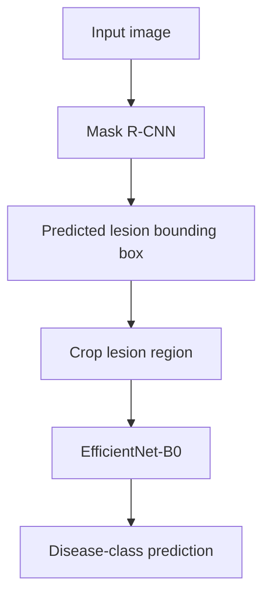

# Applied Machine Learning Portfolio

From-scratch PyTorch and NumPy implementations across computer vision, adversarial robustness and time-series forecasting, with measured benchmarks, tested components and documented failure modes.

[](https://www.python.org/)
[](https://pytorch.org/)
[](#testing-and-reproducibility)
[](license)

[Featured experiments](#featured-experiments) ·
[Explore projects](#explore-projects) ·
[Quickstart](#quickstart) ·
[Testing](#testing-and-reproducibility)

## What this repository demonstrates

- Implementation depth: manual gradients, custom architectures, loss functions, detection metrics and gradient-based attacks.
- Empirical evaluation: accuracy, robustness, latency, model size, segmentation quality and forecasting error.
- Engineering judgement: competitive baselines, unsuccessful experiments, stated evaluation limits and tests alongside the implementations.

Core architectures and selected components are implemented from `nn.Module` primitives or pure NumPy. Applied experiments also use pretrained backbones and established libraries (timm, torchvision and Ultralytics), and each of those is labelled where it appears. The phrase "from scratch" applies to the implementations named in this README. Reference models from torchvision, timm or Ultralytics serve as pretrained baselines: for example, `receptive_field_analysis.py` in `Advanced CV & Efficient Models/code/efficient_architectures/` loads torchvision's pretrained EfficientNet-B0 and ConvNeXt-Tiny to measure empirical receptive fields.

## Featured experiments

### Compression: smaller does not always mean faster

All experiments start from one ResNet-18 checkpoint (93.43% top-1, 11.17M parameters, trained from scratch on CIFAR-10).

| Configuration | Params (M) | Size (MB) | CPU latency (ms) | Top-1 accuracy |
| :--- | ---: | ---: | ---: | ---: |
| ResNet-18 FP32 baseline | 11.17 | 42.70 | 9.47 | 93.43% |
| Static INT8 PTQ | 11.17 | 10.80 | 6.21 | 93.44% |
| Dynamic INT8 PTQ | 11.17 | 42.69 | 18.80 | 93.44% |
| Pruning, 40% L1 unstructured | 11.17 | 42.70 | 9.47 | 93.27% |
| SmallCNN, distilled (T=4, alpha=0.3) | 0.17 | 0.65 | 0.86 | 78.33% |
| SmallCNN, cross-entropy baseline | 0.17 | 0.65 | 0.84 | 78.97% |

Static INT8 post-training quantisation gives a 3.95x size reduction and a 1.52x speedup at equal accuracy (93.44% against 93.43%, which is parity within run-to-run noise). Distilling into SmallCNN gives 65.6x fewer parameters (170,378 against 11,173,962) and an 11.0x speedup, and the distilled student trails the cross-entropy baseline by 0.64 points. Pruning 40% of the weights costs 0.16 points and gives no CPU speedup, because dense kernels process zero-valued weights exactly as they process non-zero ones; structured pruning would be required for hardware acceleration.

Evaluation: CIFAR-10 test accuracy; single-sample CPU inference, median of 100 timed runs after 20 warmup iterations.

Timing limitation: an independent run of the same benchmark on the same machine measured the FP32 baseline at 12.44 ms in place of 9.47 ms, a 31% spread, so the latency ratios indicate order of magnitude only. The accuracy figures for the two SmallCNN runs are stored in their checkpoints (`val_acc` 0.7833 for the distilled student and 0.7897 for the baseline, both at epoch 29, computed on the test split despite the field name).

[Inspect compression and benchmarking code](Advanced%20CV%20%26%20Efficient%20Models/code/compression/)

### Adversarial robustness: clean accuracy hides vulnerability

FGSM, PGD and Carlini-Wagner L2 attacks are implemented from scratch and evaluated through a shared harness against the same clean-trained ResNet-18.

| Attack | Steps | Accuracy | Success rate | Mean L-inf | Mean L2 |
| :--- | ---: | ---: | ---: | ---: | ---: |
| None | 0 | 93.40% | 0.0000 | 0.000000 | 0.000000 |
| FGSM | 1 | 16.60% | 0.8223 | 0.031373 | 1.723553 |
| PGD | 20 | 0.00% | 1.0000 | 0.031373 | 1.322516 |
| PGD | 50 | 0.00% | 1.0000 | 0.031373 | 1.378558 |
| C&W L2 | 100 | 0.00% | 1.0000 | 0.024777 | 0.230860 |

Evaluation: the first 1,000 CIFAR-10 test images on CPU. FGSM and PGD use an L-inf budget of 8/255. Success rate counts samples classified correctly before the attack and incorrectly after it, over the 934 clean-correct samples.

A perturbation at the full budget on every pixel of a 3x32x32 image has an L2 norm of 1.7388. FGSM spends 99.1% of that ceiling and still leaves 16.6% of images correct, while PGD-20 spends 76.1% and leaves none, so the advantage of iteration lies in the direction of the perturbation. C&W is an L2 attack with no L-inf budget, so its accuracy is not directly comparable to the rows above it; it measures minimum distortion, which is 5.7 times below PGD-20's L2.

Defended model: the same ResNet-18 architecture trained against a 7-step PGD adversary at 8/255 for 30 epochs, following Madry et al. (2018). On the full 10,000-image test set it reaches 78.03% clean accuracy (95% Wilson interval 77.21 to 78.83) and 47.24% accuracy under PGD-20 with ten restarts (46.26 to 48.22). The naturally trained model scores 0.00% under PGD-20 on the 1,000-image subset above. The toolkit README reports the subset rows for both models side by side, together with the restart analysis and the obfuscated-gradient checks.

[Inspect the toolkit](adversarial-ml-toolkit/) ·
[Read the defended-model protocol and results](adversarial-ml-toolkit/README.md#pgd-adversarial-training) ·
[Read derivations and threat-model notes](adversarial-ml-toolkit/Notes/adversarial_ml_notes.md)

### Forecasting: the linear baseline remains competitive

PatchTST, iTransformer and TimeMixer are implemented from scratch and evaluated on ETTh1 (7 variates, hourly transformer temperature) alongside a linear baseline.

| Model | Look-back | MSE, horizon 96 | MSE, horizon 336 |
| :--- | ---: | ---: | ---: |
| Linear baseline | 512 | 0.389 | 0.485 |
| PatchTST | 512 | 0.398 | 0.467 |
| iTransformer | 96 | 0.484 | 0.611 |
| TimeMixer | 512 | 0.454 | 0.543 |

At horizon 96 the linear baseline records the lowest MSE of the four models. At horizon 336 PatchTST (0.467) improves on it (0.485), while iTransformer and TimeMixer do not. A transformer that fails to beat the linear model is not learning temporal structure beyond the trend, so the baseline serves as a sanity floor.

Evaluation: test-set metrics at seed 42 under the recorded training budgets. Look-back lengths differ by model, so the table compares each model at its stated setting and is not a controlled architecture ranking. The linear baseline was run at horizons 96 and 336 only. MSE and MAE for every horizon are in the benchmark details below.

[Inspect models and experiments](time-series-forecasting/) ·
[Browse result files](time-series-forecasting/results/)

### Medical imaging: component performance differs from pipeline performance

An end-to-end skin-lesion pipeline chains localisation and classification:



The classifier is trained on full resized images, while the composed pipeline passes it cropped regions.

| Evaluation | Result |
| :--- | ---: |
| Standalone EfficientNet-B0 balanced accuracy (best validation checkpoint) | 0.7457 |
| Pipeline balanced accuracy | 0.5219 |
| Pipeline detection failures | 0 / 50 |
| Pipeline classification failures given detection | 15 / 50 |
| Pipeline overall accuracy | 35 / 50 (70.0%) |

The pipeline scores about 22 points below the standalone classifier. The two figures come from different populations (50 validation images against the full validation split), so the gap is indicative; a matched comparison would score the same 50 images with the standalone classifier. Ground-truth segmentation masks are unavailable for the 50 pipeline images because the Task 1 and HAM10000 datasets use disjoint ISIC image ID ranges, so segmentation quality is assessed qualitatively.

[Inspect the medical imaging implementation](cv-detection-segmentation/instance_segmentation/)

## Explore projects

| Project | Implementation focus | Selected evidence |
| :--- | :--- | :--- |
| [Vision foundations](computer-vision-foundations/) | Classical CV, NumPy CNN, ResNet-18, ViT-Tiny, SimCLR | CIFAR-10 accuracy: ResNet-18 93.43%, ViT-Tiny 86.70% |
| [Efficient models and compression](Advanced%20CV%20%26%20Efficient%20Models/) | EfficientNet, ConvNeXt, quantisation, pruning, distillation | Accuracy, model size and CPU inference benchmarks |
| [Object detection](Advanced%20CV%20%26%20Efficient%20Models/code/detection/README.md) | Ultralytics YOLOv8n fine-tuning (pretrained baseline); NumPy IoU, NMS, AP and mAP | PCB test mAP@0.5 0.9896, mAP@0.5:0.95 0.6025 |
| [Semantic segmentation](Advanced%20CV%20%26%20Efficient%20Models/code/segmentation/README.md) | U-Net from scratch | Carvana mean validation Dice 0.9955; LGG MRI not evaluated |
| [Medical imaging and instance components](cv-detection-segmentation/instance_segmentation/) | Hungarian matching, RoI Align, mask head, focal loss; pretrained medical pipelines | ISIC 2018 segmentation and classification evaluations |
| [Adversarial robustness](adversarial-ml-toolkit/) | FGSM, PGD, C&W L2, PGD adversarial training | Shared attack harness, explicit threat models, defended-model evaluation |
| [Time-series forecasting](time-series-forecasting/) | PatchTST, iTransformer, TimeMixer, linear baseline | ETTh1 results at four horizons |

<details>
<summary>Additional benchmark details</summary>

### Vision foundations

| Model | Evaluation | Result | Parameters |
| :--- | :--- | ---: | ---: |
| NumPy CNN | MNIST accuracy | 90.94% | Approximately 103,000 |
| ResNet-18 | CIFAR-10 accuracy | 93.43% | 11,173,962 |
| ViT-Tiny | CIFAR-10 accuracy | 86.70% | 5,356,234 |
| SimCLR | CIFAR-10 frozen-encoder linear evaluation | 68.23% | n/a |

These are different training and evaluation setups, so the rows do not form a uniform comparison of the four methods. Training settings, the ViT versus ResNet analysis and the NumPy-versus-autograd gradient check are documented in [computer-vision-foundations/README.md](computer-vision-foundations/README.md).

### Frozen-backbone linear probes

ImageNet-pretrained timm feature extractors, L2-normalised features and logistic regression (C=0.316) on CIFAR-10 resized to 224 x 224.

| Backbone | Top-1 accuracy | Backbone parameters | CPU inference |
| :--- | ---: | ---: | ---: |
| ConvNeXt-Tiny | 95.08% | 27.8M | 90.6 ms/image |
| EfficientNet-B0 | 90.06% | 4.0M | 29.2 ms/image |
| ResNet-18 | 83.83% | 11.2M | 26.8 ms/image |
| ViT-Tiny | 80.72% | 5.5M | 26.9 ms/image |

Inference is the median over 200 runs with single-image batches. Backbones are instantiated with `num_classes=0`, so counts and timings exclude the classification head and cannot be compared directly with the head-inclusive from-scratch models above. EfficientNet-B0 returns 22.5 accuracy points per million backbone parameters, the best of the four, and ConvNeXt-Tiny leads on absolute accuracy with about 7x the parameters.

### Object detection and semantic segmentation

| Task | Dataset | Result |
| :--- | :--- | :--- |
| Detection (Ultralytics YOLOv8n, fine-tuned) | PCB defects, 801 test images, 1,621 instances | mAP@0.5 0.9896; mAP@0.5:0.95 0.6025; precision 0.9769; recall 0.9837 |
| Segmentation (U-Net from scratch) | Carvana, 508 validation images | Mean Dice 0.9955, per-image range 0.9868 to 0.9973; mean IoU 0.9932 |
| Segmentation (U-Net from scratch) | LGG MRI | No evaluation metric recorded, so no figure is quoted |

The detection model has 3,006,818 parameters and 8.1 GFLOPs, occupies 6.0 MB and runs at 3.9 ms per image on a Tesla T4. Details: [detection README](Advanced%20CV%20%26%20Efficient%20Models/code/detection/README.md) and [segmentation README](Advanced%20CV%20%26%20Efficient%20Models/code/segmentation/README.md).

### ISIC 2018

Task 1 uses a pretrained Mask R-CNN with a ResNet-50-FPN backbone (torchvision). The best thresholded Jaccard score is 0.7822 over 519 validation images, with 46 of 519 (8.9%) scoring zero; three replications report 0.7803, 0.7764 and 0.7822.

Task 3 uses pretrained EfficientNet models (timm) and a lesion-level split.

| Configuration | Balanced accuracy | Melanoma recall | Parameters |
| :--- | ---: | ---: | ---: |
| EfficientNet-B3, weighted CE | 0.7498 | 0.505 | 10,706,991 |
| EfficientNet-B0, weighted CE | 0.7457 | 0.624 | 4,016,515 |
| EfficientNet-B0, focal loss (gamma=2.0) | 0.7376 | 0.592 | 4,016,515 |

The B0 weighted cross-entropy configuration is used in the composed pipeline. Training settings and run-by-run results are in [cv-detection-segmentation/instance_segmentation/README.md](cv-detection-segmentation/instance_segmentation/README.md).

### Forecasting: all horizons

PatchTST (look-back 512, seed 42):

| Horizon | MSE | MAE |
| ---: | ---: | ---: |
| 96 | 0.398 | 0.421 |
| 192 | 0.442 | 0.449 |
| 336 | 0.467 | 0.467 |
| 720 | 0.542 | 0.526 |

iTransformer (look-back 96) and TimeMixer (look-back 512):

| Model | Horizon | MSE | MAE | Parameters |
| :--- | ---: | ---: | ---: | ---: |
| iTransformer | 96 | 0.484 | 0.483 | 162,528 |
| iTransformer | 192 | 0.545 | 0.517 | 168,768 |
| iTransformer | 336 | 0.611 | 0.564 | 178,128 |
| iTransformer | 720 | 0.717 | 0.628 | 203,088 |
| TimeMixer | 96 | 0.454 | 0.452 | 33,667 |
| TimeMixer | 192 | 0.499 | 0.481 | 38,563 |
| TimeMixer | 336 | 0.543 | 0.514 | 45,907 |
| TimeMixer | 720 | 0.675 | 0.602 | 65,491 |

The linear baseline (look-back 512) records MSE 0.389 and MAE 0.405 at horizon 96, and MSE 0.485 and MAE 0.471 at horizon 336.

</details>

## Quickstart

### Install (Windows PowerShell)

```powershell
git clone https://github.com/AdiMendelowitz/CV-RP.git
cd CV-RP

python -m venv .venv
.venv\Scripts\Activate.ps1

pip install -e .
```

Python 3.12 is required (`requires-python = ">=3.12, <3.13"` in `pyproject.toml`), and dependencies are pinned there. With uv installed, `uv sync` rebuilds the environment from `uv.lock` (PyTorch 2.7.1).

### Run the foundations test suite

```powershell
python -m pytest computer-vision-foundations/code/tests/ -v
```

The other suites are listed under Testing and reproducibility. GPU-dependent training experiments are provided as Kaggle notebooks with T4 runtimes. Installation and tests are separate from reproducing full training runs, which also require the relevant datasets and experiment configuration.

## Testing and reproducibility

The repository contains 225 tests across six suites.

| Suite | Tests |
| :--- | ---: |
| Computer vision foundations | 38 |
| Time-series forecasting | 59 |
| Instance segmentation and medical components | 42 |
| Advanced CV: detection | 25 |
| Advanced CV: segmentation | 16 |
| Adversarial toolkit | 45 |

The badge at the top is a static label for this table and does not report a CI run.

### Run the main suites

From the repository root, in a Bash-compatible shell:

```bash
python -m pytest computer-vision-foundations/code/tests/ \
  time-series-forecasting/tests/ \
  cv-detection-segmentation/instance_segmentation/ \
  "Advanced CV & Efficient Models/code/detection/" \
  "Advanced CV & Efficient Models/code/segmentation/" -v
```

In PowerShell, run the same command on one line.

### Run adversarial toolkit tests

The toolkit's `conftest.py` makes `attacks`, `models` and `defenses` importable, so its suite runs from the toolkit root:

```bash
cd adversarial-ml-toolkit
python -m pytest tests/ -v
```

### Evaluation conventions

- Training, validation and test results are labelled separately.
- Each result states its dataset, metric and evaluation conditions.
- Timings are machine- and execution-dependent measurements.
- Differences in training budgets, model inputs and look-backs are stated next to the results they affect.
- Negative results are preserved alongside improvements.
- Experiments that are implemented and not yet evaluated carry no claimed result.

Code style is configured for flake8 with a 120-character line limit (`.flake8`), and Black is pinned in `pyproject.toml`. Type hints cover 382 of the 403 functions in the non-test source files, counted by static analysis.

## Technical environment

| Area | Tools |
| :--- | :--- |
| Core | Python 3.12, PyTorch 2.7.1, NumPy |
| Models and vision | timm, torchvision, Ultralytics |
| Data and evaluation | albumentations, scikit-learn |
| Training | Kaggle T4 GPU |
| Development | Windows 11, PyCharm |

## Repository reference

<details>
<summary>Directory overview</summary>

```text
CV-RP/
├── computer-vision-foundations/        # From-scratch: classical CV, CNNs, ViT, SimCLR
│   └── code/
│       ├── classical_cv/               # NumPy-only: convolution, Sobel, Canny, geometric transforms
│       ├── cnn_scratch/                # NumPy CNN with full forward pass and backprop (MNIST)
│       ├── pytorch_cnn/                # ResNet-18 from scratch (CIFAR-10)
│       ├── vision_transformers/        # ViT-Tiny from scratch (CIFAR-10)
│       ├── self_supervised_learning/   # SimCLR contrastive learning pipeline
│       └── tests/                      # Core unit tests (classical CV, ResNet, ViT, SimCLR, metrics)
├── Advanced CV & Efficient Models/     # Efficient architectures, compression, detection, segmentation
│   ├── code/
│   │   ├── efficient_architectures/    # EfficientNet and ConvNeXt from scratch
│   │   ├── compression/                # Knowledge distillation, INT8 PTQ, L1 pruning, inference benchmarking
│   │   ├── detection/                  # YOLOv8n PCB defect detection; NumPy metrics (IoU, NMS, AP, mAP)
│   │   └── segmentation/               # U-Net from scratch; Carvana and LGG MRI segmentation
│   └── experiments/                    # Linear-probe architecture benchmark
├── cv-detection-segmentation/          # Instance segmentation components and ISIC 2018 medical imaging
│   └── instance_segmentation/
│       ├── hungarian_loss.py           # DETR set prediction loss with Hungarian matching (from scratch)
│       ├── roi_align.py                # RoI Align with bilinear interpolation (from scratch)
│       ├── mask_head.py                # Mask R-CNN mask head (from scratch)
│       ├── focal_loss.py               # Alpha-balanced focal loss (from scratch)
│       ├── isic_pipeline.py            # End-to-end lesion segmentation and classification pipeline
│       ├── isic2018-task1-segmentation.ipynb
│       ├── isic2018-task3-classification.ipynb
│       └── isic_pipeline.ipynb
├── adversarial-ml-toolkit/             # FGSM, PGD, Carlini-Wagner; PGD adversarial training
│   ├── attacks/                        # FGSM, PGD, C&W L2 (from scratch)
│   ├── defenses/                       # PGD adversarial training
│   ├── models/                         # ResNet-18 (CIFAR stem) and the normalisation wrapper
│   ├── experiments/                    # Epsilon sweep and robustness evaluation
│   ├── Notes/                          # Derivations and analysis
│   └── tests/
└── time-series-forecasting/            # Transformer forecasting: PatchTST, iTransformer, TimeMixer
    ├── models/                         # PatchTST, iTransformer, TimeMixer implementations
    ├── baselines/                      # Linear baseline
    ├── data/                           # ETT dataset loader
    ├── experiments/                    # Training notebooks
    ├── results/                        # Benchmark CSVs and forecast plots
    └── tests/                          # Model and dataset unit tests
```

</details>

## Research foundations

Papers behind the implementations:

- [Deep Residual Learning for Image Recognition](https://arxiv.org/abs/1512.03385)
- [An Image Is Worth 16 x 16 Words](https://arxiv.org/abs/2010.11929)
- [Training Data-Efficient Image Transformers](https://arxiv.org/abs/2012.12877)
- [A Simple Framework for Contrastive Learning](https://arxiv.org/abs/2002.05709)
- [EfficientNet](https://arxiv.org/abs/1905.11946)
- [A ConvNet for the 2020s](https://arxiv.org/abs/2201.03545)
- [U-Net](https://arxiv.org/abs/1505.04597)
- [Mask R-CNN](https://arxiv.org/abs/1703.06870)
- [End-to-End Object Detection with Transformers](https://arxiv.org/abs/2005.12872)
- [Focal Loss for Dense Object Detection](https://arxiv.org/abs/1708.02002)
- [Distilling the Knowledge in a Neural Network](https://arxiv.org/abs/1503.02531)
- [Explaining and Harnessing Adversarial Examples](https://arxiv.org/abs/1412.6572)
- [Towards Deep Learning Models Resistant to Adversarial Attacks](https://arxiv.org/abs/1706.06083)
- [Towards Evaluating the Robustness of Neural Networks](https://arxiv.org/abs/1608.04644)
- [Skin Lesion Analysis Toward Melanoma Detection 2018](https://arxiv.org/abs/1902.03368)
- [The HAM10000 dataset](https://doi.org/10.1038/sdata.2018.161) (Tschandl, Rosendahl and Kittler, Scientific Data, 2018)
- [PatchTST](https://arxiv.org/abs/2211.14730)
- [iTransformer](https://arxiv.org/abs/2310.06625)
- [TimeMixer](https://arxiv.org/abs/2405.14616)

## Author

Adi Mendelowitz · [Blog](https://blog.adimendelowitz.dev/) · [LinkedIn](https://linkedin.com/in/adimendelowitz) · MIT licence ([license](license))

For implementation issues or reproducibility questions, [open a repository issue](https://github.com/AdiMendelowitz/CV-RP/issues).
