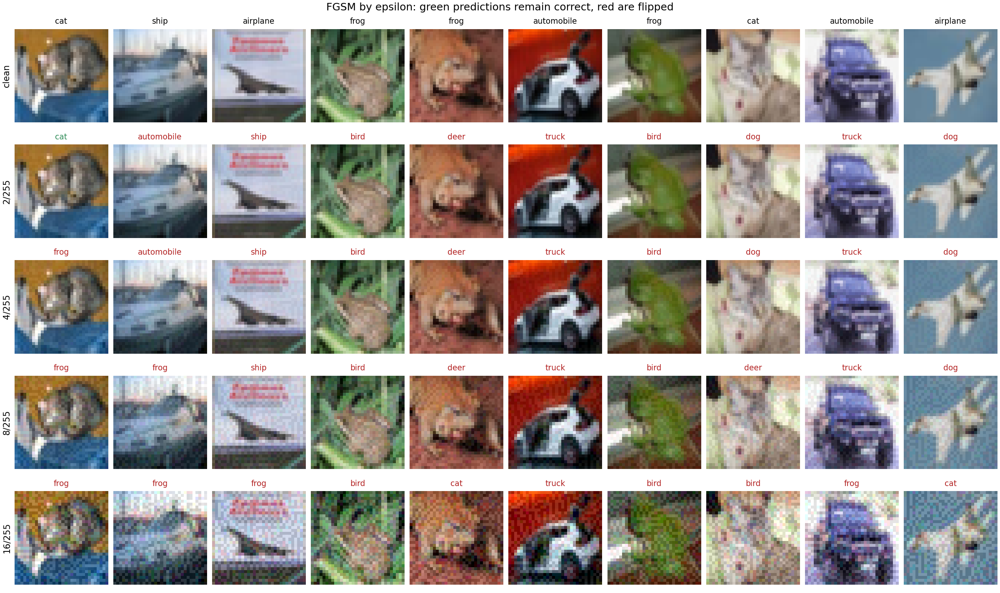

# Adversarial Examples: Attacks and Robustness Evaluation

These notes cover the theory behind the first attack in this toolkit, the design of its
implementation, and the results of evaluating it against a trained CIFAR-10 classifier.
Every number quoted here is reproduced from the CSV files under
`experiments/results/`, which the sweep and evaluation scripts regenerate
deterministically.

## Background

Szegedy et al. (2014) showed that image classifiers with excellent test accuracy can be
made to misclassify by adding a perturbation small enough to be invisible to a human
viewer. They found these perturbations with box-constrained L-BFGS optimisation and
observed a striking property: adversarial examples crafted against one network often
transfer to networks with different architectures or training data. The initial
explanation appealed to the extreme nonlinearity of deep networks and blind spots left
by finite training data.

## The linearity hypothesis

Goodfellow, Shlens and Szegedy (2015) proposed that locally linear behaviour in
high-dimensional input spaces is sufficient to explain the phenomenon, displacing the
earlier appeal to extreme nonlinearity. Consider a linear score $w^\top \tilde{x}$ with
$\tilde{x} = x + \eta$ and $\lVert \eta \rVert_\infty \le \varepsilon$. Choosing
$\eta = \varepsilon \, \mathrm{sign}(w)$ increases the activation by
$\varepsilon \lVert w \rVert_1$. For an input with $n$ dimensions and average weight
magnitude $m$, that growth is $\varepsilon m n$: it scales with dimensionality even
though no individual pixel moves by more than $\varepsilon$. Many infinitesimal,
coordinated changes add up to a large change in output. Modern networks are built from
components designed to behave linearly over much of their input range, ReLU being the
canonical example, so the same mechanism applies to them. High-dimensional inputs and
locally linear behaviour are sufficient for adversarial vulnerability; no exotic
nonlinearity is required.

## Deriving FGSM

The attacker wants to increase the training loss $J(\theta, x, y)$ subject to an
$L_\infty$ budget $\lVert \eta \rVert_\infty \le \varepsilon$. A first-order expansion
gives

$$J(\theta, x + \eta, y) \approx J(\theta, x, y) + \eta^\top \nabla_x J(\theta, x, y).$$

Maximising the linear term over the $L_\infty$ ball has a closed-form solution: put the
full budget on every coordinate, in the direction of the gradient's sign,

$$\eta^{*} = \varepsilon \, \mathrm{sign}\big(\nabla_x J(\theta, x, y)\big),$$

so the adversarial example is

$$x_{\mathrm{adv}} = \mathrm{clip}_{[0,1]}\big(x + \varepsilon \, \mathrm{sign}(\nabla_x J(\theta, x, y))\big).$$

The targeted variant descends the loss towards a chosen label instead:
$x_{\mathrm{adv}} = \mathrm{clip}_{[0,1]}(x - \varepsilon \, \mathrm{sign}(\nabla_x J(\theta, x, y_{\mathrm{target}})))$.

Two consequences follow directly from the derivation. FGSM costs a single
gradient computation, which makes it the natural baseline attack and the building block
for iterative methods. And the gradient is evaluated at the clean input, so it does not
depend on $\varepsilon$: sweeping the budget moves the adversarial example along one
fixed ray in input space (up to clipping at the pixel-range boundary).

## Implementation design

`attacks/fgsm.py` follows a contract shared across the toolkit's attacks.

The attack is a pure function over a model. It computes the input gradient with
`torch.autograd.grad` on a detached clone rather than `loss.backward()`, so model
parameter gradients are never populated and the model's state is untouched. The body is
wrapped in `torch.enable_grad()` so the attack works inside a `torch.no_grad()`
evaluation loop. The budget is expressed once, in `[0, 1]` pixel space; input
normalisation lives in a `NormalizedModel` wrapper that registers the dataset mean and
standard deviation as buffers and applies them in its forward pass. Normalisation is
linear and differentiable, so pixel-space gradients flow through it unchanged, and the
attack never needs to know the normalisation constants.

The pytest suite enforces this contract directly: shape and dtype preservation, the
$L_\infty$ budget and pixel range, non-mutation of inputs, absence of parameter-gradient
side effects, and correct operation under `no_grad`. Two integration tests run against
the trained network, and they are deliberately split: one checks clean accuracy so that
a broken model loading path is caught on its own, and one checks attack effectiveness.
The split ensures the effectiveness test cannot pass for the wrong reason on a
near-random model.

The checkpoint of record is 'best_resnet18_cifar10 (1).pth'. An earlier resnet.py had
regressed to the 7x7 ImageNet stem while this checkpoint was trained with the 3x3 CIFAR
stem; correcting the stem restored a strict state-dict load and reconfirmed 93.43% over
the full test set.

## Empirical evaluation

The target model is a ResNet-18 with the CIFAR stem (3x3 stride-1 first convolution, no
max-pool), which reaches 93.43% on the full CIFAR-10 test set. The sweep runs FGSM on
the first 1,000 test images with no shuffling and no random start, so results are exactly
reproducible.

| eps | clean accuracy | FGSM accuracy | mean L-inf |
|---------|---------------|---------------|------------|
| 2/255 | 0.9340 | 0.3590 | 0.007843 |
| 4/255 | 0.9340 | 0.2390 | 0.015686 |
| 8/255 | 0.9340 | 0.1660 | 0.031373 |
| 16/255 | 0.9340 | 0.1200 | 0.062745 |



Several observations follow from the table and the figure.

Most of the damage arrives at the smallest budget. A perturbation of 2/255, genuinely
imperceptible at native resolution and at enlargement, drops accuracy from 93.4% to
35.9%. In the figure, nine of the ten displayed samples are already misclassified at
this budget. The returns then diminish: quadrupling the budget from 4/255 to 16/255
buys another twelve points of degradation, and even at 16/255 some 12% of samples
resist a single gradient step, which is part of the motivation for iterative attacks
such as PGD.

The budget is fully spent. The mean over samples of the per-sample maximum perturbation
matches $\varepsilon$ to all six reported decimal places at every budget. Since clipping
can only reduce a pixel's step below $\varepsilon$, any clipped shortfall would pull
this mean down; at the reported precision, essentially every sample contains at least
one pixel that took the full step without hitting the pixel-range boundary.

Robustness thresholds are per-sample properties. The first column's cat survives 2/255
and falls at 4/255, so $\varepsilon$ behaves as a budget with sample-specific breaking
points rather than a global switch.

A single ray crosses several class regions. Because the gradient is computed at the
clean input, the four adversarial versions of each sample lie on one straight line
wherever no pixel is clipped at the pixel-range boundary. The
fifth column's frog is classified deer at 2/255 through 8/255 and cat at 16/255, so that
line passes through at least three decision regions within a distance imperceptible to a
human. This is a compact illustration of how close and irregular the decision boundaries
of an undefended network are.

## The saddle-point view and why restarts matter

Madry et al. (2018) frame robust training as a saddle-point problem,

$$\min_\theta \; \mathbb{E}_{(x,y)\sim\mathcal{D}} \Big[ \max_{\delta \in S} L(\theta, x+\delta, y) \Big],$$

where $S$ is the allowed perturbation set, here the $L_\infty$ ball of radius
$\varepsilon$. The inner maximisation is the adversary finding the worst perturbation
of a fixed input; the outer minimisation trains parameters against that worst case.
The two attacks evaluated here are inner maximisers of differing strength: FGSM takes
one gradient step, PGD takes many with projection back into the ball after each. The
PGD evaluation uses a step size of 2/255, following Madry et al.'s CIFAR-10 setup.

The inner problem is not concave, so a single starting point can settle at a weak
local maximum and understate the true worst-case loss. Starting PGD from a random
point inside the ball, and repeating from several random starts while keeping the
strongest result per sample, gives a tighter estimate of that inner maximum, meaning
a stronger attack and a more honest robustness number. For the naturally trained model
here a single start already drives accuracy to zero, so restarts change nothing. Their
importance shows when evaluating a defended model: reporting robustness from one weak
PGD run is how defences come to look stronger than they are, and multiple restarts
guard against that illusion.

Measured on the naturally trained ResNet-18, from
`experiments/results/robustness_table.csv`, all attacks at $\varepsilon = 8/255$:

| attack | steps | accuracy |
|--------|-------|----------|
| none   | -     | 0.9340   |
| FGSM   | 1     | 0.1660   |
| PGD    | 20    | 0.0000   |
| PGD    | 50    | 0.0000   |

PGD drives accuracy to zero where FGSM at the same budget leaves 16.6% standing. The
one-step attack understates vulnerability by a wide margin, and the gap is the standard
demonstration that robustness claims must be tested against a strong iterative
adversary. A naturally trained network has effectively no robustness in this threat
model, which is the motivation for adversarial training.

## Reproduction

From the toolkit root:

```powershell
python -m experiments.fgsm_sweep
```

The script expects a local CIFAR-10 copy and the trained checkpoint at their default
repository locations; `CIFAR10_DATA_ROOT` and `CIFAR10_RESNET18_CKPT` override them.
Dataset downloading is intentionally disabled. Outputs are the CSV quoted above and the
figure `experiments/results/fgsm_examples_by_eps.png`.


```powershell
python -m experiments.robustness_eval
```

This writes the robustness table to `experiments/results/robustness_table.csv`.


## References

Szegedy, C., Zaremba, W., Sutskever, I., Bruna, J., Erhan, D., Goodfellow, I. and
Fergus, R. (2014). Intriguing properties of neural networks. ICLR 2014. arXiv:1312.6199.

Goodfellow, I., Shlens, J. and Szegedy, C. (2015). Explaining and harnessing adversarial
examples. ICLR 2015. arXiv:1412.6572.

Madry, A., Makelov, A., Schmidt, L., Tsipras, D. and Vladu, A. (2018). Towards deep
learning models resistant to adversarial attacks. ICLR 2018. arXiv:1706.06083.

Krizhevsky, A. (2009). Learning multiple layers of features from tiny images. Technical
report, University of Toronto.
