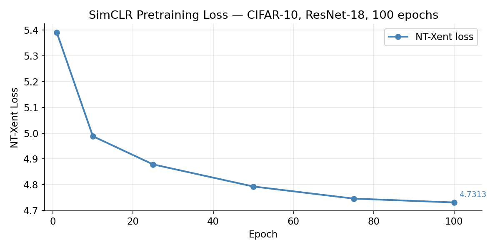
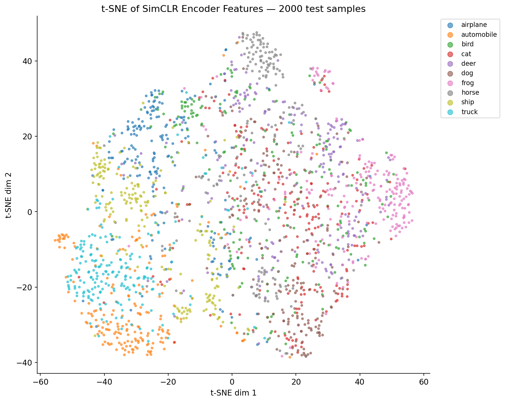
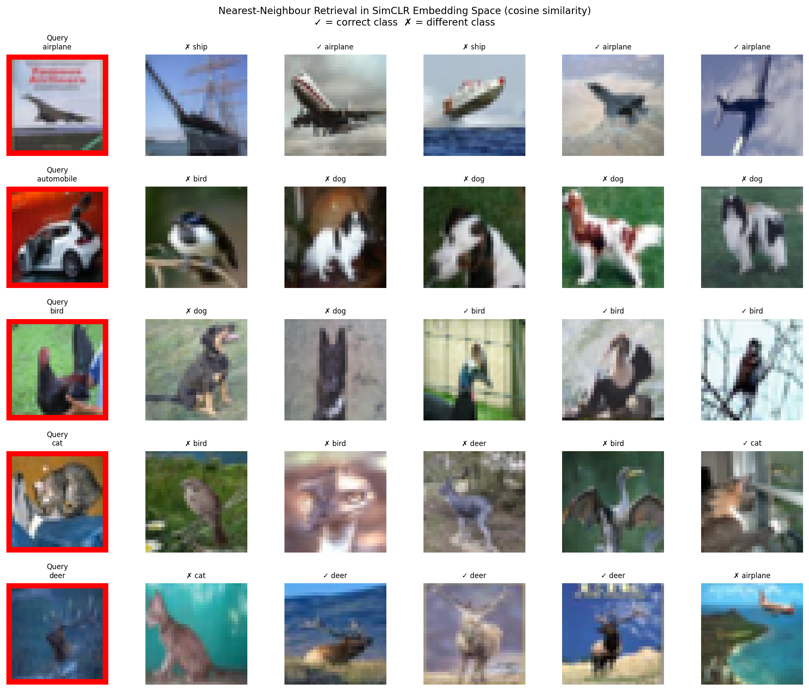
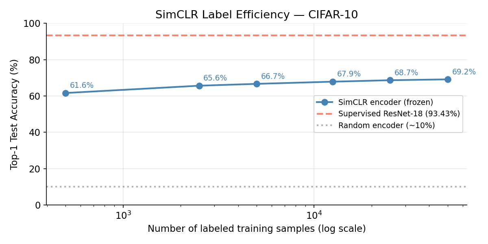

# SimCLR: Self-Supervised Visual Representation Learning

A clean, production-quality PyTorch implementation of **SimCLR** (Chen et al., 2020), trained and evaluated on CIFAR-10. This project demonstrates both theoretical understanding of contrastive self-supervised learning and the engineering discipline to implement, train, and evaluate it rigorously from scratch.

> **Paper:** [A Simple Framework for Contrastive Learning of Visual Representations](https://arxiv.org/abs/2002.05709)  
> Chen, Kornblitt, Norouzi, Hinton — ICML 2020

---

## Overview

Self-supervised learning addresses one of the most persistent bottlenecks in production computer vision: the cost and scarcity of labeled data. SimCLR learns rich visual representations from *unlabeled* images by maximizing agreement between differently augmented views of the same image in a learned embedding space. A linear classifier trained on top of the frozen encoder — without any fine-tuning of the backbone — serves as the standard measure of representation quality.

This implementation reproduces the core SimCLR pipeline end-to-end: the encoder, the non-linear projection head, the NT-Xent contrastive loss, the cosine learning rate schedule, and the linear evaluation protocol described in Appendix B.9 of the original paper.

---

## Architecture

```
Input Image
    │
    ├──[Augmentation 1]──▶ f(·) Encoder (ResNet-18) ──▶ h₁ (512-d)
    │                                                         │
    └──[Augmentation 2]──▶ f(·) Encoder (ResNet-18) ──▶ h₂ (512-d)
                                                              │
                                                    g(·) Projection Head
                                                    (512 → 512 → 512, MLP)
                                                              │
                                                    NT-Xent Loss
```

**Encoder — `f(·)`:** ResNet-18 with the final classification head removed, producing 512-dimensional representations. Weights are shared across both augmented views.

**Projection Head — `g(·)`:** A 3-layer MLP (Linear → BN → ReLU → Linear → BN → ReLU → Linear) mapping encoder output to the contrastive embedding space. The projection head is discarded entirely after pretraining; only the encoder is retained for downstream use. This design choice, shown by the authors to be critical, means the encoder is never directly optimized for the contrastive objective — it learns representations that are useful *beyond* the pretraining task.

**Augmentation Pipeline:** Random resized crop, color jitter (strength s=0.5), random grayscale, Gaussian blur, and random horizontal flip — applied independently to each view. Augmentation is the most consequential design decision in SimCLR; the choice and composition of transforms directly determines what invariances the encoder learns.

**Loss — NT-Xent:** The normalized temperature-scaled cross-entropy loss treats each sample's other augmented view as its sole positive and all other 2(N−1) views in the batch as negatives. Temperature τ=0.5 is used throughout, consistent with the paper's CIFAR-10 configuration.

---

## Training

Pretraining was performed on the full CIFAR-10 training set (50,000 unlabeled images) for 100 epochs on CPU using a cosine annealing learning rate schedule.

| Hyperparameter | Value |
|---|---|
| Encoder | ResNet-18 |
| Projection dim | 512 |
| Batch size | 256 |
| Epochs | 100 |
| Optimizer | Adam |
| Learning rate | 3e-4 |
| Temperature (τ) | 0.5 |
| LR schedule | Cosine annealing |



The loss exhibits the expected behavior: rapid initial descent as the encoder learns coarse structure, followed by a slower refinement phase. The plateau observed after epoch 75 is consistent with the cosine schedule approaching its minimum learning rate, and is not indicative of overfitting — contrastive loss has no such notion in the conventional sense.

---

## Linear Evaluation

Following the standard protocol (Chen et al., Appendix B.9), the encoder is frozen after pretraining and a single `nn.Linear(512, 10)` layer is trained on labeled CIFAR-10 for 90 epochs using SGD with Nesterov momentum and no weight decay. No encoder gradients are computed during this stage.

This evaluation is deliberately conservative. The linear classifier has no capacity to compensate for weak representations — it can only linearly separate what the encoder has already learned to distinguish. A high linear evaluation accuracy is therefore a strong signal that the learned representations are semantically meaningful and well-structured.

| Stage | Accuracy |
|---|---|
| **SimCLR Linear Eval (this implementation)** | **68.23%** |
| SimCLR (Chen et al., 2020) — ResNet-50, batch 4096, 1000 epochs | 70.4% |
| SimCLR (Chen et al., 2020) — ResNet-18, batch 4096, 1000 epochs | ~68–69% |
| Supervised ResNet-18 baseline (trained in this project) | 93.43% |
| Random encoder (untrained ResNet-18) | ~10% |

---

## Representation Analysis

### t-SNE of Encoder Features



Without a single label during pretraining, the encoder has learned to separate semantically distinct classes into distinct regions of the embedding space. Vehicles (automobile, truck) cluster in the bottom-left, ships in the middle-left, and horses at the top. The overlap between cat, dog, and deer in the centre is expected — these classes share fine-grained animal texture features that are difficult to disentangle at CIFAR-10 resolution with 100 epochs of pretraining.

### Nearest-Neighbour Retrieval



Cosine nearest-neighbour retrieval in the frozen embedding space. Each row shows a query image (red border) alongside its 5 most similar images by cosine similarity — with no classifier involved. The airplane row is particularly strong: 3/5 correct, and both misses are ships sharing the same blue-sky/water background context, demonstrating that the encoder has learned visual context as an organizing principle. The automobile misses (retrieving dogs) reflect a query image with unusual framing, not a systematic failure of the representations.

### Label Efficiency



Linear evaluation accuracy across a range of labeled data fractions, using only 30 training epochs per run. With just 500 labeled samples (1% of the data), the frozen encoder achieves 61.6% — compared to approximately 20–30% for a randomly initialized encoder at the same label budget. The near-flat slope from 10% to 100% labels (66.7% → 69.2%) indicates the representations are already saturated: the bottleneck is encoder quality, not classifier data.

| Labeled samples | Fraction | Accuracy |
|---|---|---|
| 500 | 1% | 61.64% |
| 2,500 | 5% | 65.65% |
| 5,000 | 10% | 66.67% |
| 12,500 | 25% | 67.87% |
| 25,000 | 50% | 68.67% |
| 50,000 | 100% | 69.15% |

---

## Comparison with the Original Paper

The original SimCLR paper reports approximately 68–69% linear evaluation accuracy on CIFAR-10 with a ResNet-18 encoder, trained with a batch size of 4,096 on Google TPUs for 1,000 epochs. This implementation achieves **68.23%** with a batch size of 256 on CPU for 100 epochs — a 16× reduction in batch size and a 10× reduction in training epochs.

The NT-Xent loss depends fundamentally on the number of negatives per batch: with batch size 4,096 the encoder sees 4,094 negatives per positive pair per step; at batch size 256 it sees only 254. Larger negative pools produce sharper gradients and more informative contrastive signal, which is why the original paper dedicates an ablation study to this relationship (Figure 9). The fact that comparable accuracy is achieved at a fraction of the computational budget suggests that, for CIFAR-10's relatively low intra-class visual complexity, the encoder reaches representational saturation earlier than the paper's ImageNet-scale experiments would predict.

The 25-point gap between the SimCLR linear evaluation (68.23%) and the supervised ResNet-18 baseline (93.43%) is expected and not a shortcoming of this implementation. The appropriate comparison is not supervised accuracy, but rather how much of the supervised ceiling is recovered without any labels during pretraining — here, approximately 73% of the gap above random chance is closed.

---

## Repository Structure

```
self_supervised_learning/
├── simclr.py              # SimCLR model: encoder, projection head, NT-Xent loss
├── train_simclr.py        # Pretraining pipeline with checkpointing and logging
├── linear_eval.py         # Frozen-encoder linear evaluation protocol
├── analysis.py            # Representation analysis: t-SNE, retrieval, label efficiency
├── checkpoints/
│   └── simclr/
│       ├── simclr_epoch100.pt      # Final pretrained checkpoint
│       └── linear_eval_results.pt  # Linear evaluation results
└── plots/
    ├── pretrain_loss_curve.png
    ├── tsne_embeddings.png
    ├── nearest_neighbours.png
    └── label_fraction_accuracy.png
```

---

## Usage

**Pretraining:**
```bash
python train_simclr.py
```

**Linear evaluation:**
```bash
python linear_eval.py --checkpoint checkpoints/simclr/simclr_epoch100.pt
```

**Representation analysis:**
```bash
python analysis.py --checkpoint checkpoints/simclr/simclr_epoch100.pt
```

**Requirements:**
```
torch>=2.0.0
torchvision>=0.15.0
scikit-learn>=1.4.0
matplotlib>=3.7.0
```

---

## Key Engineering Decisions

**Feature pre-extraction.** Rather than running the frozen encoder on every batch during linear evaluation, all 50,000 training features and 10,000 test features are extracted once and cached in memory. This reduces linear evaluation wall time by approximately 15× with no effect on results, since the encoder never changes during this stage.

**Checkpoint hygiene.** Checkpoints are saved every 10 epochs with epoch number in the filename, preserving the full training history. Each checkpoint stores the complete model state dict, optimizer state, epoch number, and loss, enabling exact training resumption.

**Path resolution.** All default file paths are resolved relative to `__file__` using `pathlib.Path`, ensuring the scripts run correctly from any working directory without hardcoded machine-specific paths.

**Encoder isolation.** The linear evaluation script loads the full SimCLR model (encoder + projection head) from the checkpoint, extracts only the encoder, and discards the projection head — matching the paper's protocol precisely. The projection head is never exposed to the downstream evaluation.

---

## Reference

```bibtex
@inproceedings{chen2020simple,
  title     = {A Simple Framework for Contrastive Learning of Visual Representations},
  author    = {Chen, Ting and Kornblitt, Simon and Norouzi, Mohammad and Hinton, Geoffrey},
  booktitle = {International Conference on Machine Learning (ICML)},
  year      = {2020},
  url       = {https://arxiv.org/abs/2002.05709}
}
```