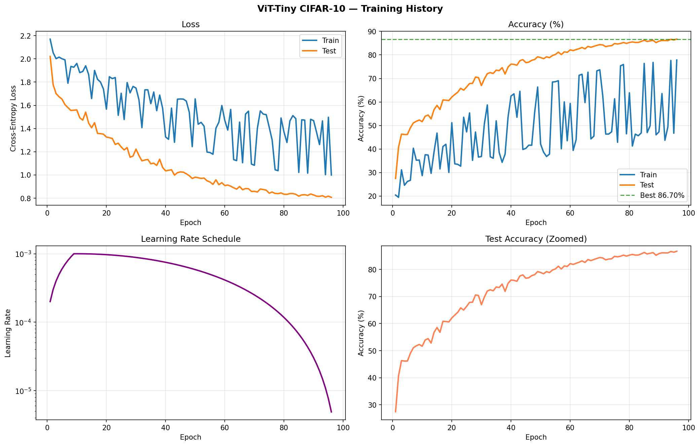
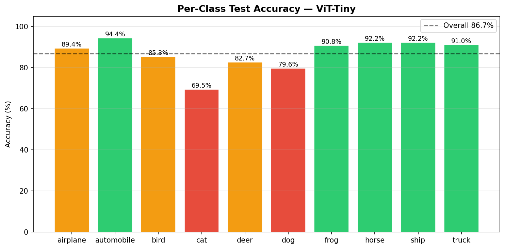
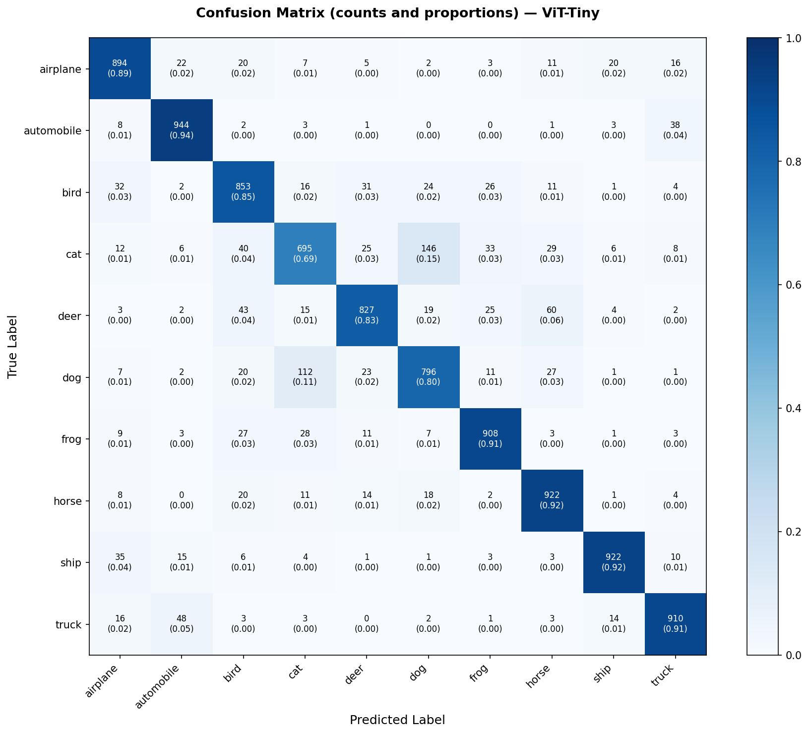
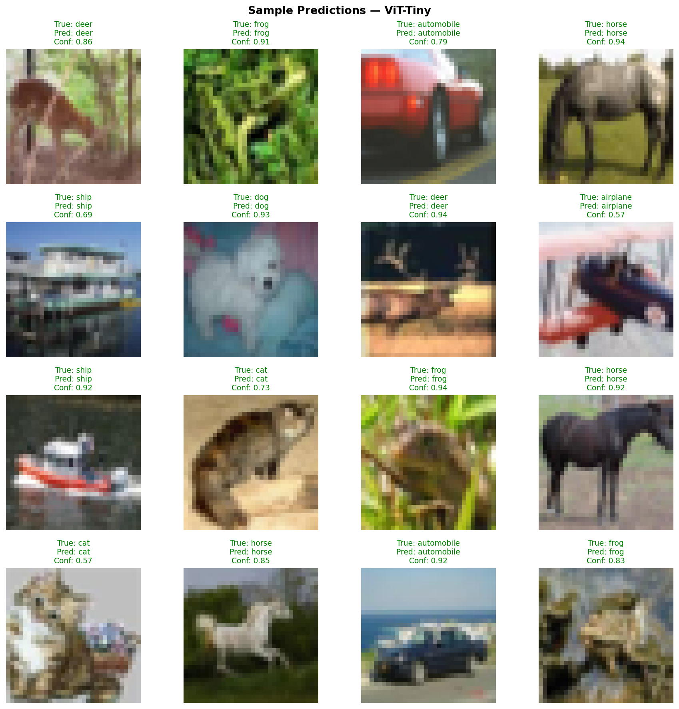
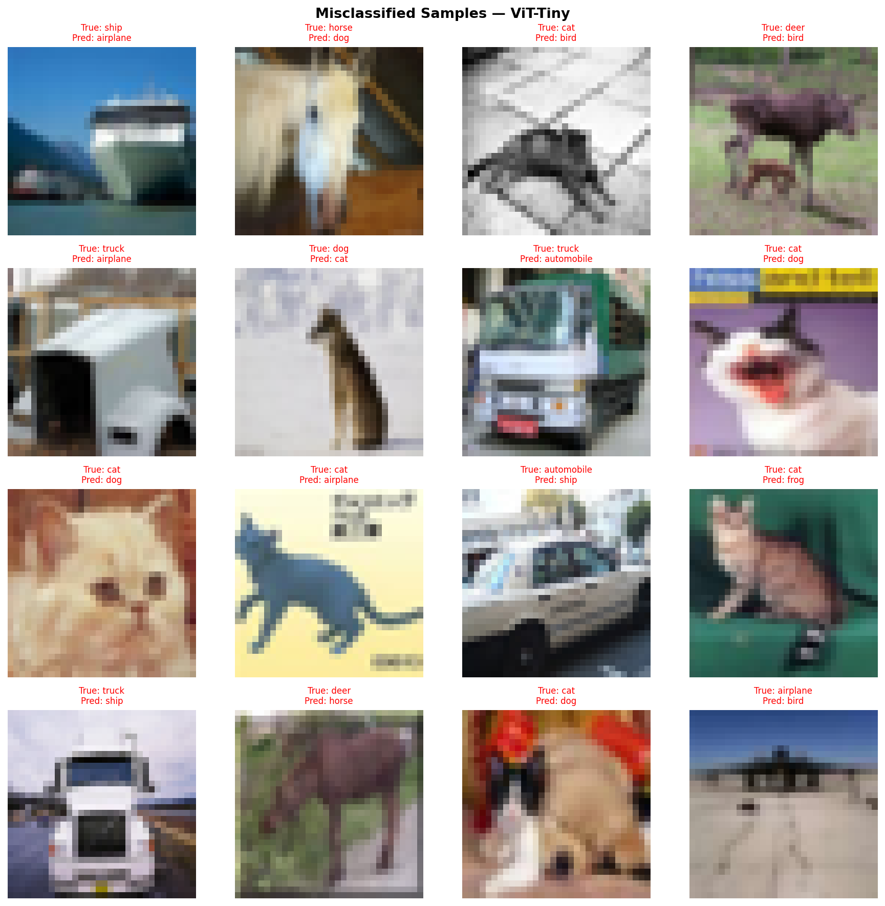

# Vision Transformer — CIFAR-10

A from-scratch implementation of Vision Transformer Tiny (ViT-Tiny) trained on CIFAR-10, achieving **86.70% test accuracy**. The project covers the full pipeline: architecture implementation, GPU training with modern regularisation techniques, and post-training evaluation with attention visualisation.

---

## Results

| Model | Test Accuracy | Parameters | Training Time |
|---|---|---|---|
| ViT-Tiny (this work) | **86.70%** | 5.36M | ~44 min (T4 GPU) |
| ResNet-18 (baseline) | 93.43% | 11.2M | ~35 min (T4 GPU) |

The 6.7-point gap is consistent with published literature on ViT performance at small data scale. Dosovitskiy et al. (2020) demonstrated that ViTs require substantially more data than CNNs to match their performance — CIFAR-10's 50,000 training images sit well below the crossover point. Notably, ViT-Tiny achieves this result at **47.7% fewer parameters** than ResNet-18.

---

## Architecture

ViT-Tiny follows the DeiT-Tiny configuration (Touvron et al., 2021):

| Hyperparameter | Value |
|---|---|
| Image size | 32 × 32 |
| Patch size | 4 × 4 |
| Number of patches | 64 |
| Embedding dimension | 192 |
| Transformer depth | 12 layers |
| Attention heads | 3 |
| MLP ratio | 4.0 |
| Dropout (training) | 0.1 |
| Attention dropout | 0.0 |
| Total parameters | 5,356,234 |

Each image is divided into 64 non-overlapping 4×4 patches. A learnable CLS token is prepended to the patch sequence, and learned positional embeddings are added before the transformer stack. The final classification is produced from the CLS token's representation after 12 layers of multi-head self-attention.

The implementation uses Pre-LN (LayerNorm before each sublayer), which is the DeiT convention and provides more stable gradients than the Post-LN architecture of the original ViT paper. Attention is computed via `F.scaled_dot_product_attention`, enabling Flash Attention on compatible hardware.

---

## Training

**Environment:** Kaggle T4 GPU, PyTorch 2.5, mixed precision (AMP), batch size 128

### Optimiser

AdamW (β₁=0.9, β₂=0.999) with decoupled weight decay, peak learning rate 1e-3. Weight decay is selectively applied — bias terms, LayerNorm parameters, the CLS token, and positional embeddings are explicitly excluded from decay, following the recommendation of Loshchilov & Hutter (2019):

```python
decay_params    = [p for n, p in model.named_parameters()
                   if not any(nd in n for nd in ['bias', 'norm', 'cls_token', 'pos_embed'])]
no_decay_params = [p for n, p in model.named_parameters()
                   if any(nd in n for nd in ['bias', 'norm', 'cls_token', 'pos_embed'])]

optimizer = AdamW([
    {'params': decay_params,    'weight_decay': 0.05},
    {'params': no_decay_params, 'weight_decay': 0.0},
], lr=1e-3)
```

### Learning Rate Schedule

Linear warmup over 10 epochs followed by cosine annealing over the remaining 90 epochs (100 total). The warmup phase prevents instability in the early stages of training when the attention weights are uninitialised. The LR curve (see `outputs/evaluation/training_history.png`) shows the characteristic cosine decay shape with a peak of 1e-3 and a final value of ~1e-5.

### Regularisation

ViTs lack the inductive biases of CNNs (local connectivity, translation equivariance), which makes them data-hungry. The following augmentation and regularisation techniques were applied to compensate:

| Technique | Configuration | Purpose |
|---|---|---|
| TrivialAugmentWide | — | Stochastic colour/geometric perturbation |
| MixUp | α = 0.2 | Interpolates pairs of images and labels |
| CutMix | α = 1.0 | Cuts and pastes image regions with mixed labels |
| RandomErasing | p = 0.25 | Randomly masks rectangular regions |
| Dropout | p = 0.1 | Applied after each MLP and residual sublayer |
| Label smoothing | ε = 0.1 | Prevents overconfident softmax predictions |
| Gradient clipping | max norm = 1.0 | Stabilises training |
| Weight decay | 0.05 | L2 regularisation on non-bias parameters |



The interaction of these techniques is visible in the training curves: train accuracy oscillates heavily (20–80% per-epoch swings) while test accuracy rises smoothly. This is the expected signature of aggressive augmentation — the model is trained on hard, mixed samples but evaluated on clean images, producing a persistent train–test accuracy gap that does not indicate overfitting.

---

## Per-Class Results

| Class | Accuracy | Correct / Total |
|---|---|---|
| airplane | 89.4% | 894 / 1000 |
| automobile | 94.4% | 944 / 1000 |
| bird | 85.3% | 853 / 1000 |
| **cat** | **69.5%** | 695 / 1000 |
| deer | 82.7% | 827 / 1000 |
| **dog** | **79.6%** | 796 / 1000 |
| frog | 90.8% | 908 / 1000 |
| horse | 92.2% | 922 / 1000 |
| ship | 92.2% | 922 / 1000 |
| truck | 91.0% | 910 / 1000 |
| **Overall** | **86.71%** | 8,671 / 10,000 |



*Green bars exceed 90%, orange bars fall between 80–90%, and red bars fall below 80%. Cat and dog are the only two classes below the overall average.*

### Top Misclassification Pairs

| True Class | Predicted As | Count |
|---|---|---|
| cat | dog | 146 |
| dog | cat | 112 |
| deer | horse | 60 |
| truck | automobile | 48 |
| deer | bird | 43 |



*Row-normalised confusion matrix. Each cell shows the raw count and the proportion of that true class. The cat→dog and dog→cat off-diagonal cells are the darkest non-diagonal entries, confirming these as the dominant confusion pair. Deer is the only class with two significant confusion targets (horse and bird), reflecting its ambiguous silhouette at 32×32.*

Cat (69.5%) and dog (79.6%) are the dominant failure modes, collectively accounting for approximately 19% of all errors. These two classes share substantial visual overlap in texture, colour, and body shape at 32×32 resolution, making them a known hard pair for small-resolution classifiers. The symmetry of the cat→dog and dog→cat confusion (146 and 112 samples respectively) confirms the difficulty is intrinsic to the class boundary, not a model bias toward one direction.

Notably, 8 of the 10 classes exceed 85% accuracy. The overall gap vs ResNet-18 is therefore largely attributable to cat and dog rather than a uniform performance deficit — the ViT is competitive on classes with discriminative texture or shape cues (automobile 94.4%, frog 90.8%, ship 92.2%).

---

## Error Analysis

Visual inspection of misclassified samples reveals three qualitatively distinct failure categories:



*16 randomly sampled test predictions (seed=42). Green titles indicate correct predictions; red titles indicate errors. Confidence scores reflect the softmax probability assigned to the predicted class.*



*16 randomly sampled misclassified examples (seed=42) from the 1,329 total errors (13.3% error rate). Each title shows the true label and what the model predicted instead.*

**Resolution-limited cases** — A significant portion of misclassifications involve images where the 32×32 resolution genuinely removes discriminative information. A cat photographed at a low angle has a body silhouette indistinguishable from a bird; a deer at distance on grass has a leg-and-body profile identical to a horse. These errors would likely appear in any classifier at this resolution.

**Silhouette confusion** — Several ship→airplane misclassifications involve large vessels photographed bow-on at a low angle. The wide hull against sky produces a shape that activates aircraft-like features. This failure mode is architecturally informative: it suggests the model uses global shape contour (which emerges through CLS token aggregation across patches) as a primary feature, rather than local texture — consistent with ViT's lack of CNN-style local filters.

**Close-up face crops** — Cats photographed in tight facial close-up are sometimes misclassified as frog. At 32×32, a round face, open mouth, and green background tint produces a patch distribution that overlaps with frog features. This class of error vanishes at higher input resolution.

Confidence scores from the sample predictions corroborate these findings: cat predictions consistently show the lowest confidence values (0.57–0.73), while geometrically distinctive classes show high confidence (frog 0.94, horse 0.92). The model's uncertainty is well-calibrated to actual difficulty.

---

## Comparison with ResNet-18

| Property | ViT-Tiny | ResNet-18 |
|---|---|---|
| Test accuracy | 86.70% | 93.43% |
| Parameters | 5.36M | 11.2M |
| Inductive biases | None | Local connectivity, translation equivariance |
| Receptive field | Global (all patches) | Hierarchical, local→global |
| Attention to long-range structure | ✓ | ✗ |
| Data efficiency | Low | High |

The performance gap is consistent with the theoretical difference in inductive biases. ResNet-18's convolutional filters provide translation equivariance and locality by construction — properties well-matched to CIFAR-10's small images. ViT-Tiny must *learn* spatial structure purely from data, which requires more training examples than CIFAR-10 provides.

The crossover point where ViTs match or exceed CNNs has been empirically placed at approximately 14M images in the original ViT paper (ImageNet-21k scale). CIFAR-10's 50,000 images are three orders of magnitude below that threshold, making the 6.7-point gap expected rather than a sign of architectural weakness.

---

## Repository Structure

```
vision_transformers/
├── vit_cifar10_kaggle.ipynb   # Training notebook (Kaggle T4 GPU)
├── evaluate_vit.py            # Post-training evaluation and metrics
├── visualize_attention.py     # Attention map and rollout visualisation
├── checkpoints/
│   └── best_vit_cifar10.pth   # Trained checkpoint (epoch 96)
└── outputs/
    └── evaluation/
        ├── training_history.png
        ├── per_class_accuracy.png
        ├── confusion_matrix.png
        ├── sample_predictions.png
        └── misclassified_samples.png
```

---

## Usage

**Training** (Kaggle T4 GPU):
Run `vit_cifar10_kaggle.ipynb` on Kaggle with GPU T4 x2 accelerator. The checkpoint is saved automatically to `/kaggle/working/`.

**Evaluation** (CPU):
```bash
# Place checkpoint at checkpoints/best_vit_cifar10.pth first
python evaluate_vit.py
```

**Attention visualisation** (CPU):
```bash
python visualize_attention.py
```

---
## 👤 Author

**Adi Mendelowitz**  
Machine Learning Engineer  
Specialization: Computer Vision & Image Processing
---

## References

- Dosovitskiy, A. et al. (2020). *An Image is Worth 16x16 Words: Transformers for Image Recognition at Scale*. [arXiv:2010.11929](https://arxiv.org/abs/2010.11929)
- Touvron, H. et al. (2021). *Training data-efficient image transformers & distillation through attention*. [arXiv:2012.12877](https://arxiv.org/abs/2012.12877)
- Loshchilov, I. & Hutter, F. (2019). *Decoupled Weight Decay Regularization*. [arXiv:1711.05101](https://arxiv.org/abs/1711.05101)
- Abnar, S. & Zuidema, W. (2020). *Quantifying Attention Flow in Transformers*. [arXiv:2005.00928](https://arxiv.org/abs/2005.00928)