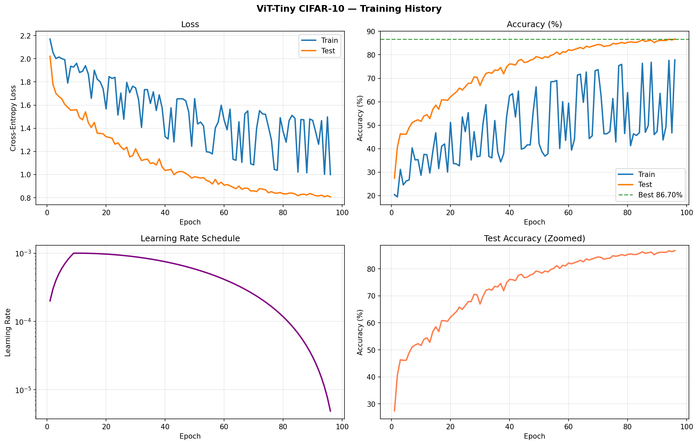
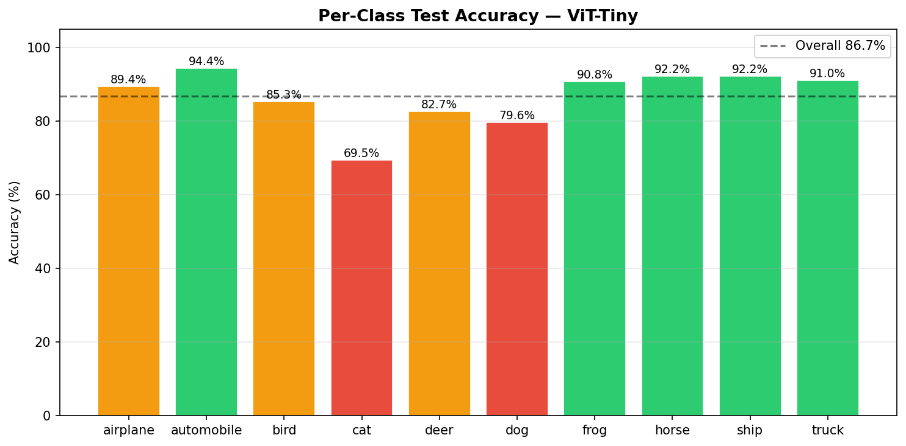
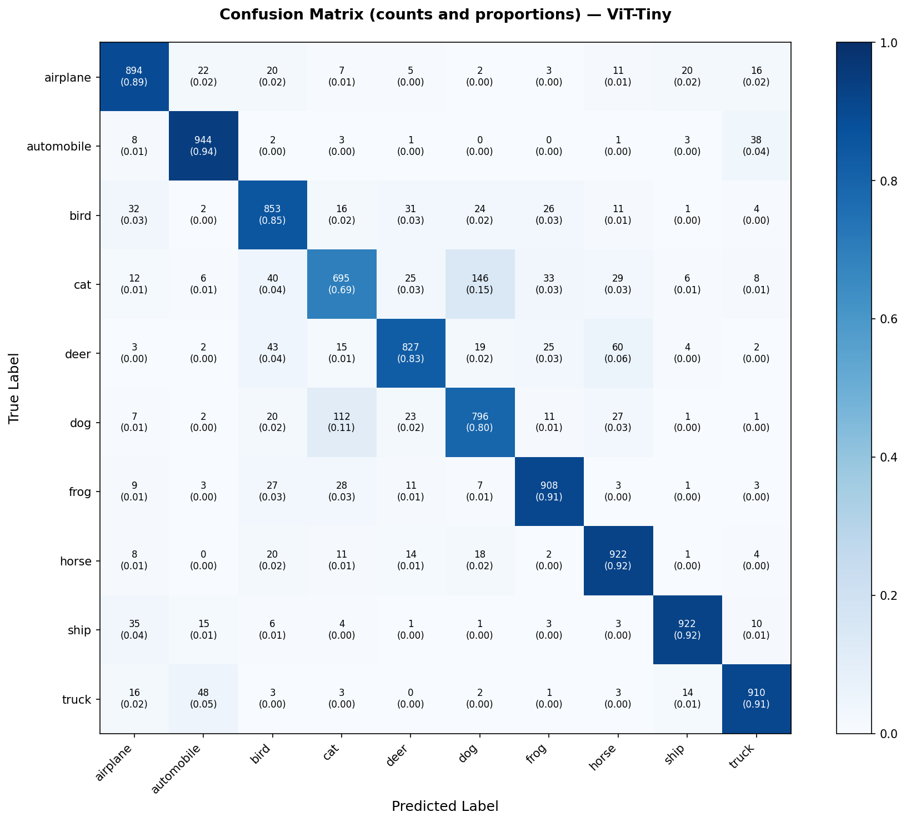
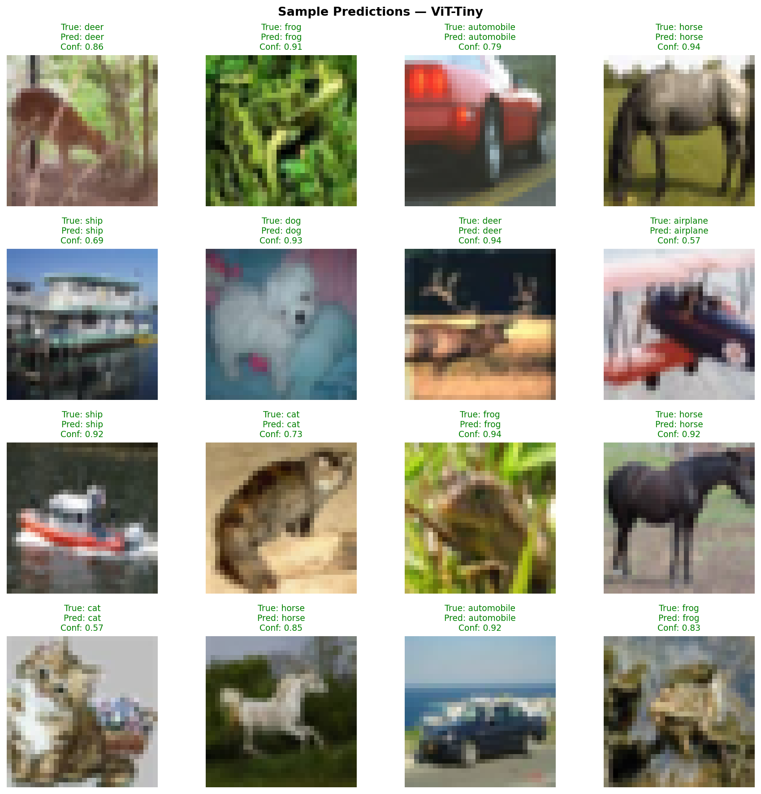
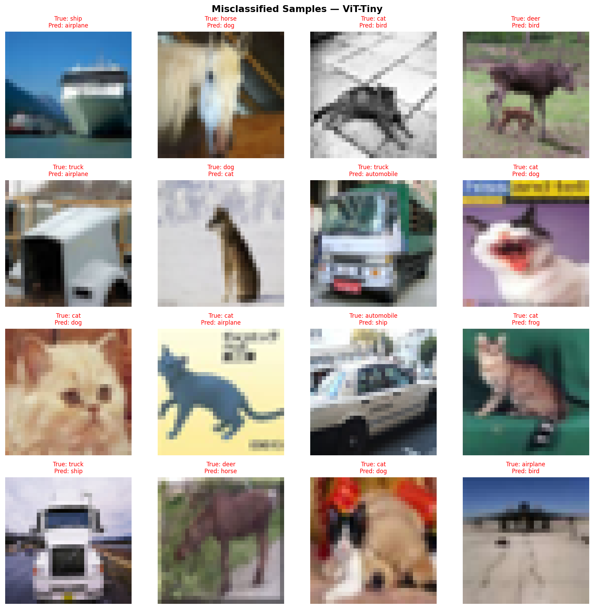

# Vision Transformer (ViT-Tiny): CIFAR-10

A from-scratch implementation of ViT-Tiny trained on CIFAR-10, achieving **86.70% test accuracy**. Covers the full pipeline: architecture implementation, GPU training with modern regularisation, post-training evaluation with attention visualisation, and a detailed comparison against ResNet-18.

---

## Results

| Model | Test Accuracy | Parameters | Training Time |
|---|---|---|---|
| ViT-Tiny (this work) | **86.70%** | 5.36M | ~46 min (Kaggle T4, 100 epochs) |
| ResNet-18 (baseline) | 93.43% | 11.2M | ~35 min (Kaggle T4, 100 epochs) |

The 6.7-point gap is consistent with published findings on ViT performance at small data scale. Dosovitskiy et al. (2021) showed that ViTs require substantially more data than CNNs to match their performance. CIFAR-10's 50,000 training images are well below that crossover point. ViT-Tiny achieves this result at 52% fewer parameters than ResNet-18.

---

## Architecture

ViT-Tiny follows the DeiT-Tiny configuration (Touvron et al., 2021):

| Hyperparameter | Value |
|---|---|
| Image size | 32 x 32 |
| Patch size | 4 x 4 |
| Number of patches | 64 |
| Embedding dimension | 192 |
| Transformer depth | 12 layers |
| Attention heads | 3 |
| MLP ratio | 4.0 |
| Dropout (training) | 0.1 |
| Attention dropout | 0.0 |
| Total parameters | 5,356,234 |

Each image is divided into 64 non-overlapping 4x4 patches. A learnable CLS token is prepended to the patch sequence, and learned positional embeddings are added before the transformer stack. The classification is read from the CLS token after 12 layers of multi-head self-attention.

The implementation uses Pre-LN (LayerNorm before each sublayer), which is the DeiT convention and provides more stable gradients than the Post-LN architecture of the original ViT paper. Attention is computed via `F.scaled_dot_product_attention`, enabling Flash Attention on compatible hardware.

### Parameter Budget

| Component | Params | Notes |
|---|---|---|
| Patch embedding | ~9,400 | Conv2d: 192 x 3 x 4 x 4 + biases |
| QKV projections (x12) | ~1.33M | 12 x (192 x 576) |
| Output projections (x12) | ~0.44M | 12 x (192 x 192) |
| MLP layers (x12) | ~3.54M | 12 x (192x768 + 768x192), the dominant term |
| LayerNorm (x24) | ~9,200 | 24 x 192 x 2 (scale + bias) |
| Positional embeddings | ~12,500 | 65 x 192 (64 patches + CLS) |
| CLS token | 192 | |
| Classification head | ~1,930 | 192 x 10 + 10 |
| **Total** | **~5.36M** | |

The MLP layers dominate, accounting for ~66% of all parameters. The architectural elements that seem most significant conceptually (the CLS token (192), positional embeddings (~12,500), and patch embedding (~9,400)) are collectively negligible in parameter count. The quadratic scaling of the MLP (`embed_dim x mlp_ratio x embed_dim = 192 x 4 x 192`) is what drives the total.

For comparison, ResNet-18 (CIFAR-10 adapted, 3x3 stem) has 11,173,962 parameters. Its fully connected head for 10 classes contributes only ~5,100 params (512 x 10 + 10); the bulk sits in the later residual stages where channel count reaches 256 and 512.

---

## Training

**Environment:** Kaggle T4 GPU, PyTorch 2.5, mixed precision (AMP), batch size 128.

### Optimiser

AdamW (b1=0.9, b2=0.999) with decoupled weight decay and peak learning rate 1e-3. Weight decay is selectively applied: bias terms, LayerNorm parameters, the CLS token, and positional embeddings are excluded from decay, following Loshchilov & Hutter (2019):

```python
decay_params    = [p for n, p in model.named_parameters()
                   if not any(nd in n for nd in ['bias', 'norm', 'cls_token', 'pos_embed'])]
no_decay_params = [p for n, p in model.named_parameters()
                   if any(nd in n for nd in ['bias', 'norm', 'cls_token', 'pos_embed'])]

optimizer = AdamW([
    {'params': decay_params,    'weight_decay': 0.05},
    {'params': no_decay_params, 'weight_decay': 0.0},
], lr=1e-3)
```

Applying weight decay to positional embeddings or the CLS token would penalise their magnitude independently of their learned content, distorting their role as spatial and sequence-level representations.

### Learning Rate Schedule

Linear warmup over 10 epochs followed by cosine annealing over the remaining 90 epochs. Warmup prevents instability in early training when attention weights are uninitialised and gradient signals are poorly scaled.

### Regularisation

ViTs lack the spatial inductive biases of CNNs (local connectivity, translation equivariance), making them data-hungry. The following techniques were applied to compensate:

| Technique | Configuration | Purpose |
|---|---|---|
| TrivialAugmentWide | N/A | Stochastic colour and geometric perturbation |
| MixUp | alpha=0.2 | Interpolates image pairs and labels |
| CutMix | alpha=1.0 | Cuts and pastes image regions with mixed labels |
| RandomErasing | p=0.25 | Randomly masks rectangular regions |
| Dropout | p=0.1 | Applied after each MLP and residual sublayer |
| Label smoothing | eps=0.1 | Prevents overconfident softmax outputs |
| Gradient clipping | max norm=1.0 | Stabilises training |
| Weight decay | 0.05 | L2 regularisation on non-bias parameters |



The effect of aggressive augmentation is visible in the training curves: train accuracy oscillates heavily (20-80% per-epoch swings) while test accuracy rises smoothly from ~50% at epoch 10 to 86.70% at epoch 96. This is the expected signature of MixUp and CutMix: the model trains against mixed-label targets and is evaluated on clean images. The train metric is not meaningful as a convergence indicator; only the test curve is.

ResNet training curves look fundamentally different: train and test accuracy track closely with no wild oscillation, train accuracy climbs above test accuracy smoothly producing the classic overfitting gap, and convergence completes around epoch 60-70. The visual difference reflects the architectural difference: ResNet trains stably with minimal augmentation; ViT requires heavy augmentation which makes the training metrics noisy.

---

## Per-Class Results

| Class | Accuracy | Correct / Total |
|---|---|---|
| airplane | 89.4% | 894 / 1000 |
| automobile | 94.4% | 944 / 1000 |
| bird | 85.3% | 853 / 1000 |
| **cat** | **69.5%** | 695 / 1000 |
| deer | 82.7% | 827 / 1000 |
| **dog** | **79.6%** | 796 / 1000 |
| frog | 90.8% | 908 / 1000 |
| horse | 92.2% | 922 / 1000 |
| ship | 92.2% | 922 / 1000 |
| truck | 91.0% | 910 / 1000 |
| **Overall** | **86.71%** | 8,671 / 10,000 |



Cat (69.5%) and dog (79.6%) are the only two classes below the overall average. Together they account for approximately 19% of all errors. Eight of ten classes exceed 85%. The overall gap vs ResNet-18 is therefore largely attributable to a single hard pair rather than a uniform performance deficit; the ViT is competitive on classes with discriminative texture or shape (automobile 94.4%, frog 90.8%, ship 92.2%).

### Top Misclassification Pairs

| True Class | Predicted As | Count |
|---|---|---|
| cat | dog | 146 |
| dog | cat | 112 |
| deer | horse | 60 |
| truck | automobile | 48 |
| deer | bird | 43 |



The cat-to-dog and dog-to-cat confusion (146 and 112 samples respectively) is the dominant off-diagonal signal. The symmetry confirms the difficulty is intrinsic to the class boundary at 32x32 resolution, not a model bias toward one direction. Deer is the only class with two significant confusion targets (horse and bird), reflecting its ambiguous silhouette at this resolution.

---

## Error Analysis





Three qualitatively distinct failure categories emerge from visual inspection of the 1,329 misclassified samples (13.3% error rate):

**Resolution-limited cases.** A portion of misclassifications involve images where 32x32 resolution genuinely removes discriminative information. A cat photographed at a low angle has a body silhouette indistinguishable from a bird; a deer at distance on grass has a leg-and-body profile identical to a horse. These errors would appear in any classifier at this resolution.

**Silhouette confusion.** Several ship-to-airplane misclassifications involve large vessels photographed bow-on at a low angle. The wide hull against sky produces a shape that activates aircraft-like features. This is architecturally informative: it suggests the model uses global shape contour (emerging through CLS token aggregation across patches) as a primary feature rather than local texture, consistent with ViT's lack of CNN-style local filters.

**Close-up face crops.** Cats photographed in tight facial close-up are sometimes misclassified as frog. At 32x32, a round face, open mouth, and green background produces a patch distribution that overlaps with frog features. This class of error would diminish at higher input resolution.

Confidence scores corroborate these findings: cat predictions consistently show the lowest confidence values (0.57-0.73), while geometrically distinctive classes show high confidence (frog 0.94, horse 0.92). The model's uncertainty is well-calibrated to actual difficulty.

---

## Comparison with ResNet-18

### Accuracy

ResNet-18: 93.43% | ViT-Tiny: 86.70%. ResNet wins by 6.7pp.

The gap matches the theoretical prediction: on 50K images, CNNs' built-in spatial inductive biases (locality, translation equivariance) give them an inherent advantage over Transformers that must learn these relationships from data.

Per-class, the story is more nuanced. The classes where ViT approaches ResNet (automobile 94.4%, frog 90.8%, ship 92.2%) have distinctive global shapes that are consistent across examples. These are exactly the cases where attention-based global reasoning is competitive. The largest gaps (cat, deer) involve fine-grained texture discrimination where local CNN filters are decisive and attention across 64 patches provides insufficient discriminative signal.

### Training Dynamics

ResNet training curves look fundamentally different from ViT's. Train and test accuracy track closely with no oscillation; the classic overfitting gap is smooth and gradual; convergence completes around epoch 60-70. This is a direct consequence of the difference in augmentation strategy: ResNet uses lightweight augmentation (random crop + horizontal flip) producing clean training signals, while ViT uses aggressive mixed augmentation that deliberately makes training targets noisy to prevent the model from overfitting on so few examples.

### Why Attention Is Slower Than Convolution

ViT is ~3x slower despite fewer parameters. The bottleneck is the attention operation.

Convolution complexity: O(k^2 x C_in x C_out x H x W), where k is kernel size. For ResNet with k=3, most compute is O(9 x C^2) per spatial position.

Self-attention complexity: O(n^2 x d), where n is sequence length and d is embedding dim. For 32x32 images with patch_size=4: n=65 tokens. The 65x65 attention matrix must be computed for every head, every layer, every batch.

At 32x32 the quadratic cost is manageable (n=65). At 224x224 with 16x16 patches, n=197; the quadratic cost becomes dominant and ViT becomes much slower relative to ResNets. Additionally, PyTorch's `nn.Conv2d` benefits from decades of cuDNN kernel optimisation that attention operations do not.

### Data Scale Tradeoff

| Dataset size | Winner | Mechanism |
|---|---|---|
| CIFAR-10 (50K) | ResNet | CNN inductive bias compensates for data scarcity |
| ImageNet (1.3M) | Roughly equal | Enough data for ViT to learn spatial patterns |
| ImageNet-21K (14M) | ViT | ViT representations generalise better |
| JFT-300M (300M) | ViT by large margin | Full potential of attention at scale |

The original ViT paper (Dosovitskiy et al., 2021) places the crossover at approximately 14M images. CIFAR-10's 50,000 training images are three orders of magnitude below that threshold, making the 6.7pp gap expected. For transfer learning, the gap inverts even on small data: a ViT pretrained on ImageNet-21K and fine-tuned on CIFAR-10 reaches approximately 98%, above any CNN trained from scratch on CIFAR-10.

**The accuracy gap is a direct measurement of inductive bias value on small datasets.** ResNet's 3x3 convolutions enforce that nearby pixels are related; every filter is shared across all spatial positions. ViT starts with no such assumption. The positional embeddings give it the opportunity to learn spatial relationships, but learning which of the 65x65 = 4,225 pairwise patch relationships matter requires data. At 5,000 examples per class, the attention mechanism never fully specialises.

---

## Setup and Usage

### Model Configuration (ViT-Tiny for CIFAR-10)

```python
img_size:     32     # CIFAR-10 image size
patch_size:   4      # 4x4 patches -> 64 patches total
embed_dim:    192    # embedding dimension
depth:        12     # transformer blocks
num_heads:    3      # attention heads
dropout:      0.1    # regularisation
```

### Training Configuration (CPU-optimized for local use)

```python
num_epochs:    100   # reduce to 50 for a quick test (~70-75% accuracy)
batch_size:    64    # CPU-efficient; use 128 on GPU
learning_rate: 0.001 # peak LR after warmup
weight_decay:  0.05  # AdamW regularisation
warmup_epochs: 10    # linear warmup
num_workers:   0     # set to 4 on GPU
```

GPU training was performed on Kaggle T4 with batch size 128. CPU estimates:

| Setup | Expected Accuracy | Approx. Time |
|---|---|---|
| 50 epochs, CPU | 70-75% | 6-12 hours |
| 100 epochs, CPU | 75-80% | 12-24 hours |
| 100 epochs, GPU (achieved) | 86.70% | ~46 min |

### Running

**Training** (Kaggle T4):
Run `vit_cifar10_kaggle.ipynb` on Kaggle with GPU T4 x2 accelerator. Checkpoints are saved automatically to `/kaggle/working/`.

**Evaluation** (CPU):
```bash
# Place checkpoint at checkpoints/best_vit_cifar10.pth first
python evaluate_vit.py
```

**Attention visualisation** (CPU):
```bash
python visualize_attention.py
```

### Troubleshooting

If training is slow on CPU, options in order of impact:

```python
# Reduce epochs
num_epochs=50   # roughly half the time, ~70-75% accuracy

# Smaller batch size (less memory pressure)
batch_size=32

# Disable AutoAugment
# In get_cifar10_dataloaders(), comment out the AutoAugment transform
# ~10-15% faster, slightly lower accuracy

# Reduced model size (roughly 4x faster, ~65-70% accuracy)
embed_dim=96
depth=6
num_heads=2
```

---

## Repository Structure

```
vision_transformers/
├── vit.py                         # local ViT-Tiny implementation (CPU training)
├── vit-cifar10-kaggle.ipynb       # GPU training notebook (produced the 86.70% result)
├── vit-attention-viz-kaggle.ipynb # attention visualisation notebook (Kaggle)
├── train_vit_cifar10.py           # CPU-optimized training script
├── config_vit_cifar10.py          # hyperparameter configuration
├── evaluate_vit.py                # post-training evaluation and metrics
├── visualize_attention.py         # attention map and rollout visualisation
├── vit_results.png                # training curves and per-class plot from Kaggle run
├── attention_maps/
│   ├── attn_layer12_heads.png     # per-head CLS attention, layer 12
│   ├── attn_all_layers.png        # CLS attention across all 12 layers
│   └── attn_rollout.png           # attention rollout map
├── checkpoints/
│   └── best_vit_cifar10.pth       # best checkpoint (epoch 96, 86.70%)
└── outputs/
    └── evaluation/
        ├── training_history.png
        ├── per_class_accuracy.png
        ├── confusion_matrix.png
        ├── sample_predictions.png
        └── misclassified_samples.png
```

---

## References

- Dosovitskiy, A., Beyer, L., Kolesnikov, A., Weissenborn, D., Zhai, X., Unterthiner, T., Dehghani, M., Minderer, M., Heigold, G., Gelly, S., Uszkoreit, J., & Houlsby, N. (2021). *An Image is Worth 16x16 Words: Transformers for Image Recognition at Scale*. ICLR 2021. [arXiv:2010.11929](https://arxiv.org/abs/2010.11929)
- Touvron, H., Cord, M., Douze, M., Massa, F., Sablayrolles, A., & Jegou, H. (2021). *Training data-efficient image transformers & distillation through attention*. ICML 2021. [arXiv:2012.12877](https://arxiv.org/abs/2012.12877)
- Loshchilov, I., & Hutter, F. (2019). *Decoupled Weight Decay Regularization*. ICLR 2019. [arXiv:1711.05101](https://arxiv.org/abs/1711.05101)
- Abnar, S., & Zuidema, W. (2020). *Quantifying Attention Flow in Transformers*. ACL 2020. [arXiv:2005.00928](https://arxiv.org/abs/2005.00928)

---

## Author

**Adi Mendelowitz**

Machine Learning Engineer