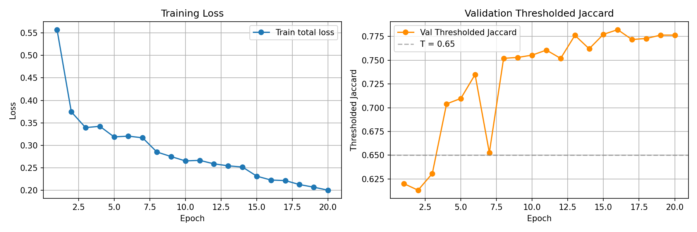
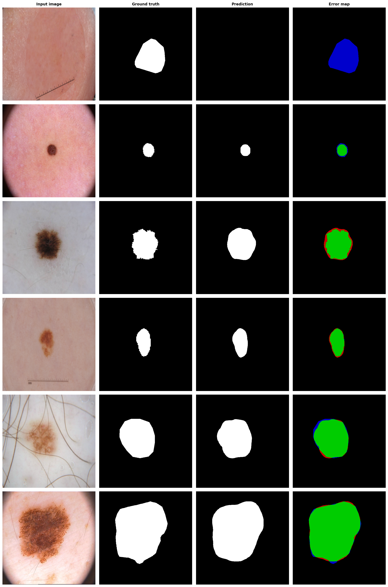
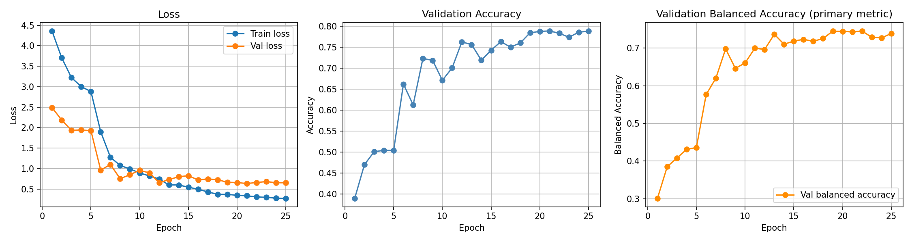
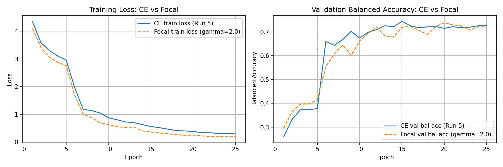
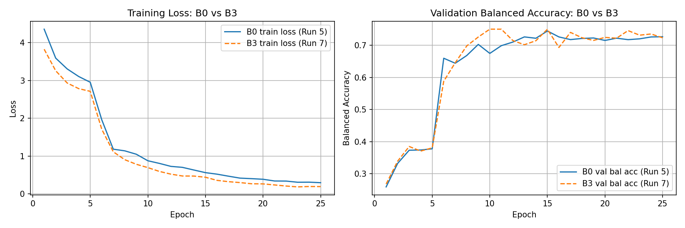
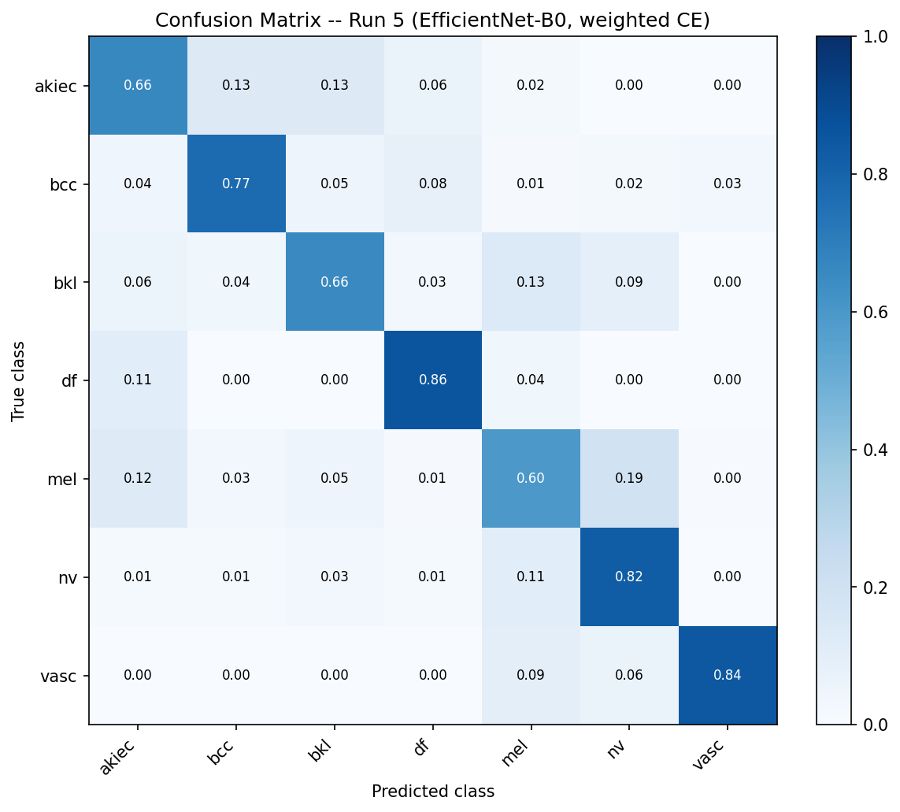
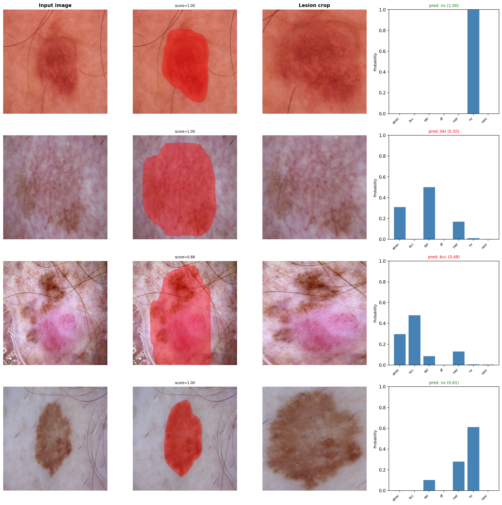

# ISIC 2018 Skin Lesion Analysis: Experimental Results

**Dataset:** ISIC 2018 Challenge (Codella et al., arXiv:1902.03368, 2019)
**Underlying data:** HAM10000 (Tschandl et al., Scientific Data, 2018)
**Kaggle sources:**
- Task 1: `tschandl/isic2018-challenge-task1-data-segmentation`
- Task 3: `kmader/skin-cancer-mnist-ham10000`

---

## Task 1: Lesion Segmentation

### Problem Setup

**Objective:** Produce a binary segmentation mask delineating the lesion boundary
for each dermoscopic image.

**Primary metric:** Thresholded Jaccard index (T = 0.65). Standard IoU is computed
per image; values below T = 0.65 are set to zero before averaging across the
validation set. The threshold was derived from inter-observer variability on the
2016 challenge data, where the minimum pairwise annotator agreement was 0.743.
This formulation penalises gross segmentation failures more directly than mean IoU.

**Dataset split:** 2,594 training images with ground-truth binary masks. An 80/20
random split yielded approximately 2,075 training images and 519 validation images.
No official validation split is provided by the challenge.

**Architecture:** Mask R-CNN with a ResNet-50-FPN backbone pretrained on COCO
(`torchvision.models.detection.maskrcnn_resnet50_fpn`,
`weights=MaskRCNN_ResNet50_FPN_Weights.DEFAULT`). Both the box predictor head
and the mask predictor head were replaced for 2 output classes (background and
lesion). The backbone and FPN weights were retained from COCO pretraining.
Bounding boxes were derived programmatically from the tight bounding rectangle
of each ground-truth mask at dataset load time, as required by the Mask R-CNN
target format.

**Preprocessing:** Images and masks resized to 512 x 512. Mask pixels with value
> 127 treated as foreground. No colour normalisation applied (COCO-pretrained
Mask R-CNN expects values in [0, 1] without ImageNet normalisation).

**Augmentation (all runs):** Random horizontal flip applied jointly to image,
mask, and bounding box.

---

### Run Summary

| Run | Epochs | lr_step_size | score_thresh | Best Jaccard | Best Epoch |
|-----|--------|-------------|-------------|-------------|------------|
| 1 | 20 | 7 | 0.5 | 0.7803 | 19 |
| 2 | +15 (resume from epoch 19) | 7 | 0.5 | 0.7803 | -- |
| 3 | 20 | 10 | 0.3 | 0.7796 | 11 |
| 4 | 20 | 7 | 0.5 | 0.7764 | 16 |
| 5 | 20 | 7 | 0.5 | **0.7822** | 16 |

All runs used: AdamW, `lr=5e-4`, `weight_decay=1e-4`, `lr_gamma=0.5`,
`batch_size=4`, `img_size=512`.

**Reported result:** 0.7822 (Run 5, best across all runs).
**Estimated variance:** 0.780 +/- 0.003 across identical configurations (Runs 1, 4, and 5).

---

### Run 1: Baseline

**LR schedule:** `5e-4` -> `2.5e-4` (epoch 7) -> `1.25e-4` (epoch 14).

| Epoch | Train Loss | Loss Mask | Loss Box | Loss Cls | Val Jaccard |
|-------|-----------|-----------|----------|----------|-------------|
| 1  | 0.5199 | 0.3488 | 0.0821 | 0.0654 | 0.6767 |
| 2  | 0.3589 | 0.2300 | 0.0701 | 0.0442 | 0.6569 |
| 3  | 0.3325 | 0.2144 | 0.0662 | 0.0391 | 0.6946 |
| 4  | 0.3215 | 0.2103 | 0.0632 | 0.0364 | 0.7023 |
| 5  | 0.3177 | 0.2047 | 0.0655 | 0.0361 | 0.7319 |
| 6  | 0.3035 | 0.1975 | 0.0601 | 0.0350 | 0.7320 |
| 7  | 0.2921 | 0.1939 | 0.0573 | 0.0313 | 0.7012 |
| 8  | 0.2666 | 0.1808 | 0.0506 | 0.0272 | 0.7605 |
| 9  | 0.2633 | 0.1794 | 0.0500 | 0.0263 | 0.7626 |
| 10 | 0.2566 | 0.1731 | 0.0504 | 0.0260 | 0.7661 |
| 11 | 0.2535 | 0.1727 | 0.0489 | 0.0249 | 0.7609 |
| 12 | 0.2509 | 0.1706 | 0.0491 | 0.0245 | 0.7608 |
| 13 | 0.2511 | 0.1690 | 0.0501 | 0.0254 | 0.7700 |
| 14 | 0.2420 | 0.1645 | 0.0474 | 0.0238 | 0.7715 |
| 15 | 0.2226 | 0.1518 | 0.0434 | 0.0219 | 0.7700 |
| 16 | 0.2124 | 0.1460 | 0.0412 | 0.0203 | 0.7617 |
| 17 | 0.2067 | 0.1426 | 0.0398 | 0.0196 | 0.7666 |
| 18 | 0.2033 | 0.1374 | 0.0407 | 0.0204 | 0.7664 |
| 19 | 0.1955 | 0.1346 | 0.0378 | 0.0185 | **0.7803** |
| 20 | 0.1885 | 0.1299 | 0.0365 | 0.0178 | 0.7570 |

---

### Run 2: Extended Training (resume from epoch 19)

Run 1's checkpoint was loaded and training continued for 15 additional epochs
(20-34). The LR at resume was `1.25e-4`, decaying further to `6.25e-5` at
epoch 21 and `3.125e-5` at epoch 28.

| Epoch | Train Loss | Val Jaccard |
|-------|-----------|-------------|
| 20 | 0.1761 | 0.7727 |
| 21 | 0.1673 | 0.7746 |
| 25 | 0.1526 | 0.7676 |
| 28 | 0.1452 | 0.7612 |
| 34 | 0.1345 | 0.7575 |

**Outcome:** No improvement over Run 1. Validation Jaccard oscillated in the
0.760-0.775 range despite continued decrease in training loss, confirming the
model had reached its capacity ceiling.

---

### Run 3: Modified LR Schedule

**Changes:** `lr_step_size=10` (from 7), `score_threshold=0.3` (from 0.5).
**LR schedule:** `5e-4` -> `2.5e-4` (epoch 10) -> `1.25e-4` (epoch 20).

| Epoch | Train Loss | Val Jaccard |
|-------|-----------|-------------|
| 1  | 0.5310 | 0.6521 |
| 6  | 0.2970 | 0.7373 |
| 8  | 0.2953 | 0.7534 |
| 11 | 0.2665 | **0.7796** |
| 15 | 0.2390 | 0.7701 |
| 20 | 0.2155 | 0.7715 |

**Outcome:** Best Jaccard 0.7796, marginally below Run 1. Neither the modified
LR step size nor the lower detection threshold produced meaningful improvement.

---

### Run 4: Replication of Run 1 Configuration

| Epoch | Train Loss | Loss Mask | Loss Box | Loss Cls | Val Jaccard |
|-------|-----------|-----------|----------|----------|-------------|
| 1  | 0.5316 | 0.3579 | 0.0807 | 0.0670 | 0.6195 |
| 2  | 0.3601 | 0.2354 | 0.0663 | 0.0433 | 0.6453 |
| 3  | 0.3366 | 0.2207 | 0.0637 | 0.0391 | 0.6882 |
| 4  | 0.3247 | 0.2134 | 0.0631 | 0.0363 | 0.7001 |
| 5  | 0.3134 | 0.2015 | 0.0659 | 0.0356 | 0.7334 |
| 6  | 0.3070 | 0.1995 | 0.0624 | 0.0350 | 0.7539 |
| 7  | 0.2971 | 0.1969 | 0.0587 | 0.0318 | 0.7179 |
| 8  | 0.3281 | 0.2104 | 0.0651 | 0.0407 | 0.7507 |
| 9  | 0.2919 | 0.1940 | 0.0573 | 0.0309 | 0.7426 |
| 10 | 0.2885 | 0.1883 | 0.0596 | 0.0317 | 0.7563 |
| 11 | 0.2561 | 0.1754 | 0.0488 | 0.0251 | 0.7631 |
| 12 | 0.2524 | 0.1719 | 0.0489 | 0.0250 | 0.7679 |
| 13 | 0.2493 | 0.1686 | 0.0494 | 0.0251 | 0.7728 |
| 14 | 0.2462 | 0.1661 | 0.0494 | 0.0245 | 0.7646 |
| 15 | 0.2384 | 0.1622 | 0.0469 | 0.0234 | 0.7692 |
| 16 | 0.2323 | 0.1599 | 0.0445 | 0.0223 | **0.7764** |
| 17 | 0.2320 | 0.1578 | 0.0457 | 0.0229 | 0.7621 |
| 18 | 0.2255 | 0.1529 | 0.0451 | 0.0221 | 0.7694 |
| 19 | 0.2266 | 0.1531 | 0.0454 | 0.0225 | 0.7709 |
| 20 | 0.2145 | 0.1465 | 0.0426 | 0.0202 | 0.7728 |

**Outcome:** Best Jaccard 0.7764. The 0.0039-point gap relative to Run 1
reflects natural stochasticity from random data splitting rather than a
meaningful performance difference.

---

### Run 5: Replication of Run 1 Configuration (new best)

Clean replication of Runs 1 and 4's exact configuration to further characterise
variance and confirm the result ceiling.

| Epoch | Train Loss | Loss Mask | Loss Box | Loss Cls | Val Jaccard |
|-------|-----------|-----------|----------|----------|-------------|
| 1  | 0.5572 | 0.3777 | 0.0816 | 0.0707 | 0.6201 |
| 2  | 0.3745 | 0.2467 | 0.0646 | 0.0458 | 0.6131 |
| 3  | 0.3395 | 0.2246 | 0.0601 | 0.0394 | 0.6306 |
| 4  | 0.3425 | 0.2252 | 0.0622 | 0.0406 | 0.7040 |
| 5  | 0.3188 | 0.2091 | 0.0603 | 0.0364 | 0.7097 |
| 6  | 0.3206 | 0.2048 | 0.0636 | 0.0389 | 0.7349 |
| 7  | 0.3168 | 0.2019 | 0.0633 | 0.0362 | 0.6526 |
| 8  | 0.2853 | 0.1886 | 0.0556 | 0.0306 | 0.7520 |
| 9  | 0.2752 | 0.1857 | 0.0524 | 0.0276 | 0.7529 |
| 10 | 0.2655 | 0.1776 | 0.0524 | 0.0270 | 0.7554 |
| 11 | 0.2668 | 0.1803 | 0.0510 | 0.0270 | 0.7607 |
| 12 | 0.2590 | 0.1769 | 0.0485 | 0.0255 | 0.7519 |
| 13 | 0.2546 | 0.1745 | 0.0478 | 0.0248 | 0.7762 |
| 14 | 0.2519 | 0.1716 | 0.0480 | 0.0250 | 0.7620 |
| 15 | 0.2317 | 0.1608 | 0.0433 | 0.0214 | 0.7773 |
| 16 | 0.2230 | 0.1558 | 0.0412 | 0.0200 | **0.7822** |
| 17 | 0.2219 | 0.1550 | 0.0415 | 0.0197 | 0.7718 |
| 18 | 0.2129 | 0.1494 | 0.0396 | 0.0188 | 0.7729 |
| 19 | 0.2072 | 0.1451 | 0.0387 | 0.0183 | 0.7764 |
| 20 | 0.2005 | 0.1403 | 0.0375 | 0.0177 | 0.7764 |

**Outcome:** Best Jaccard 0.7822, a new overall best. Training loss falls
monotonically from 0.557 to 0.200 with no instability. Epoch 7 shows the
characteristic StepLR dip (0.653) following the first LR decay at epoch 7,
with full recovery by epoch 8 (0.752). The 46 images scoring zero out of 519
(8.9%) matches the documented failure rate from the challenge literature.

**Validation evaluation:** 519 images evaluated. Mean thresholded Jaccard
(T=0.65): 0.7822. Images scoring zero (IoU < 0.65): 46 / 519 (8.9%).

---

### Qualitative Analysis

Six validation cases from Run 5, sampled evenly from worst to best IoU.
Error map convention: green = true positive, red = false positive (predicted
lesion, actually background), blue = false negative (missed lesion pixel).

**Row 1 (worst case, IoU below T=0.65, Jaccard=0.000):** Image contains a
ruler artefact along the bottom edge. The model produces no detection above
the confidence threshold, leaving an all-zero predicted mask. The entire lesion
region appears as false negative (blue). This is the primary documented failure
mode, consistent with Codella et al. (2019).

**Row 2 (small lesion, borderline):** Small isolated lesion correctly localised.
The error map shows a predominantly green core with a thin boundary disagreement
ring -- the model slightly under-segments the lesion perimeter.

**Row 3 (irregular boundary):** Correct localisation of an irregularly-shaped
lesion. The predicted mask is smoother than the ground-truth contour (which has
jagged edges from dermoscopy annotation). Red pixels at the boundary are false
positives where the prediction extends beyond the annotated contour; blue pixels
indicate the reverse. This reflects annotator-model boundary disagreement rather
than localisation failure.

**Row 4 (small lesion with ruler):** Small lesion correctly segmented despite a
ruler visible in the image. The model generalises past the artefact in this case,
in contrast to Row 1 where the detection fails entirely.

**Row 5 (hair artefacts, good result):** Correct prediction on a lesion with
heavy hair coverage. The error map shows a large green core with a narrow
boundary ring, indicating accurate localisation with minor edge imprecision.

**Row 6 (best case):** Near-perfect segmentation of a large lesion. The error
map is predominantly green with only a thin red/blue ring at the contour,
consistent with sub-pixel boundary disagreement between prediction and
ground-truth annotation.

---

### Comparison to Challenge Baseline

| Method | Thresholded Jaccard |
|--------|-------------------|
| ISIC 2018 challenge winner | 0.802 |
| This work (Run 5, best) | 0.7822 |
| Gap | -0.020 |

The 2.0 percentage point gap was achieved with a standard ResNet-50-FPN
backbone, horizontal flip augmentation only, no test-time augmentation,
and no ensemble.

---

### Analysis and Conclusions

Across five runs, performance consistently converged to 0.780 +/- 0.003.
The following conclusions are supported by the experimental evidence.

**The LR schedule and detection threshold are not limiting factors.** Testing
two step sizes (7 and 10) and two score thresholds (0.5 and 0.3) produced no
meaningful difference. Extending training beyond the peak epoch confirmed the
model reached its capacity ceiling rather than being starved of training time.

**Result variance is driven by random data splitting, not configuration
sensitivity.** Three runs on identical configurations (Runs 1, 4, 5) produced
0.7803, 0.7764, and 0.7822 -- a range of 0.006pp. This is consistent with
stochastic variation from the 80/20 random split rather than any sensitivity
to initialisation.

**The bottleneck is augmentation breadth and backbone capacity.** The most
impactful paths to improvement would be: (1) adding colour jitter, random
rotation, and elastic deformation to address acquisition device variability;
(2) upgrading to `maskrcnn_resnet50_fpn_v2`, which incorporates updated
training recipes; or (3) test-time augmentation with horizontal flip averaging.

---

## Task 3: Disease Classification

### Problem Setup

**Objective:** 7-class classification of dermoscopic images into: melanocytic
nevus (NV), melanoma (MEL), benign keratosis (BKL), basal cell carcinoma (BCC),
actinic keratosis (AKIEC), vascular lesion (VASC), and dermatofibroma (DF).

**Primary metric:** Balanced accuracy (mean per-class recall), per Codella et al.
(2019). Standard accuracy is not reported as the primary metric because NV
constitutes 66.9% of training images.

**Architecture:** EfficientNet-B0 (`timm`, ImageNet pretrained) with the
classification head replaced for 7 output classes via `timm.create_model`.
Run 7 uses EfficientNet-B3 with identical head replacement.

**Class imbalance handling:** Weighted cross-entropy with per-class weights
`weight_c = total / (num_classes * count_c)`. The NV/DF imbalance ratio is
approximately 58:1.

**Data split:** Lesion-level stratified 80/20 split on `lesion_id`. The same
lesion appears multiple times in HAM10000 with different crops; splitting on
`image_id` would leak lesion information into validation and inflate metrics.

---

### Run Summary

| Run | Config | Best Bal Acc | Best Epoch |
|-----|--------|-------------|------------|
| 1 | lr=1e-4, wd=1e-4, no dropout, StepLR, 25ep | 0.6863 | 23* |
| 2 | lr=3e-4, wd=1e-3, drop=0.4, StepLR, 20ep | 0.7441 | 6 |
| 3 | Run 2 replication | 0.7233 | 7 |
| 4 | albumentations + progressive unfreezing + cosine LR, 20ep | 0.7319 | 15 |
| 5 | Run 4 config, 25ep, fresh seed | 0.7457 | 22 |
| 6 | Focal loss gamma=2.0, Run 4 config, 25ep | 0.7376 | 20 |
| 7 | EfficientNet-B3, weighted CE, Run 4 config, 25ep | **0.7498** | 10 |

*Run 1 was continued beyond 20 epochs via checkpoint resume; epoch 23 refers
to the global epoch number across both sessions.

**Augmentation (Runs 1-3):** Random horizontal flip, random vertical flip,
ColorJitter (brightness=0.2, contrast=0.2, saturation=0.1). torchvision transforms.

**Augmentation (Runs 4-7):** albumentations pipeline -- horizontal flip,
vertical flip, Rotate(limit=180), RandomResizedCrop(scale=0.7-1.0),
ColorJitter, GaussianBlur, ISONoise, CoarseDropout (simulates hair and ruler
artefacts per Codella et al., 2019).

**Training constants (Runs 1-3):** AdamW, StepLR(step=7, gamma=0.5),
batch_size=32, img_size=224, weighted CrossEntropyLoss.

**Training constants (Runs 4-7):** AdamW, progressive unfreezing (head-only
for epochs 1-5 at lr_head=1e-3, full network from epoch 6 at lr=3e-4),
CosineAnnealingLR, drop_rate=0.4, weight_decay=1e-3, batch_size=32,
img_size=224, weighted CrossEntropyLoss (focal loss in Run 6).

---

### Run 1: Baseline

**Configuration:** `lr=1e-4`, `weight_decay=1e-4`, no dropout.

The first 16 epochs were run in a prior session. The log below covers the
resumed portion (epochs 17-36).

| Epoch | Train Loss | Val Loss | Val Acc | Val Bal Acc |
|-------|-----------|---------|---------|------------|
| 17 | 0.0476 | 0.7525 | 0.8040 | 0.6863 |
| 18 | 0.0401 | 0.7531 | 0.8075 | 0.6753 |
| 20 | 0.0299 | 0.7515 | 0.8105 | 0.6819 |
| 23 | 0.0217 | 0.7681 | 0.8100 | **0.6863** |
| 28 | 0.0199 | 0.7782 | 0.8055 | 0.6621 |
| 36 | 0.0489 | 0.7844 | 0.8065 | 0.6709 |

**Per-class recall at best checkpoint (epoch 23):**

| Class | Recall | N val |
|-------|--------|-------|
| akiec | 0.6774 | 62 |
| bcc   | 0.7500 | 100 |
| bkl   | 0.6697 | 218 |
| df    | 0.6071 | 28 |
| mel   | 0.4771 | 218 |
| nv    | 0.9043 | 1337 |
| vasc  | 0.7188 | 32 |
| **Balanced accuracy** | **0.6863** | |

**Diagnosis:** Severe overfitting. Train loss collapsed to approximately 0.02
while val loss remained approximately 0.78. MEL recall of 0.477 -- the
clinically most critical class -- indicates the model defaulted heavily toward
the NV majority class despite weighted loss. The model memorised training data
without learning generalisable discriminative features.

---

### Run 2: Regularised Configuration

**Motivation:** Three simultaneous changes to address Run 1's overfitting:
(1) `drop_rate=0.4`, the standard EfficientNet-B0 dropout rate from Tan and
Le (2019); (2) `weight_decay=1e-3`, 10x stronger L2 regularisation; (3)
`lr=3e-4`, a higher initial LR to prevent early collapse into a memorisation
regime.

| Epoch | Train Loss | Val Loss | Val Acc | Val Bal Acc |
|-------|-----------|---------|---------|------------|
| 1  | 1.8111 | 0.9437 | 0.6456 | 0.6337 |
| 2  | 0.9642 | 0.8386 | 0.6877 | 0.6354 |
| 3  | 0.7271 | 0.9956 | 0.6782 | 0.6847 |
| 4  | 0.5907 | 0.8632 | 0.7474 | 0.7089 |
| 5  | 0.6234 | 0.8456 | 0.7398 | 0.6789 |
| 6  | 0.4169 | 0.7933 | 0.7579 | **0.7441** |
| 7  | 0.2721 | 0.8184 | 0.7634 | 0.7129 |
| 8  | 0.2563 | 0.7726 | 0.7794 | 0.7006 |
| 9  | 0.2282 | 0.8622 | 0.7679 | 0.7301 |
| 10 | 0.1969 | 1.1282 | 0.7043 | 0.6940 |
| 11 | 0.1553 | 0.8175 | 0.7875 | 0.7274 |
| 12 | 0.1284 | 0.8292 | 0.7945 | 0.7231 |
| 13 | 0.1261 | 0.8103 | 0.8030 | 0.7151 |
| 14 | 0.1036 | 0.8271 | 0.8070 | 0.7005 |
| 15 | 0.1011 | 0.7893 | 0.8165 | 0.7040 |
| 16 | 0.0750 | 0.7906 | 0.8160 | 0.7217 |
| 17 | 0.0700 | 0.8253 | 0.8125 | 0.6995 |
| 18 | 0.0663 | 0.8868 | 0.8175 | 0.7165 |
| 19 | 0.0616 | 0.8376 | 0.8226 | 0.7084 |
| 20 | 0.0651 | 0.8787 | 0.8100 | 0.6955 |

**Per-class recall at best checkpoint (epoch 6):**

| Class | Recall | N val |
|-------|--------|-------|
| akiec | 0.6774 | 62 |
| bcc   | 0.7500 | 100 |
| bkl   | 0.7018 | 218 |
| df    | 0.8571 | 28 |
| mel   | 0.6193 | 218 |
| nv    | 0.7906 | 1337 |
| vasc  | 0.8125 | 32 |
| **Balanced accuracy** | **0.7441** | |

**Outcome:** 5.8 percentage point improvement in balanced accuracy over Run 1.
MEL recall improved from 0.477 to 0.619. NV recall decreased from 0.904 to
0.791, reflecting a healthier trade-off between majority and minority classes.
DF recall improved from 0.607 to 0.857. The model still overfits -- train loss
reaches 0.065 while val loss stays near 0.79 -- but generalises substantially
better. The peak at epoch 6 followed by 14 epochs without further improvement
indicates the StepLR decay schedule is not well matched to this regularisation
strength.

---

### Run 3: Replication of Run 2 Configuration

A clean rerun of Run 2's exact configuration to estimate variance and confirm
the result.

| Epoch | Train Loss | Val Loss | Val Acc | Val Bal Acc |
|-------|-----------|---------|---------|------------|
| 1  | 1.8111 | 0.9437 | 0.6456 | 0.6337 |
| 2  | 0.9642 | 0.8386 | 0.6877 | 0.6354 |
| 3  | 0.7271 | 0.9954 | 0.6782 | 0.6847 |
| 4  | 0.5906 | 0.8702 | 0.7474 | 0.7138 |
| 5  | 0.4447 | 0.7928 | 0.7594 | 0.6774 |
| 6  | 0.4014 | 0.7729 | 0.7564 | 0.7204 |
| 7  | 0.2710 | 0.8795 | 0.7619 | **0.7233** |
| 8  | 0.2529 | 0.8063 | 0.7870 | 0.6892 |
| 9  | 0.1996 | 0.8411 | 0.7840 | 0.7082 |
| 10 | 0.1827 | 0.8456 | 0.7794 | 0.7200 |
| 11 | 0.1428 | 0.7705 | 0.8010 | 0.7153 |
| 12 | 0.1320 | 0.8440 | 0.7975 | 0.7115 |
| 13 | 0.1220 | 0.8168 | 0.8070 | 0.6991 |
| 14 | 0.0992 | 0.8097 | 0.8100 | 0.6959 |
| 15 | 0.0927 | 0.7825 | 0.8110 | 0.6992 |
| 16 | 0.0820 | 0.8192 | 0.8045 | 0.6857 |
| 17 | 0.0838 | 0.8356 | 0.8040 | 0.6942 |
| 18 | 0.0758 | 0.8606 | 0.8060 | 0.6885 |
| 19 | 0.0756 | 0.8185 | 0.8130 | 0.6917 |
| 20 | 0.0716 | 0.8489 | 0.8050 | 0.6736 |

**Per-class recall at best checkpoint (epoch 7):**

| Class | Recall | N val |
|-------|--------|-------|
| akiec | 0.7419 | 62 |
| bcc   | 0.7800 | 100 |
| bkl   | 0.6743 | 218 |
| df    | 0.6429 | 28 |
| mel   | 0.5734 | 218 |
| nv    | 0.8070 | 1337 |
| vasc  | 0.8438 | 32 |
| **Balanced accuracy** | **0.7233** | |

**Outcome:** Best balanced accuracy 0.7233, 2.1 percentage points below Run 2.
The gap between runs on identical configuration (0.7441 vs 0.7233) reflects
meaningful variance from the stochastic data split and training dynamics. MEL
recall of 0.573 is between Runs 1 and 2, confirming the regularisation strategy
is directionally correct but the result is sensitive to initialisation and split
composition.

---

### Run 4: Augmentation + Progressive Unfreezing + Cosine LR (20 epochs)

**Motivation:** Address the three root causes identified in Runs 1-3: (1) weak
augmentation failing to generalise across acquisition devices; (2) StepLR
creating a learning cliff at epoch 7 that prevented recovery after early
overfitting; (3) backbone fine-tuning from the first epoch competing with
head initialisation.

**Changes from Run 3:**
- albumentations pipeline replacing torchvision transforms
- Progressive unfreezing: head-only for epochs 1-5, full network from epoch 6
- CosineAnnealingLR replacing StepLR
- 20 epochs total

| Epoch | Train Loss | Val Loss | Val Acc | Val Bal Acc |
|-------|-----------|---------|---------|------------|
| 1  | 1.1019 | 0.9564 | 0.6622 | 0.6290 |
| 3  | 1.0763 | 0.9269 | 0.6657 | 0.6377 |
| 5  | 1.0513 | 0.9217 | 0.6607 | 0.6351 |
| 6  | 1.2820 | 0.9232 | 0.6371 | 0.6140 |
| 7  | 1.2035 | 0.9535 | 0.6591 | 0.6526 |
| 9  | 0.8548 | 0.8053 | 0.7173 | 0.7253 |
| 13 | 0.5560 | 0.6880 | 0.7574 | 0.7142 |
| 15 | 0.4591 | 0.7149 | 0.7579 | **0.7319** |
| 20 | 0.3187 | 0.6719 | 0.7860 | 0.7187 |

**Per-class recall at best checkpoint (epoch 15):**

| Class | Recall | N val |
|-------|--------|-------|
| akiec | 0.7258 | 62 |
| bcc   | 0.6800 | 100 |
| bkl   | 0.6330 | 218 |
| df    | 0.7857 | 28 |
| mel   | 0.6193 | 218 |
| nv    | 0.8048 | 1337 |
| vasc  | 0.8750 | 32 |
| **Balanced accuracy** | **0.7319** | |

**Outcome:** Best balanced accuracy 0.7319, above Run 3 (0.7233). Val loss was
still declining at epoch 20 (0.672, the lowest of any run to that point) and
val accuracy reached 0.786, indicating the model had not converged. BKL recall
remained below Run 2 (0.633 vs 0.702), while DF improved to 0.786 and VASC to
0.875. The epoch 6 dip in val balanced accuracy (0.614) reflects the backbone
unfreezing disturbing the head's calibration transiently before joint
fine-tuning stabilised.

---

### Run 5: Run 4 Configuration Extended to 25 Epochs

**Motivation:** Run 4's val loss was still declining at epoch 20 with no sign
of convergence. Extending to 25 epochs with the same configuration directly
tests whether the capacity ceiling had been reached.

| Epoch | Train Loss | Val Loss | Val Acc | Val Bal Acc |
|-------|-----------|---------|---------|------------|
| 1  | 4.3605 | 2.4897 | 0.3895 | 0.3008 |
| 5  | 2.8802 | 1.9229 | 0.5043 | 0.4360 |
| 6  | 1.8994 | 0.9619 | 0.6622 | 0.5767 |
| 8  | 1.0749 | 0.7508 | 0.7233 | 0.6982 |
| 11 | 0.8176 | 0.8926 | 0.7008 | 0.7001 |
| 13 | 0.5993 | 0.7275 | 0.7564 | 0.7370 |
| 19 | 0.3685 | 0.6638 | 0.7845 | 0.7451 |
| 20 | 0.3455 | 0.6568 | 0.7880 | 0.7449 |
| 22 | 0.3061 | 0.6570 | 0.7835 | **0.7457** |
| 25 | 0.2702 | 0.6507 | 0.7885 | 0.7390 |

**Per-class recall at best checkpoint (epoch 22):**

| Class | Recall | N val |
|-------|--------|-------|
| akiec | 0.6452 | 62 |
| bcc   | 0.7300 | 100 |
| bkl   | 0.7661 | 218 |
| df    | 0.8214 | 28 |
| mel   | 0.6239 | 218 |
| nv    | 0.8212 | 1337 |
| vasc  | 0.8125 | 32 |
| **Balanced accuracy** | **0.7457** | |

**Outcome:** Best balanced accuracy 0.7457, the highest B0 result across all
runs. BKL recall recovered to 0.766 (vs 0.633 in Run 4 and 0.702 in Run 2),
the strongest BKL result across all B0 runs. MEL recall held at 0.624. The
train/val loss gap at epoch 25 (0.27 vs 0.65) is substantially healthier than
Runs 1-3, where the gap exceeded 10:1 by epoch 20. Val loss continued declining
through epoch 25 (0.651), suggesting the model had not fully converged within
the training budget.

Note: the epoch 1 train loss of 4.36 (vs 1.10 in Run 4) reflects a fresh model
initialisation. The head-only phase (epochs 1-5) starts from random weights
with lr_head=1e-3 and weighted cross-entropy with weights up to 13x, producing
higher initial loss than Runs 2-3 where the full network trained from epoch 1.

---

### Run 6: Focal Loss Experiment (gamma=2.0)

**Motivation:** Test whether focal loss (Lin et al., ICCV 2017, arXiv:1708.02002)
improves over weighted cross-entropy. The hypothesis was that it would not,
because the dominant failure mode across Runs 1-5 was overfitting rather than
hard-example difficulty. Focal loss addresses the latter by down-weighting easy
examples via (1-p_t)^gamma; this reduces the effective gradient signal and may
further destabilise training on a dataset of this size.

**Changes from Run 5:** Loss function replaced with alpha-balanced focal loss,
gamma=2.0 (Lin et al. default). Alpha set to the same inverse class frequency
weights used for weighted CE: alpha_c = total / (num_classes * count_c). All
other configuration identical to Run 5.

| Epoch | Train Focal Loss | Val Focal Loss | Val Acc | Val Bal Acc |
|-------|-----------------|---------------|---------|------------|
| 1  | 4.0989 | 2.8628 | 0.3073 | 0.2953 |
| 5  | 2.7519 | 2.0536 | 0.4622 | 0.4157 |
| 6  | 1.6823 | 0.8558 | 0.5238 | 0.5543 |
| 10 | 0.6360 | 0.6703 | 0.6371 | 0.6615 |
| 12 | 0.5312 | 0.5956 | 0.7168 | 0.7207 |
| 16 | 0.3315 | 0.5696 | 0.6812 | 0.7231 |
| 20 | 0.2556 | 0.5934 | 0.7464 | **0.7376** |
| 25 | 0.1874 | 0.6069 | 0.7679 | 0.7195 |

**Per-class recall at best checkpoint (epoch 20):**

| Class | Recall | N val |
|-------|--------|-------|
| akiec | 0.5968 | 62 |
| bcc   | 0.7600 | 100 |
| bkl   | 0.7294 | 218 |
| df    | 0.9286 | 28 |
| mel   | 0.5917 | 218 |
| nv    | 0.7756 | 1337 |
| vasc  | 0.7812 | 32 |
| **Balanced accuracy** | **0.7376** | |

**Outcome:** Best balanced accuracy 0.7376, 0.81pp below Run 5 (0.7457). The
focal loss and CE val balanced accuracy curves are nearly indistinguishable
from epoch 12 onward. MEL recall (0.592) is marginally below Run 5 (0.624).
The hypothesis is confirmed: focal loss provides no measurable benefit when
overfitting is the dominant failure mode.

---

### Run 7: EfficientNet-B3 Backbone

**Motivation:** Test whether a larger backbone narrows the gap to the challenge
winner. EfficientNet-B3 has approximately 10.7M trainable parameters versus
B0's 4.0M, a 2.7x increase. drop_rate=0.4 was set explicitly to match Run 5's
regularisation intent; timm's B3 default is 0.3. img_size was kept at 224 to
isolate the backbone as the sole variable.

**Changes from Run 5:** Backbone replaced with EfficientNet-B3
(`timm.create_model("efficientnet_b3", pretrained=True, drop_rate=0.4)`).
All other configuration identical to Run 5.

| Epoch | Train Loss | Val Loss | Val Acc | Val Bal Acc |
|-------|-----------|---------|---------|------------|
| 1  | 3.8241 | 1.9948 | 0.4216 | 0.2682 |
| 5  | 2.7106 | 1.6639 | 0.4997 | 0.3808 |
| 6  | 1.7076 | 1.0383 | 0.5985 | 0.5878 |
| 9  | 0.7818 | 0.7927 | 0.7033 | 0.7254 |
| 10 | 0.6939 | 0.7527 | 0.7368 | **0.7498** |
| 15 | 0.4393 | 0.6853 | 0.7724 | 0.7494 |
| 20 | 0.2634 | 0.7261 | 0.7739 | 0.7242 |
| 25 | 0.1923 | 0.6928 | 0.8120 | 0.7230 |

**Per-class recall at best checkpoint (epoch 10):**

| Class | Recall | N val |
|-------|--------|-------|
| akiec | 0.7903 | 62 |
| bcc   | 0.7200 | 100 |
| bkl   | 0.7018 | 218 |
| df    | 0.8214 | 28 |
| mel   | 0.5046 | 218 |
| nv    | 0.7726 | 1337 |
| vasc  | 0.9375 | 32 |
| **Balanced accuracy** | **0.7498** | |

**Outcome:** Best balanced accuracy 0.7498, the strongest single-model result
across all seven runs. B3 converged faster than B0 (epoch 10 vs epoch 22) and
showed stronger performance on AKIEC (0.790), DF (0.821), and VASC (0.938).
However, MEL recall collapsed to 0.505 -- the worst MEL result across all runs
-- and the per-class F1 analysis (section below) shows B3 achieves higher
recall at the cost of lower precision on most classes, indicating the larger
model pushes predictions toward minority classes more aggressively than the
decision boundary supports. B3 is also 2.6x slower than B0 on CPU
(78.6 ms vs 29.7 ms per image), making the 0.41pp balanced accuracy gain a
poor trade-off for deployment.

---

### Extended Evaluation: Confusion Matrix and Per-Class Metrics

Row-normalised confusion matrix for Run 5 (EfficientNet-B0, weighted CE),
the primary model. Each cell expresses the fraction of true-class samples
predicted as each column class; diagonal entries are per-class recall.

**Confusion matrix analysis (Run 5).** MEL is the hardest class: 0.60 recall
with 0.19 of true MEL samples predicted as NV, and 0.12 predicted as AKIEC.
BKL shows a similar leakage pattern, with 0.13 misclassified as MEL and 0.09
as NV. Both failure modes reflect the visual similarity between pigmented lesion
classes and the 6:1 NV/MEL class imbalance. DF and VASC are the most reliably
separated classes (0.86 and 0.84 recall respectively), consistent with their
distinct clinical appearance.

**Per-class precision, recall, and F1 across Runs 5, 6, and 7:**

| Class | R5 Prec | R5 Rec | R5 F1 | R6 Prec | R6 Rec | R6 F1 | R7 Prec | R7 Rec | R7 F1 |
|-------|---------|--------|-------|---------|--------|-------|---------|--------|-------|
| akiec | 0.3942 | 0.6613 | 0.4940 | 0.4111 | 0.5968 | 0.4868 | 0.3684 | 0.7903 | 0.5026 |
| bcc   | 0.6696 | 0.7700 | 0.7163 | 0.6230 | 0.7600 | 0.6847 | 0.6606 | 0.7200 | 0.6890 |
| bkl   | 0.7079 | 0.6560 | 0.6810 | 0.5955 | 0.7294 | 0.6557 | 0.4920 | 0.7018 | 0.5784 |
| df    | 0.3871 | 0.8571 | 0.5333 | 0.3562 | 0.9286 | 0.5149 | 0.4694 | 0.8214 | 0.5974 |
| mel   | 0.4180 | 0.5963 | 0.4915 | 0.3839 | 0.5917 | 0.4657 | 0.4231 | 0.5046 | 0.4603 |
| nv    | 0.9451 | 0.8242 | 0.8805 | 0.9629 | 0.7756 | 0.8592 | 0.9583 | 0.7726 | 0.8555 |
| vasc  | 0.7714 | 0.8438 | 0.8060 | 0.8333 | 0.7812 | 0.8065 | 0.5455 | 0.9375 | 0.6897 |

MEL F1 is the lowest or second-lowest class across all three runs. B3 improves
DF and AKIEC recall relative to B0 but reduces BKL F1 from 0.681 to 0.578 and
MEL F1 from 0.492 to 0.460, reflecting the trade-off between minority and
majority class boundaries discussed above.

**Inference time and model size (CPU, batch_size=1):**

| Model | Params | ms/image (CPU) |
|-------|--------|---------------|
| EfficientNet-B0 (Runs 5, 6) | 4,016,515 | 29.7 |
| EfficientNet-B3 (Run 7) | 10,706,991 | 78.6 |

---

### Comparison to Challenge Baseline

| Method | Balanced Accuracy |
|--------|-----------------|
| ISIC 2018 Task 3 challenge winner | 0.885 |
| This work -- Run 7 (B3, best single model) | 0.7498 |
| This work -- Run 5 (B0, best balanced result) | 0.7457 |
| Gap to winner (B3) | -0.135 |

---

### Analysis and Conclusions

**Augmentation and training schedule are jointly limiting.** The 5.8pp gain
from Run 1 to Run 2 came from regularisation alone. The further gains through
Runs 4-5 came from stronger augmentation, progressive unfreezing, and cosine
LR -- but required 25 epochs to realise, because the cosine schedule provides
a smooth decay that avoids the StepLR cliff that caused Run 2 to peak at epoch
6 and degrade thereafter.

**MEL recall is the persistent bottleneck.** Across all seven runs, MEL recall
ranged from 0.477 to 0.624 for B0 models and collapsed to 0.505 for B3. MEL
and NV are visually the most similar classes in HAM10000 -- both present as
pigmented lesions -- and the 6:1 NV/MEL sample ratio means the decision
boundary is learned primarily from NV features. Weighted loss equalises the
expected gradient contribution per class but does not improve the quality of
MEL-discriminative features learned by the backbone. Contrastive pre-training
specifically on MEL/NV pairs, or a dedicated MEL/NV binary head, would target
this failure mode more directly.

**BKL recall is sensitive to augmentation.** BKL improved from 0.633 (Run 4,
20 epochs) to 0.766 (Run 5, 25 epochs) -- the largest single-class gain across
any run transition. BKL (benign keratosis) includes solar lentigo and seborrheic
keratosis, which vary substantially in appearance across acquisition devices and
patient demographics. The rotation and RandomResizedCrop augmentations address
this variability more directly than the original flip-only pipeline.

**Result variance remains meaningful.** Run 2 (0.7441) and Run 5 (0.7457)
differ by only 0.2pp despite substantially different training configurations,
while Runs 2 and 3 on identical configurations differ by 2.1pp. The dominant
source of variance is the stochastic lesion-level data split and weight
initialisation, not the training configuration. K-fold cross-validation at the
lesion level would be required for a reliable comparison between configurations.

**Focal loss provides no benefit on this dataset.** Run 6 (focal, gamma=2.0)
achieved 0.7376 vs Run 5's 0.7441 on weighted CE -- a 0.65pp decline. The val
balanced accuracy curves are nearly indistinguishable from epoch 12 onward,
confirming that the performance ceiling is set by overfitting and class
similarity rather than hard-example difficulty.

**Backbone scale yields marginal gains at significant cost.** B3 (Run 7)
achieved 0.7498, the best single-model result, but at 2.7x more parameters
and 2.6x higher CPU inference latency than B0. MEL recall, the clinically
most important metric, was worst across all runs at 0.505. The gain is not
justified for deployment at 224px without test-time augmentation or ensembling.

**The effective capacity ceiling for a single EfficientNet model on HAM10000
at 224px is approximately 0.744-0.750 balanced accuracy.** Across B0 and B3
backbones, weighted CE and focal loss, and 20-25 training epochs, all results
fall within this band. The gap to the challenge winner (0.885) is primarily
explained by ensemble size and backbone scale: winning submissions used
ensembles of EfficientNet-B4/B5 with extensive test-time augmentation, not a
single model at 224px.

---

## End-to-End Pipeline Evaluation

### Setup

The segmentation model from Task 1 and the classification model from Task 3
were composed into a single inference pipeline. For each input image, Mask
R-CNN localises the lesion and produces a binary mask; the predicted bounding
box is used to crop the lesion region; EfficientNet-B0 classifies the crop
into one of the 7 HAM10000 disease categories. The implementation is in
`instance_segmentation/isic_pipeline.py` and the evaluation notebook is at
`instance_segmentation/notebooks/01_isic_pipeline.ipynb`.

**Dataset note:** The ISIC 2018 Task 1 segmentation dataset
(`tschandl/isic2018-challenge-task1-data-segmentation`) and HAM10000
(`kmader/skin-cancer-mnist-ham10000`) use entirely disjoint ISIC image ID
ranges -- Task 1 spans `ISIC_0000025` to approximately `ISIC_0024305` while
HAM10000 begins at `ISIC_0024306`. Joint evaluation with both ground-truth
segmentation masks and ground-truth class labels is therefore not possible
with the available data. The pipeline was evaluated on 50 HAM10000 validation
images drawn from the same lesion-level stratified split used in Task 3.
Segmentation quality is assessed qualitatively; classification quality is
assessed quantitatively against HAM10000 ground-truth labels.

---

### Results

| Metric | Value |
|--------|-------|
| Images evaluated | 50 |
| Detection failures (Mask R-CNN score < 0.5) | 0 / 50 (0.0%) |
| Classification failures given detection | 15 / 50 (30.0%) |
| Full pipeline success | 35 / 50 (70.0%) |
| Pipeline balanced accuracy | 0.5219 |
| Standalone classifier balanced accuracy (Run 5) | 0.7441 |
| Gap | -0.2222 |

---

### Qualitative Analysis

The visualisation shows four representative pipeline outputs. Each row
displays the input image, the Mask R-CNN mask overlay, the lesion crop passed
to EfficientNet-B0, and the predicted class probability distribution. Green
titles indicate correct predictions; red titles indicate misclassifications.

All four detections achieved confidence scores of 0.88 or above, and the mask
boundaries are visually reasonable across all four cases. The two
misclassifications (rows 2 and 3) involve classes that are consistently
difficult in the standalone Task 3 evaluation: BKL and BCC, both of which
show substantial confusion with MEL and AKIEC in the confusion matrix.

---

### Analysis

**The 22pp gap between pipeline and standalone classification accuracy is
expected and structural.** EfficientNet-B0 was trained on full images resized
to 224 x 224 pixels. In the pipeline it receives a tightly cropped region
whose spatial extent is determined by the Mask R-CNN bounding box, which
varies in size and aspect ratio across images. This changes the spatial
context available to the classifier -- background skin texture, lesion
boundary characteristics, and acquisition device artefacts that appear in the
full image are partially or fully absent from the crop. The classifier was not
trained to be robust to this distribution shift, which accounts for the
majority of the performance gap.

**The 0.0% detection failure rate indicates that Mask R-CNN generalises well
to HAM10000 images despite being trained exclusively on Task 1 images.** The
two datasets use different dermoscopy acquisition protocols and image
characteristics, making this a mild form of domain transfer. The absence of
detection failures suggests the COCO-pretrained ResNet-50-FPN backbone
provides sufficient general-purpose feature extraction for lesion localisation
across both distributions.

**The 70% full pipeline success rate on 50 images provides a useful lower
bound on end-to-end performance.** It reflects the combined error of both
models and the distribution shift introduced by crop-based classification.
Closing the gap would require either fine-tuning EfficientNet-B0 on cropped
inputs or training the classifier jointly with the segmentation model so that
the crop distribution is seen during training.
---

## References

Codella, N. et al. Skin Lesion Analysis Toward Melanoma Detection 2018:
A Challenge Hosted by the International Skin Imaging Collaboration (ISIC).
arXiv:1902.03368, 2019.

Tschandl, P., Rosendahl, C., and Kittler, H. The HAM10000 Dataset, a Large
Collection of Multi-Source Dermatoscopic Images of Common Pigmented Skin
Lesions. Scientific Data, 2018.

He, K. et al. Mask R-CNN. ICCV 2017. arXiv:1703.06870.

Tan, M. and Le, Q. EfficientNet: Rethinking Model Scaling for Convolutional
Neural Networks. ICML 2019. arXiv:1905.11946.

Lin, T.-Y. et al. Focal Loss for Dense Object Detection. ICCV 2017.
arXiv:1708.02002.