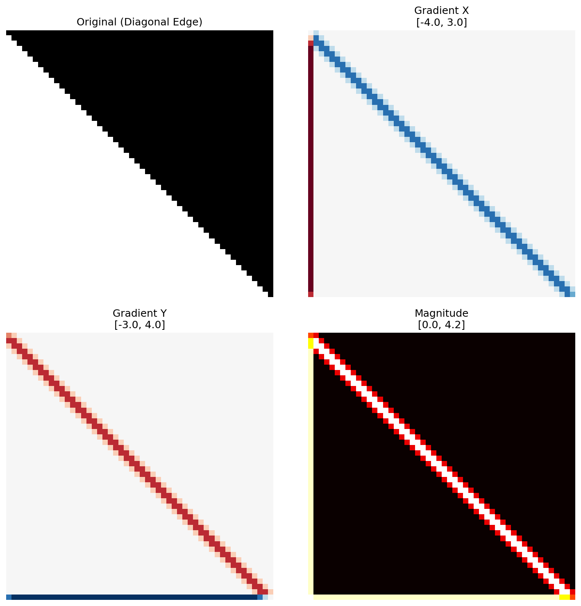
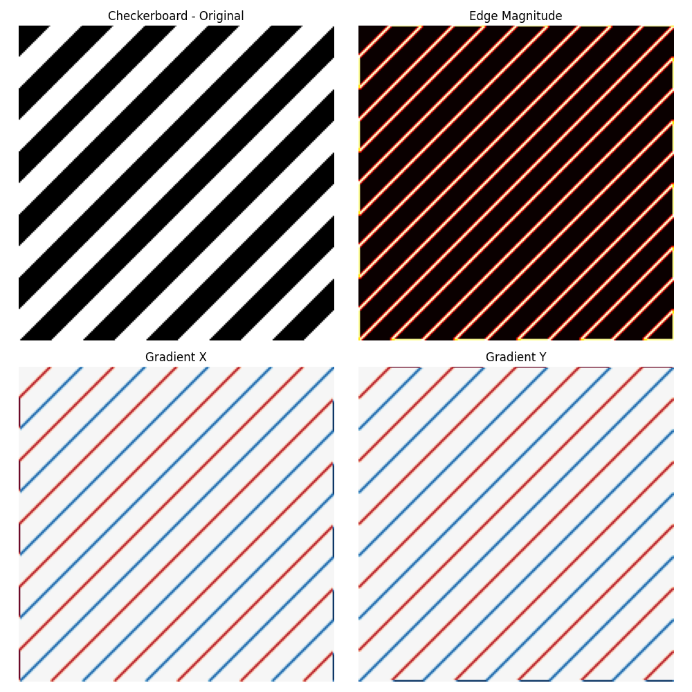
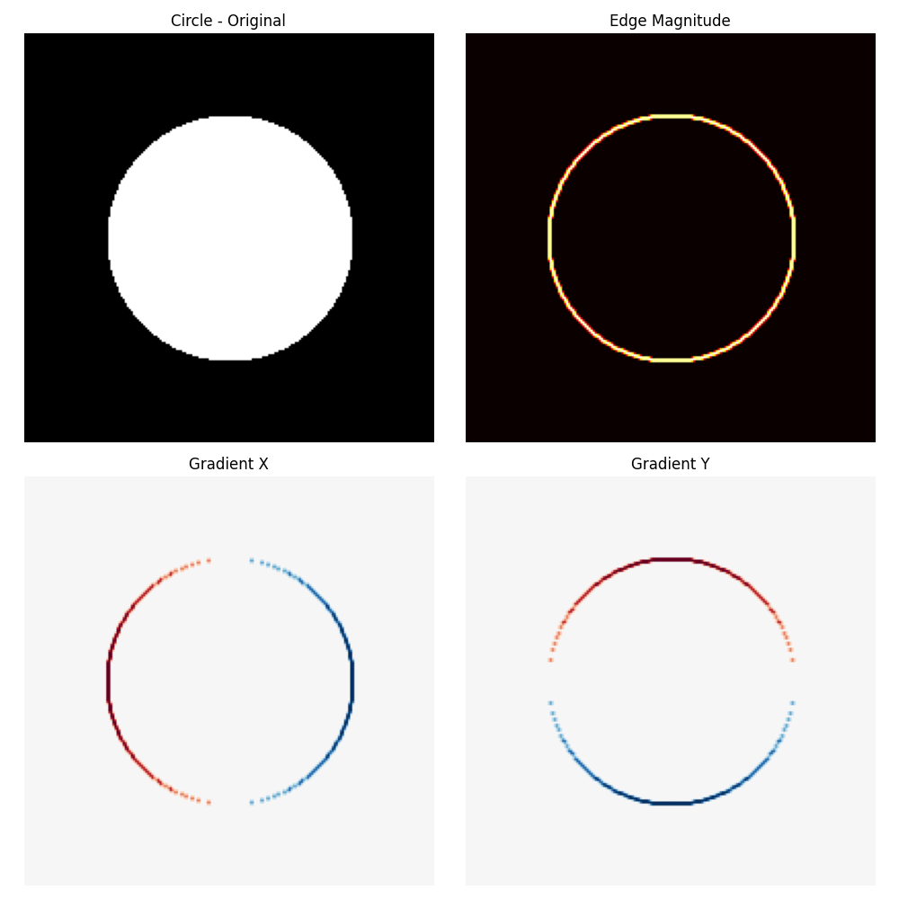
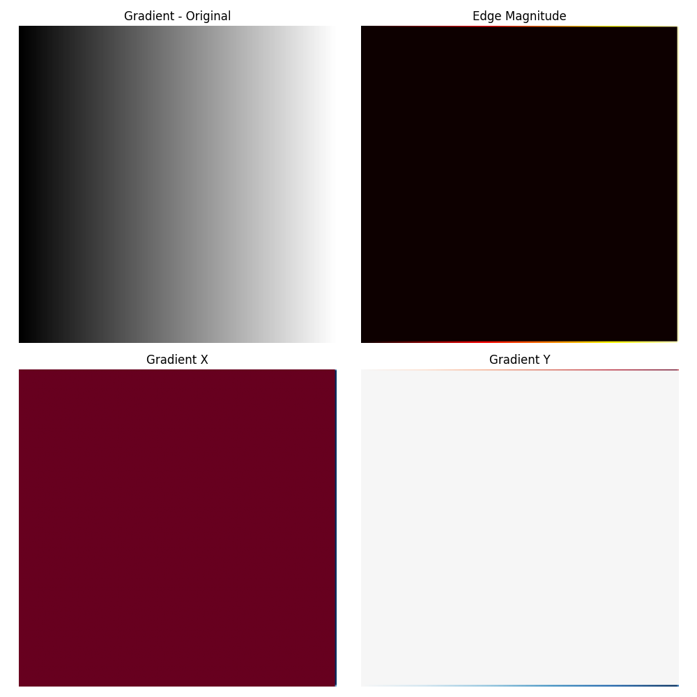
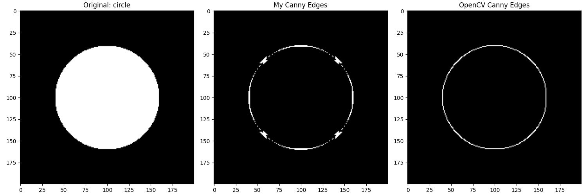
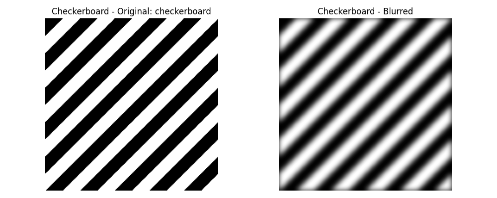

# Classical Computer Vision

Edge detection and image transformation algorithms implemented **from scratch using NumPy only**, verified against OpenCV.

---

## Table of Contents
- [Gaussian Blur](#gaussian-blur)
- [Sobel Edge Detection](#sobel-edge-detection)
- [Canny Edge Detection](#canny-edge-detection)
- [Image Transformations](#image-transformations)

---

## Gaussian Blur

Gaussian blur implemented via 2D kernel convolution with σ=3.

**Key observations:**
- The inner gray square blurs more slowly than the outer white square - demonstrates how σ controls the blur radius relative to feature size
- Smaller features lose detail faster than larger ones at the same σ
- Blur is **symmetric** in all directions, confirming correct 2D kernel implementation
- Used as a preprocessing step in the Canny pipeline to suppress noise before edge detection

---

## Sobel Edge Detection

Sobel operator applied to a diagonal edge, visualizing Gx, Gy, and magnitude.

**Key observations:**
- **Gradient X** (blue=negative, red=positive): responds to vertical boundaries - the strong left-side column shows the leftmost vertical edge
- **Gradient Y** (red=positive, blue=negative): responds to horizontal boundaries - weaker response on the diagonal
- **Magnitude** = √(Gx² + Gy²): the diagonal edge produces an **equal X and Y response**, correctly reflecting that a 45° edge has equal horizontal and vertical components
- **Yellow pixel at corner** = maximum magnitude, where both gradients peak simultaneously
- The 3-pixel-wide response on the diagonal is expected - Sobel's 3×3 kernel spreads the response across neighboring pixels

**Per-image Sobel results:**

### Checkerboard

Diagonal stripes produce consistent gradient responses along all edges. Both X and Y gradients respond equally to 45° edges, shown by symmetric red/blue banding.

### Circle

The circular boundary shows how gradient direction rotates continuously around the edge:
- **Left/right sides**: strong Gx, weak Gy
- **Top/bottom**: strong Gy, weak Gx
- **Diagonals**: equal Gx and Gy response

### Gradient Image

A smooth gradient image (no true edges) produces a **uniform Gx response** across the entire image - the Sobel operator correctly detects the constant rate of intensity change. Gy is near-zero since the gradient is purely horizontal.

---

## Canny Edge Detection

Full Canny pipeline: Gaussian blur → Sobel gradients → Non-maximum suppression → Double thresholding → Hysteresis.

Compared against OpenCV's `cv2.Canny()`.

### Checkerboard

My implementation detects **both edges per stripe** (thick white bands) while OpenCV produces **single-pixel thin edges**.

This difference comes down to **non-maximum suppression (NMS)**: OpenCV's NMS thins edges to exactly 1 pixel wide by suppressing all but the local gradient maximum along the gradient direction. My implementation's NMS is less aggressive on diagonal edges, leaving multiple adjacent pixels marked as edges. The edge positions are correct - only the thinning differs.

### Circle

Both implementations correctly detect the circular boundary. My version shows **thick blobs at cardinal points** (top, bottom, left, right) where the gradient direction transitions between octants on a discrete pixel grid - a known artifact of 8-direction gradient quantization. OpenCV handles this transition more smoothly, producing a clean 1-pixel-wide circle.

### Gradient Image

My implementation **incorrectly fires** across the smooth gradient image while OpenCV correctly returns an empty result.

This reveals a **threshold calibration issue**: the smooth gradient has a low but uniform intensity change everywhere. My thresholds are set too low relative to this background gradient, causing false edge detections. OpenCV's default thresholds correctly ignore gradients below a meaningful edge strength. This is a known challenge with Canny - threshold selection is image-dependent and requires tuning.

---

## Image Transformations

All transformations implemented via **inverse mapping** - for each output pixel, compute the source coordinate and sample from the input. This avoids holes that forward mapping creates.

### Gaussian Blur (preprocessing)

Gaussian blur applied to all three test images as a preprocessing step. The blur radius is visually consistent across images, confirming correct kernel normalization (kernel sum = 1).

---

### Rotation (45°)

**My result matches OpenCV exactly.**

Rotation implemented via the standard 2D rotation matrix centered at the image midpoint. The **jagged diagonal edges** (aliasing) are expected - without anti-aliasing interpolation, pixels are assigned by nearest-neighbor sampling. OpenCV shows the same aliasing at the same threshold, confirming correctness.

---

### Affine Warp

**My result matches OpenCV with sub-pixel accuracy.**

Affine transformation implemented via inverse mapping with the 2×3 affine matrix. Key property preserved: **parallel lines remain parallel** - the rectangle correctly becomes a parallelogram. Any affine transform (rotation, scale, shear, translation) preserves parallelism, which is visually confirmed here.

---

### Perspective Warp

**My result matches OpenCV.**

Perspective transformation implemented via homogeneous coordinates and the full 3×3 homography matrix. Unlike affine, **parallel lines are NOT preserved** - the top edge is shorter than the bottom edge, simulating a 3D viewpoint looking up at the rectangle. This is the fundamental difference between affine and perspective transforms, and is correctly reproduced.

---

## Implementation Notes

| Algorithm | From Scratch | vs OpenCV |
|-----------|-------------|-----------|
| Gaussian Blur | ✅ NumPy convolution | Matches |
| Sobel | ✅ NumPy convolution | Matches |
| Canny | ✅ Full pipeline | Edge positions match, thinning differs |
| Rotation | ✅ Inverse mapping | Matches exactly |
| Affine Warp | ✅ Inverse mapping | Matches exactly |
| Perspective Warp | ✅ Homogeneous coords | Matches exactly |

**No OpenCV used for computation** - only for comparison visualization.